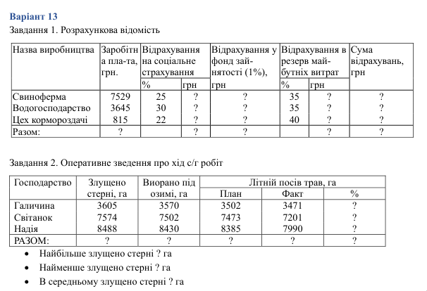
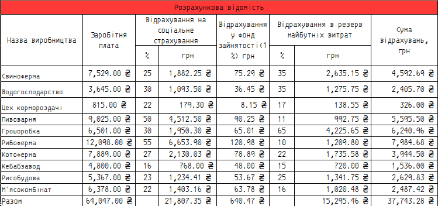
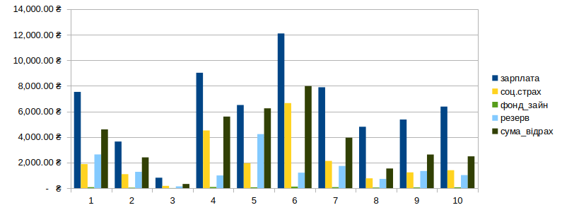
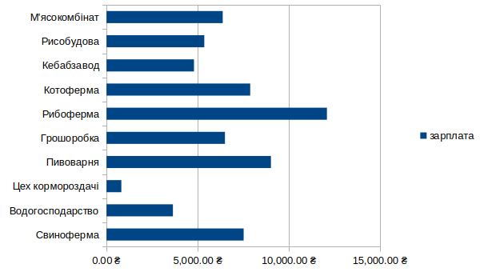
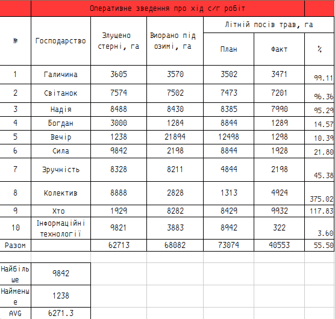

\input{$UNI/.templates/parts/header.tex}
 оволодіти основними навичками роботи з електронними таблицями
MS Excel, включаючи введення даних, виконання обчислень із використанням
вбудованих функцій та формул, форматування даних для кращого зрозуміння та
інтерпретації, а також побудову діаграм для візуалізації даних.

# Індивідуальне завдання

\clearpage

# Результати виконання завдань
## Завдання 1

Подивившись на діаграму (рис. 2), можна порівняти різні відрахування
із зарплатами на виробництвах. На наступному графіку (рис. 3) відображене порівняння зарплат.

\clearpage

## Завдання 2
{width=11cm}

{width=11cm}

# Висновок

Під час виконання лабораторної роботи я покращив уміння роботи у програмі
LibreOffice Calc (вільному аналогу Excel). Створив дві таблиці згідно з варіантом
завдання та побудував діаграми, оцінив їх.
