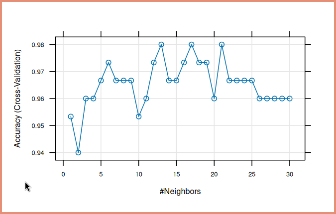

\input{$UNI/.templates/parts/header.tex}
Мета роботи – навчитися класифікувати дані за допомогою методу k-найближчих
сусідів. Вивчити теоретичні основи методу та для реалізації аналізу даних навчитися
використовувати програму WEKA та Excel.

# Завдання

1. Для індивідуального завдання вирішите задачу класифікації з використанням
   методу найближчих сусідів двома способами – спершу за допомогою Weka, потім
   – за допомогою Excel. Вирішіть, скільки сусідів потрібно для вашої моделі.
   Вам буде потрібно декілька експериментальних спроб для того, щоб визначити,
   яка кількість сусідів є оптимальною. Крім того, якщо ви використовуєте
   модель для отримання бінарного результату (0 або 1), то очевидно, що вам
   буде потрібна парна кількість сусідів.
2. Змінюючи параметри налаштування алгоритму, спробуйте досягти найкращої
   якості навчання класифікаторів.
3. Порівняйте результати отримані в обидвох системах.
4. У звіті надайте результати роботи кожного алгоритму, його налаштування, а
   також результати порівняння.

# Хід роботи
## R

Я одразу використав R для визначення найбільш оптимального значення K.
Ось скрипт, який я написав для цього та ще для, власне, класифікації.
Графік значень k зображений на рис. 1.

\inputminted{r}{scr.r}

{width=13cm}

Ось результат його роботи:

\inputminted{r}{output}

## Weka

Але у Weka я отримав гірші результати класифікації за цих значень, і виявив, що тут
краще працює значення 2.

\footnotesize

```r
=== Run information ===

Scheme:       weka.classifiers.lazy.IBk -K 2 -W 0 -A "weka.core.neighboursearch.LinearNNSearch -A \"weka.core.EuclideanDistance -R first-last\""
Relation:     iris
Instances:    150
Attributes:   5
              sepallength
              sepalwidth
              petallength
              petalwidth
              class
Test mode:    evaluate on training data

=== Classifier model (full training set) ===

IB1 instance-based classifier
using 2 nearest neighbour(s) for classification


Time taken to build model: 0 seconds

=== Evaluation on training set ===

Time taken to test model on training data: 0 seconds

=== Summary ===

Correctly Classified Instances         146               97.3333 %
Incorrectly Classified Instances         4                2.6667 %
Kappa statistic                          0.96
Mean absolute error                      0.0198
Root mean squared error                  0.0883
Relative absolute error                  4.4445 %
Root relative squared error             18.7331 %
Total Number of Instances              150

=== Detailed Accuracy By Class ===

                 TP Rate  FP Rate  Precision  Recall   F-Measure  MCC      ROC Area  PRC Area  Class
                 1.000    0.000    1.000      1.000    1.000      1.000    1.000     1.000     Iris-setosa
                 1.000    0.040    0.926      1.000    0.962      0.943    0.999     0.996     Iris-versicolor
                 0.920    0.000    1.000      0.920    0.958      0.941    0.999     0.995     Iris-virginica
Weighted Avg.    0.973    0.013    0.975      0.973    0.973      0.961    0.999     0.997

=== Confusion Matrix ===

  a  b  c   <-- classified as
 50  0  0 |  a = Iris-setosa
  0 50  0 |  b = Iris-versicolor
  0  4 46 |  c = Iris-virginica
```

\normalsize

А використавши метод обчислення відстані FilteredDistance, я досягнув 100% точності класифікації.
Але ця точність виявилася оманливою --- виконавши аналіз із розділенням даних на тренувальну та тестову групу,
я виявив, що звичайна Евклідова відстань значно краще працює.

\footnotesize

```r
=== Run information ===

Scheme:       weka.classifiers.lazy.IBk -K 2 -W 0 -X -A "weka.core.neighboursearch.LinearNNSearch -A \"weka.core.FilteredDistance -R first-last -F \\\"weka.filters.unsupervised.attribute.RandomProjection -N 10 -R 42 -D Sparse1\\\" -D \\\"weka.core.EuclideanDistance -R first-last\\\"\""
Relation:     iris
Instances:    150
Attributes:   5
              sepallength
              sepalwidth
              petallength
              petalwidth
              class
Test mode:    evaluate on training data

=== Classifier model (full training set) ===

IB1 instance-based classifier
using 1 nearest neighbour(s) for classification


Time taken to build model: 0.01 seconds

=== Evaluation on training set ===

Time taken to test model on training data: 0.28 seconds

=== Summary ===

Correctly Classified Instances         150              100      %
Incorrectly Classified Instances         0                0      %
Kappa statistic                          1
Mean absolute error                      0.0085
Root mean squared error                  0.0091
Relative absolute error                  1.9219 %
Root relative squared error              1.9335 %
Total Number of Instances              150

=== Detailed Accuracy By Class ===

                 TP Rate  FP Rate  Precision  Recall   F-Measure  MCC      ROC Area  PRC Area  Class
                 1.000    0.000    1.000      1.000    1.000      1.000    1.000     1.000     Iris-setosa
                 1.000    0.000    1.000      1.000    1.000      1.000    1.000     1.000     Iris-versicolor
                 1.000    0.000    1.000      1.000    1.000      1.000    1.000     1.000     Iris-virginica
Weighted Avg.    1.000    0.000    1.000      1.000    1.000      1.000    1.000     1.000

=== Confusion Matrix ===

  a  b  c   <-- classified as
 50  0  0 |  a = Iris-setosa
  0 50  0 |  b = Iris-versicolor
  0  0 50 |  c = Iris-virginica
```

\normalsize

# Висновок

В R я дуже зручно та швидко виконав класифікацію та знайшов оптимальні значення k.
Але у Weka я отримав гірші результати класифікації за цих значень, і виявив, що тут
краще працює значення 2.
А використавши метод обчислення відстані FilteredDistance, я досягнув 100% точності класифікації.
Але ця точність виявилася оманливою --- виконавши аналіз із розділенням даних на тренувальну та тестову групу,
я виявив, що звичайна Евклідова відстань значно краще працює.

# Відповіді на контрольні запитання

1. **Поясніть роботу методу найближчих сусідів.**
   Метод найближчих сусідів (k-NN) - це алгоритм машинного навчання для
   класифікації та регресії, який використовується для припущення класу або
   значення вихідної змінної для нових вхідних даних. Він працює наступним
   чином: для вхідного прикладу визначається k найближчих до нього прикладів з
   навчального набору даних, а потім для класифікації вхідного прикладу
   використовується більшість класів цих найближчих сусідів (у випадку
   класифікації) або середнє значення їх вихідних змінних (у випадку регресії).

2. **Чому значення k має значення?**
   Значення k в методі найближчих сусідів визначає кількість найближчих
   сусідів, які використовуються для класифікації або припущення значення
   вихідної змінної нового вхідного прикладу. Вибір правильного значення k є
   важливим, оскільки він може вплинути на точність моделі.

3. **Як вибрати оптимальний фактор k?**
   Оптимальне значення k можна вибрати шляхом перехресної перевірки
   (cross-validation) або за допомогою методу ліктя
   (elbow method). У першому випадку модель оцінюється на даних, які не
   використовуються для навчання, для різних значень k, і обирається те
   значення, яке має найкращу точність. У другому випадку шукається значення k,
   при якому зменшуються помилки при класифікації.

4. **Як оцінити якість побудованої моделі класифікації?**
   Якість побудованої моделі класифікації можна оцінити за допомогою метрик,
   таких як точність (accuracy), статистика Каппи.

5. **Де застосовується метод найближчих сусідів?**
   Метод найближчих сусідів застосовується в багатьох галузях, включаючи
   класифікацію текстів, розпізнавання образів, рекомендаційні системи, медичні
   діагностики та біоінформатику.

6. **Плюси та мінуси методу.**
   Плюси методу найближчих сусідів включають простоту реалізації, можливість
   застосування до даних без вимог до їх розподілу, а також високу ефективність
   для невеликих обсягів даних. Мінуси включають велику обчислювальну
   складність для великих обсягів даних, вразливість до шуму та аномалій, а
   також важкість інтерпретації результатів.

7. **У яких випадках необхідно здійснювати нормалізацію даних.**
   Нормалізація даних часто є необхідною, коли масштаби різних функцій вхідних
   даних суттєво відрізняються. Наприклад, якщо одна функція має діапазон
   значень від 0 до 1, а інша - від 1 до 1000, то вона буде домінувати при
   визначенні відстаней між точками, що може спотворити результати методу
   найближчих сусідів.

8. **Наскільки метод чутливий до аномалій?**
   Метод найближчих сусідів досить чутливий до аномалій, оскільки він
   використовує простий механізм визначення класу на основі найближчих сусідів.
   Один аномальний приклад може значно вплинути на результати класифікації,
   зокрема, якщо він знаходиться близько до вхідного прикладу.
