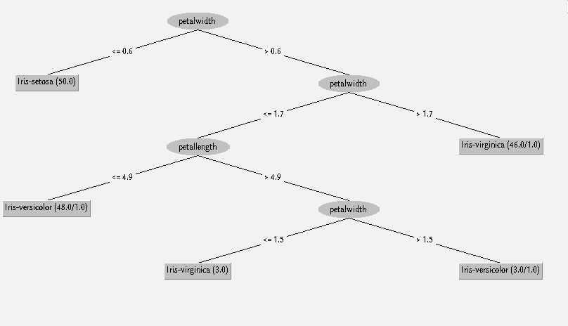

\input{$UNI/.templates/parts/header.tex}
Ознайомитися та отримати навички побудови моделей класифікації за допомогою Data
Mining GUI бібліотеки Weka та Excel. На практиці вивчити роботу методу побудови дерев
рішень, навчитися інтерпретувати результати роботи класифікаторів.

# Завдання

1. Для індивідуального завдання вирішіть задачу класифікації за допомогою наступного
алгоритму:
• метод побудови дерев рішень С4.5 (trees.J48).
2. Змінюючи параметри налаштування алгоритму, спробуйте досягти найвищої якості
навчання класифікатора.
3. Для цього ж датасету побудуйте дерево рішень у  Excel.
4. Порівняйте отримані результати отримані у різних системах.
5. У звіті надайте результати роботи роботи алгоритму, його налаштування.

# Хід роботи
## Weka

\footnotesize

```r
=== Run information ===

Scheme:       weka.classifiers.trees.J48 -C 0.25 -M 2
Relation:     iris
Instances:    150
Attributes:   5
              sepallength
              sepalwidth
              petallength
              petalwidth
              class
Test mode:    split 80.0% train, remainder test

=== Classifier model (full training set) ===

J48 pruned tree
------------------

petalwidth <= 0.6: Iris-setosa (50.0)
petalwidth > 0.6
|   petalwidth <= 1.7
|   |   petallength <= 4.9: Iris-versicolor (48.0/1.0)
|   |   petallength > 4.9
|   |   |   petalwidth <= 1.5: Iris-virginica (3.0)
|   |   |   petalwidth > 1.5: Iris-versicolor (3.0/1.0)
|   petalwidth > 1.7: Iris-virginica (46.0/1.0)

Number of Leaves  : 	5

Size of the tree : 	9


Time taken to build model: 0.02 seconds

=== Evaluation on test split ===

Time taken to test model on test split: 0 seconds

=== Summary ===

Correctly Classified Instances          30              100      %
Incorrectly Classified Instances         0                0      %
Kappa statistic                          1
Mean absolute error                      0.0105
Root mean squared error                  0.0166
Relative absolute error                  2.3665 %
Root relative squared error              3.5274 %
Total Number of Instances               30

=== Detailed Accuracy By Class ===

                 TP Rate  FP Rate  Precision  Recall   F-Measure  MCC      ROC Area  PRC Area  Class
                 1.000    0.000    1.000      1.000    1.000      1.000    1.000     1.000     Iris-setosa
                 1.000    0.000    1.000      1.000    1.000      1.000    1.000     1.000     Iris-versicolor
                 1.000    0.000    1.000      1.000    1.000      1.000    1.000     1.000     Iris-virginica
Weighted Avg.    1.000    0.000    1.000      1.000    1.000      1.000    1.000     1.000

=== Confusion Matrix ===

  a  b  c   <-- classified as
 11  0  0 |  a = Iris-setosa
  0 10  0 |  b = Iris-versicolor
  0  0  9 |  c = Iris-virginica
```

\normalsize

Усі іриси правильно класифіковані.



## R

Наступний скрипт будує дерево рішень, зображене на рис. 2:

\inputminted{r}{scriptus.r}

{width=13cm}

# Висновок

Я побудував дерева рішень у R та Weka. Вони виявилися різними, хоча обоє
правильно класифікують іриси. В R мені більше подобається візуалізація.

# Відповіді на контрольні запитання

1. **Що таке дерева рішень в машинному навчанні?**
Дерева рішень - це графічний метод представлення прийняття рішень у вигляді
   дерева, де кожен вузол представляє прийняття рішення, а кожне ребро -
   можливі результати цього рішення.

2. **Які основні етапи побудови дерева рішень?**
Основні етапи побудови дерева рішень:
   - Вибір атрибута для розділення даних.
   - Розділення даних на підмножини на основі значення обраного атрибута.
   - Рекурсивне застосування попередніх двох кроків до кожної підмножини.
   - Зупинка рекурсії, коли виконується певна умова зупинки або коли всі
	 елементи в підмножині належать до одного класу.

3. **Які алгоритми використовуються для побудови дерев рішень?**
Для побудови дерев рішень використовуються різні алгоритми, такі як CART
(Classification and Regression Trees), ID3 (Iterative Dichotomiser 3), C4.5,
CHAID (Chi-squared Automatic Interaction Detector) тощо.

4. **Як визначити критерій поділу при побудові дерева рішень?**
Критерій поділу при побудові дерева рішень визначається на основі міри
неоднорідності (наприклад, ентропія або індекс Джині), що допомагає вибрати
атрибут, за яким розділяються дані.

5. **Що таке глибина дерева рішень і чому вона важлива?**
Глибина дерева рішень визначається кількістю рівнів у дереві. Вона важлива,
оскільки впливає на складність моделі та може вплинути на її здатність до
узагальнення.

6. **Що таке обрізка дерева і навіщо він використовується?**
Обрізка дерева - це процес видалення частини дерева з метою зменшення
перенавчання та покращення узагальнюючої здатності моделі.

7. **Як використовується дерево рішень для класифікації?**
Дерево рішень використовується для класифікації шляхом просування даних
через рішення, які представлені у вигляді дерева, та вибору відповідного шляху
згідно з значеннями атрибутів.

8. **Що є перевагами і недоліками використання дерев рішень у порівнянні з іншими
алгоритмами машинного навчання?**
Переваги використання дерев рішень включають простоту інтерпретації,
здатність робити вирішальні висновки, навіть якщо вхідні дані мають складну
структуру. Недоліки можуть включати недостатню точність порівняно з іншими
методами та схильність до перенавчання.

9. **Як оцінюється якість класифікації методом дерев рішень?**
Якість класифікації методом дерев рішень може оцінюватися за допомогою
метрик, таких як точність, чутливість, специфічність, F1-показник тощо.

10. **Як впливає кількість точок даних на якість побудови дерева рішень?**
Кількість точок даних може впливати на якість побудови дерева рішень, але
це не єдиний фактор. Важливо також правильно підібрати критерії поділу та інші
параметри побудови моделі.

11. **Чому важливо враховувати перенавчання при використанні дерев рішень?**
Перенавчання - це коли модель добре відтворює тренувальні дані, але погано
працює на нових даних. Це важливо враховувати при використанні дерев рішень,
оскільки вони схильні до перенавчання, особливо при великій глибині.

12. **Яка роль відіграє вибір різних атрибутів при побудові дерева рішень?**
Вибір різних атрибутів при побудові дерева рішень визначає, за якими
ознаками дані будуть розділятися на вузли дерева. Це важливо для правильного
визначення правил класифікації.

13. **Що таке ентропія?**
Ентропія - це міра невизначеності у системі. В контексті дерев рішень,
ентропія використовується для визначення неоднорідності підмножин даних.

14. **Що таке індекс Джині? Як він використовується в деревах рішень?**
Індекс Джині - це міра неоднорідності, яка використовується для вибору
критерію поділу при побудові дерев рішень. Він вимірює ймовірність того, що
випадково вибраний елемент буде невірно класифікований.
