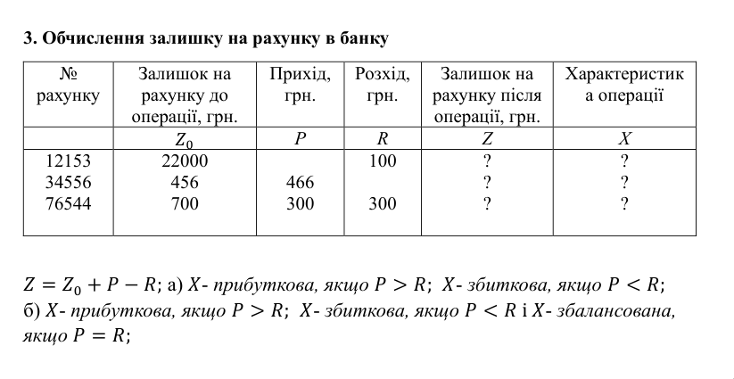
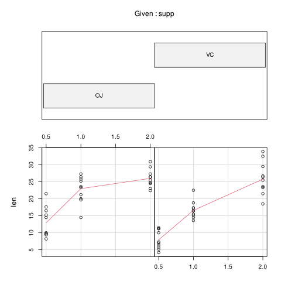

\input{$UNI/.templates/parts/header.tex}
Ознайомитися з основними інструментами MS Excel; навчитися працювати з різними
форматами даних; вводити та редагувати данні на робочих листах; складати
формули тощо.

# Індивідуальне завдання

## Завдання 1 – Сортування та оброблення списків

У вас є зразок двох таблиць та статистичні збірники з даними, на основі яких ви
можете створити свої таблиці.

1. Детально вивчіть зразок таблиці. Зверніть увагу на те, які дані приведені,
   як вони організовані та які висновки можна зробити на підставі цієї таблиці.
2. Виберіть один зі статистичних збірників, який вам найбільш цікавий.
   Перегляньте доступні дані та визначте, які з них було б корисно представити
   за допомогою таблиці.
3. Створіть свою власну таблицю на основі ваших даних. Пам'ятайте про те, що
   таблиця повинна бути логічною, корисною та зрозумілою. Ви також можете
   додатково групувати дані чи використовувати діаграми, якщо це потрібно.
4. Проаналізуйте отриману зведену таблицю - що ви можете сказати про дані на
   основі вашої таблиці? Які висновки можна отримати?
5. Виконайте із своєю таблицею завдання, які наведені для таблиці – прикладу.

### Приклади виконання
#### 1

1. Створіть у MS Excel файл з ім'ям Прізвище_варіант_завдання і збережіть його
   в папці Мої документи.
2. Перейменуйте Лист1 на Молочна продукція та створіть наступну таблицю додавши
   ще 10-15 рядків:
3. Заповніть порожні комірки із знаком ?.
4. Зробіть копію аркуша Молочна продукція та перейменуйте його на Сортування1.
5. На аркуші Сортування1 відсортуйте дані таблиці за стовпцем Всього в порядку
   зростання.
6. Зробіть копію аркуша Молочна продукція та перейменуйте його на Сортування2.
7. На аркуші Сортування2 відсортуйте дані таблиці за стовпцем Продукція в
   алфавітному порядку, а у разі однакової продукції – за стовпцем Країни за
   алфавітом.
8. Зробіть копію аркуша Молочна продукція та перейменуйте його на Фільтр1.
9. На аркуші Фільтр1 за допомогою Автофільтра залиште в таблиці дані з молока з
   сумарним експортом продукції більше 1000 тис. т, але менше 2000 тис. т.
10. Зробіть копію аркуша Молочна продукція та перейменуйте його на Фільтр2.
11. На аркуші Фільтр2 за допомогою розширеного фільтра залиште в таблиці дані
    щодо експорту сиру з країн ЄС та експорту олії за 2009 з кількістю більше
    100 тис. т.

#### 2

1. Створіть у MS Excel файл з ім'ям `Прізвище_варіант` і збережіть його в папці
   Мої документи.
2. Перейменуйте Лист1 на Автотранспорт та створіть наступну таблицю:
3. Заповніть порожні комірки із знаком ?.
4. Зробіть копію аркуша Автотранспорт та перейменуйте його на Сортування1.
5. На аркуші Сортування1 відсортуйте дані таблиці за стовпцем Разом за
   зростанням.
6. Зробіть копію аркуша Автотранспорт та перейменуйте його на Сортування2.
7. На аркуші Сортування2 відсортуйте дані таблиці за зростанням стовпцем Рік, а
   у випадку однакового року – за стовпцем Вид транспорту за абеткою.
8. Зробіть копію аркуша Автотранспорт та перейменуйте його на Фільтр1.
9. На аркуші Фільтр1 за допомогою Автофільтра залишіть у таблиці дані щодо
   автомобільного транспорту з вантажообігом від 300 до 500 млн. `т*км`.
10. Зробіть копію аркуша Автотранспорт та перейменуйте його на Фільтр2.
11. На аркуші Фільтр2 за допомогою розширеного фільтра залиште в таблиці дані
    по 2012 р. з кількістю перевезених вантажів більше 3600 тис. т і повітряним
    транспортом з кількістю перевезених пасажирів менше 20 тис. осіб.

## Завдання 2



# Етапи розв'язку
## Завдання 1
### Огляд даних та графік

len --- довжина одонтобластів (клітин, відповідальних за
ріст зубів) у 60 морських свинок. Кожна тварина отримала одну з
доз --- dose --- вітаміну С (0,5, 1 і 2 мг/день) одним із
двох способів, через апельсиновий сік (OJ) або аскорбінову кислоту (VC).

Див. Таблицю \ref{pig}.

```r
> summary(ToothGrowth)
      len        supp         dose
 Min.   : 4.20   OJ:30   Min.   :0.500
 1st Qu.:13.07   VC:30   1st Qu.:0.500
 Median :19.25           Median :1.000
 Mean   :18.81           Mean   :1.167
 3rd Qu.:25.27           3rd Qu.:2.000
 Max.   :33.90           Max.   :2.000
```

```r
> require(graphics)
> png("out.png")
> coplot(len ~ dose | supp, data = ToothGrowth, panel = panel.smooth,
            xlab = "довжина проти дози, за типом добавки")
> dev.off()
```

{width=10cm}

Чим більша доза, тим більше ростуть зуби,
VC може дати більший приріст, але загалом
менш ефективна.

\clearpage

### Сортування за довжиною одонтобластів
```r
> library(dplyr)
> sorted_1 <- ToothGrowth %>% arrange(len)
> write.csv(sorted_1, "sorted_1.csv")
```

Див. Таблицю \ref{sorted_1}.

### Сортую за довжиною одонтобластів та дозою
Насправді можна не використовувати `arrange`, а ось так зручно посортувати одразу два стовпці:
```r
> sorted_1[
+ with(sorted_1, order(len, dose)),
+ ]
    len supp dose
1   4.2   VC  0.5
2   5.2   VC  0.5
3   5.8   VC  0.5
4   6.4   VC  0.5
5   7.0   VC  0.5
6   7.3   VC  0.5
7   8.2   OJ  0.5
8   9.4   OJ  0.5
9   9.7   OJ  0.5
10  9.7   OJ  0.5
11 10.0   VC  0.5
12 10.0   OJ  0.5
13 11.2   VC  0.5
14 11.2   VC  0.5
15 11.5   VC  0.5
16 13.6   VC  1.0
18 14.5   OJ  0.5
17 14.5   VC  1.0
```

Так само запишу це у новий датафрейм і файл:
```
> sorted_2 <- sorted_1[with(sorted_1, order(len, dose)),]
> write.csv(sorted_2, "sorted_2.csv")
```

Див. Таблицю \ref{sorted_2}.

### Фільтрування

Вибираю з `sorted_1` тільки ті заміри, де довжина одонтобластів вища за середню:
```r
> filtered_1 <- sorted_1 %>% filter(len > mean(len))
> head(filtered_1)

   len supp dose
1 19.7   OJ  1.0
2 20.0   OJ  1.0
3 21.2   OJ  1.0
4 21.5   VC  2.0
5 21.5   OJ  0.5
6 22.4   OJ  2.0
```

Вибираю з `sorted_2` тільки ті заміри, де довжина одонтобластів вища за середню та використовували аскорбінову кислоту:
```r
> filtered_2 <- sorted_2 %>% filter(len > mean(len), supp == "VC")
> head(filtered_2)

   len supp dose
1 21.5   VC    2
2 22.5   VC    1
3 23.3   VC    2
4 23.6   VC    2
5 25.5   VC    2
6 26.4   VC    2
```

## Завдання 2

### Підготовка даних
```r
> bank$z <- bank$z_0 + bank$p - bank$r
> bank
     id  z_0   p   r    z
1 12153 2200   0 100 2100
2 34556  456 466   0  922
3 76544  700 300 300  700
> bank_a <- bank
> bank_b <- bank
```

### Варіант а)
```r
> bank_a$x <- ifelse (bank$p > bank$r, "Прибуткова", "Збиткова")
> bank_a
     id  z_0   p   r    z          x
1 12153 2200   0 100 2100   Збиткова
2 34556  456 466   0  922 Прибуткова
3 76544  700 300 300  700   Збиткова
```

### Варіант б)
```r
> bank_b$x <- ifelse (bank$p > bank$r, "Прибуткова", ifelse(bank$p == bank$r, "Збалансована", "Збиткова"))
> bank_b
     id  z_0   p   r    z            x
1 12153 2200   0 100 2100     Збиткова
2 34556  456 466   0  922   Прибуткова
3 76544  700 300 300  700 Збалансована
```

# Висновок

Я навчився сортувати дані та використовувати оператори умовного переходу, будувати порівняльні графіки.
Дослідив набір даних залежності росту зубів морських свинок від дози та типу постачання вітаміну C.
Висновки щодо даних писав у звіті по ходу виконання роботи, тому не дублюю тут.

# Таблиці

\begin{table}[h]
\tiny
\subfloat[оригінальні дані]{
	\csvautotabular{pig.csv}
	\label{pig}
}
\quad
\subfloat[sorted_1]{
	\csvautotabular{sorted_1.csv}
	\label{sorted_1}
}
\quad
\subfloat[sorted_2]{
	\csvautotabular{sorted_2.csv}
	\label{sorted_2}
}
\caption{Таблиці}
\end{table}
