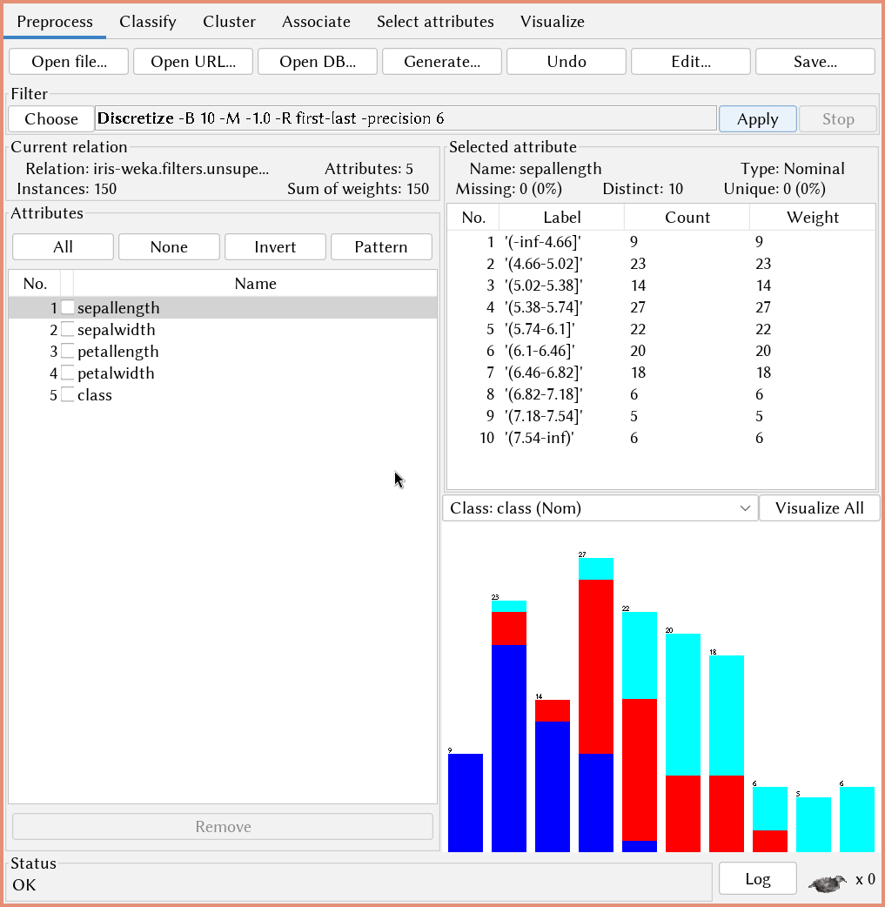
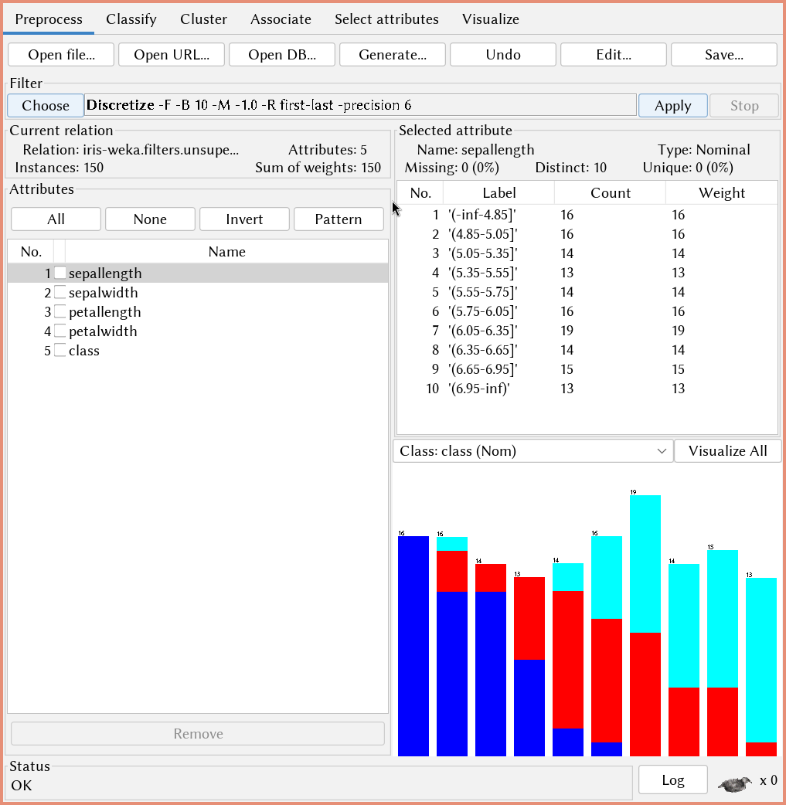
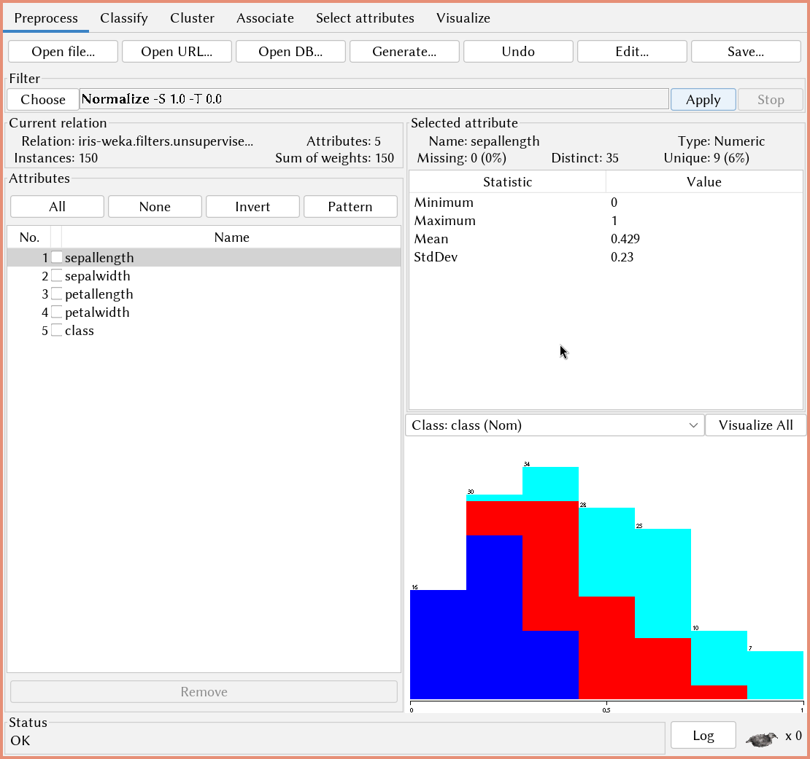
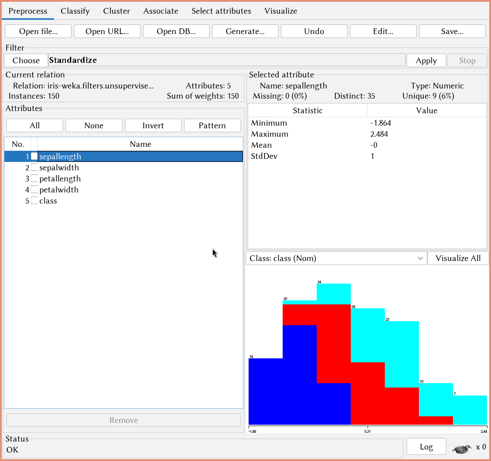
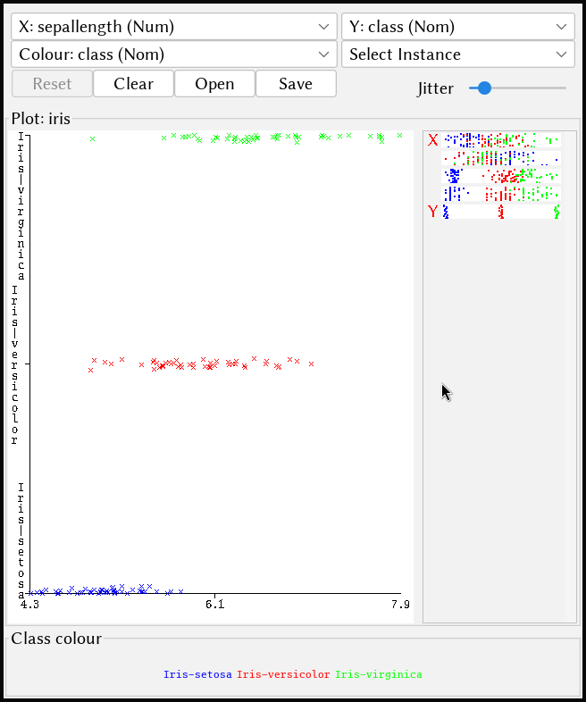

\input{$UNI/.templates/parts/header.tex}
ознайомлення студентів з системою WEKA, яка є потужним
інструментом для обробки і аналізу даних. Студенти повинні навчитися використовувати
основні функції цієї системи, зокрема, завантажувати, обробляти і візуалізувати набори
даних. Додатково, метою є вміння проводити попередній аналіз даних і коректно
вибирати методи їх обробки в майбутньому. Студенти мають розвинути вміння
використовувати WEKA для практичного застосування у процесі вивчення курсу та
роботи над індивідуальними завданнями. Результатом виконання роботи є підготований
набір даних до подальшого аналізу та машинного навчання.

# Хід виконання роботи

1. Визначте та охарактеризуйте набір даних
	a) Ви можете вибрати набір даних зі списку загальнодоступних наборів
	   даних у сховищі машинного навчання UCI або в розділі наборів даних
	   на Weka (посилання подані нижче). Ви також можете самостійно
	   досліджувати набори даних з інших джерел.

	*Я обрав Iris зі стандартних наборів у Weka. У нім зібрані дані про розміри листя та пелюсток ірисів.*

	b) Використовуючи вкладки попередньої обробки даних та візуалізації,
	   проведіть детальний опис вибірки даних. Вкажіть:
		- яке практичне завдання вирішується; **Дослідження відмінностей між сортами ірисів.**
		- скільки примірників у вибірці; **150**
		- атрибути, які характеризують екземпляри вибірки, їхні типи та
		  опис;
			1. sepal length in cm (довжина чашолистків у см)
			2. sepal width in cm (ширина чашолистків у см)
			3. petal length in cm (довжина пелюсток у см)
			4. petal width in cm (ширина пелюсток у см)
			5. class --- клас:
				- Iris Setosa
				- Iris Versicolour
				- Iris Virginica
		- чи є екземпляри з відсутніми значеннями, чи є викиди у даних; **Немає.**
		- який атрибут є цільовим, які значення він приймає, скільки
		  екземплярів кожного класу у вибірці. **50 екземплярів кожного класу.**

2. Дослідження та попередня обробка даних
	a) Виберіть один атрибут та обговоріть відповідні міри центральної
	   тенденції та дисперсії для атрибуту. Використовуйте підмножину
	   значень атрибутів (на власний вибір) із набору даних і обчисліть
	   середнє, медіану, режим **(моду?)**, діапазон, квартилі та дисперсію для
	   атрибута.

	Імпортую файл в R, хоча там є такий самий набір даних за замовчуванням.
	Обчислюю медіану (median), середнє (mean), 1 та 3 квартилі (1st Qu., 3rd Qu.):


	```r
> library(foreign)
> iris <- read.arff("/usr/share/weka/data/iris.arff")
> summary(iris$petalwidth)
   Min. 1st Qu.  Median    Mean 3rd Qu.    Max.
  0.100   0.300   1.300   1.199   1.800   2.500
	```

	Діапазон

	```r
> max(iris$petalwidth) - min(iris$petalwidth)
[1] 2.4
 	```

	Дисперсія обчислюється зручною функцією `var`:

	```r
> var(iris$petalwidth)
[1] 0.5824143
	```

	b) Обговоріть питання якості даних набору даних. Чи існують
	   (потенційні) проблеми з певними атрибутами даних? Які відповіді на
	   ці питання якості?

	Проблем з атрибутами не бачу.

	{width=10cm}

	c) Обговоріть кілька методів попередньої обробки даних, які, ймовірно,
	   необхідні для набору даних. Наприклад, чи потрібне згладжування
	   даних або зменшення даних, і що було б відповідною технікою. **Не думаю, що тут потрібне згладжування чи зменшення.**
	   Виберіть один атрибут і використовуйте підмножину значень атрибутів,
	   щоб зробити наступне:
		1) розділіть їх на відповідну кількість сегментів з рівною
		   частотою, а також розділенням однакової ширини,
		2) використовуйте засоби згладжування за допомогою bin, щоб
		   згладити дані на основі розділення,

		Розділення відображені на рис. 2 та 3.

		{width=10cm}

		{width=10cm}

		3) нормалізуйте атрибут на основі мінімальної нормалізації та
		   нормалізації z-оцінки. Прокоментуйте, який метод ви бажаєте
		   використовувати для розділення, згладжування та нормалізації
		   для даного атрибута.

		Результати на рис. 4 та 5.

		{width=10cm}

		{width=10cm}

3. Дослідить можливості Weka
	a) Завантажте набір даних у Weka.
	b) Дослідить функції візуалізації та попередньої обробки
	   («візуалізувати», «попередню обробку» та «вибрати атрибути»),
	   використовуючи ваш набір даних. Обговоріть нову інформацію, яку ви
	   знайшли при візуалізації даних, випробуваних технік та отриманих
	   результатів.

	Див. рис. 6.

	{width=10cm}

# Висновок

З даних, що іриси Iris-virginica загалом найбільші, але Iris-setosa мають найширші чашолистки (найбільше -- 49 см, а в Iris-virginica --- 41).
Iris-versicolor за різними критеріями тримається стабільно між згаданими вище видами.

# Відповіді на контрольні запитання

1. Що таке інтелектуальний аналіз даних? **Це отримання корисної інформації з
   даних.**
2. Для чого використовується програма WEKA, які її можливості? **WEKA
   використовують для аналізу даних та машинного навчання.**
3. Яке призначення модулів Explorer, Knowledge Flow, Experimenter, Command-Line
   Interface? **Explorer --- для загального огляду та препроцесингу даних,
   Knowledge Flow --- для розробки процесів обробки даних та машинного
   навчання, Experimenter --- для експериментів, щоб порівняти різні алгоритми.
   Command-Line --- інтерфейс командного рядка.**
4. Опишіть формат arff файлу. **В ньому присутні значення, розділені комами, і
   атрибути. На відміну від csv, можна додавати різні метадані для зручності
   аналізу.**
5. Основні типи змінних, які використовуються у Інтелектуальному аналізі даних?
   **Кількісні та якісні.**
6. Призначення вкладок в модулі Explorer: Preprocess, Classify, Cluster,
   Associate, Select Attributes, Visualize. **Підготовка даних, класифікація,
   кластеризація, виявлення закономірностей та зв'язків, вибір атрибутів,
   візуалізація.**
7. Що таке генеральна сукупність і вибірка? Якими властивостями повинні
   володіти дані? Що таке репрезентативна вибірка? **Генеральна сукупність - це
   повний набір об'єктів, а вибірка - підмножина генеральної сукупності.
   Репрезентативна вибірка --- така, що відображає основні характеристики
   генеральної сукупності.**
8. Що розуміють під фільтрацією у Weka? В чому різниця між фільтрами атрибутів
   та фільтрами екземплярів? В чому різниця між unsupervised та supervised
   фільтрами? **Фільтрація у Weka - це процес зміни даних або їх аналізу для
   виявлення або видалення непотрібних елементів. Фільтри атрибутів впливають
   на атрибути, фільтри екземплярів - на дані. Unsupervised фільтри працюють
   без міток класу, а supervised - з мітками.**
9. Що таке якість даних? Яка мета підготовки даних до аналізу? Які завдання
   входять в підготовку даних? **Якість даних - це ступінь відповідності даних
   вимогам для конкретного аналізу. Підготовка даних має на меті зробити дані
   придатними для аналізу та може включати очищення, перетворення та відбір.**
10. Який атрибут даних називають цільовим? **Атрибут даних, який має бути
    передбачений або визначений у процесі аналізу.**
11. Що таке значимий та незначимий атрибут? Що таке відбір атрибутів?
    **Значимий атрибут має велике вплив на цільову змінну, незначимий -
    невеликий. Відбір атрибутів - це процес вибору найважливіших атрибутів для
    моделі.**
12. За допомогою яких фільтрів можна виконати наступні завдання підготовки
    даних:
	- перетворити тип атрибута; **NominalToBinary.**
	- нормалізувати значення числового атрибута; **Normalize.**
	- знайти та замінити відсутні значення в даних;
	  **ReplaceMissingValues.**
	- видалити всі екземпляри даних з заданим значенням атрибута;
	  **RemoveWithValues.**
	- створити новий атрибут; **AddExpression.**
	- виконати відбір атрибутів; **AttributeSelection.**
	- знайти викиди в даних; **InterquartileRange.**
	- створити підвибірку даних. **RandomSubset.**
