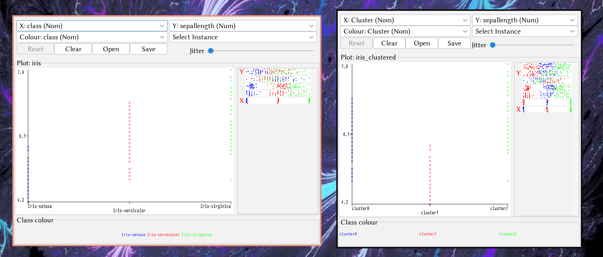
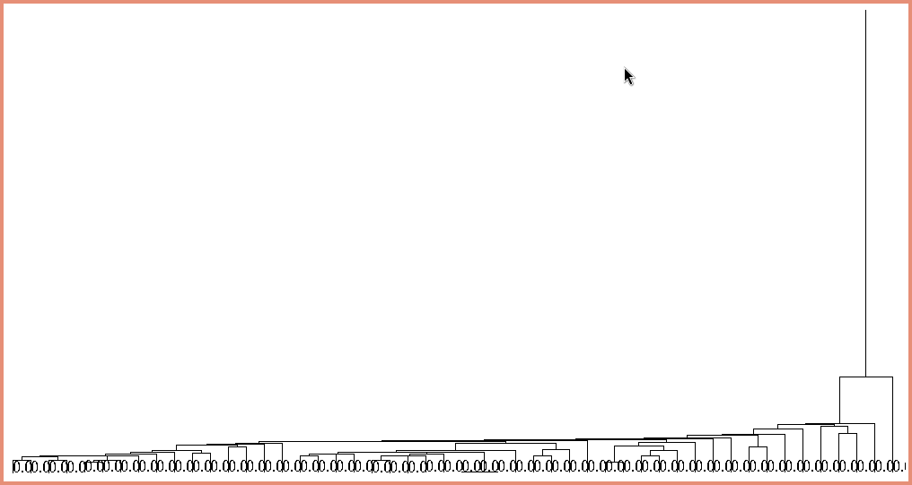
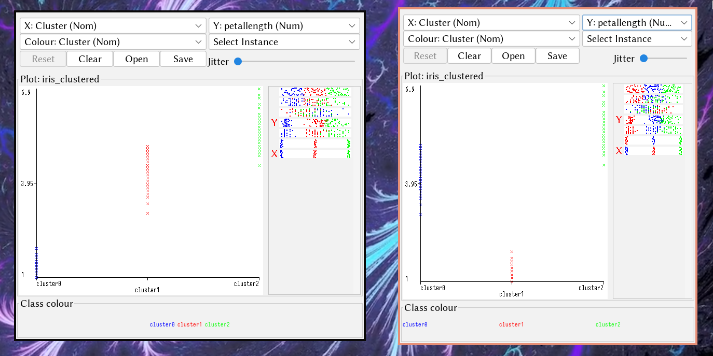
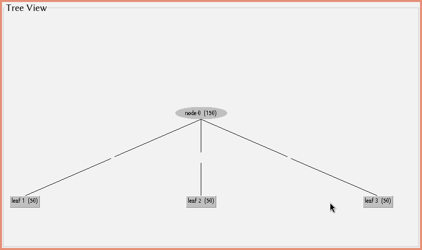

\input{$UNI/.templates/parts/header.tex}
Метою лабораторної роботи є вивчення та застосування трьох методів кластеризації в
середовищі
Weka:
поділяючого
методу
кластеризації
K-середніх
(SimpleKMeans),
ієрархічного методу кластеризації (HierarchicalClusterer) та ієрархічного методу кластеризації
COBWEB (COBWEB). Студенти мають набути навичок роботи з цими алгоритмами, вміти
прикладати їх для аналізу реальних даних та інтерпретувати отримані результати.

# Індивідуальне завдання

Ваше завдання для цієї лабораторної роботи - оцінити алгоритми кластеризації за
допомогою Weka.

1. Використайте набір даних, який ви вибрали для лабораторної №1. Якщо він не
   підходить для задач кластеризації, то виберіть інший, який підходить.
2. Визначте, як ви будете вимірювати якість сформованих кластерів.
3. Для свого набору даних застосуйте три алгоритми кластеризації та порівняйте
   їх результати, використовуючи ваші показники якості.
4. Напишіть короткий звіт:
	a) Опишіть набори даних та ваші показники якості.
	b) Опишіть налаштування експерименту, наприклад, як ви попередньо обробили
	   дані (якщо такі є), як вибрали параметри для вибраних алгоритмів (якщо
	   такі є) та чому.
	c) Представити результати експерименту. Вони не повинні бути простим
	   копіюванням та вставкою з вихідних даних Weka, а скоріше представленими
	   у вигляді таблиці або діаграми для зручності порівняння.
	d) Запропонуйте ідеї та зробіть висновки зі своїх експериментів. Наприклад,
	   чи різні методи кластеризації мають різницю щодо якості або
	   продуктивності для певних наборів даних, які ви вибрали? І чому? Як може
	   допомогти попередня обробка даних? Чи існують умови або загальні типи
	   наборів даних, які роблять певні алгоритми більш придатними, ніж інші?

# Етапи розв'язку

1. Використайте набір даних, який ви вибрали для лабораторної №1. Якщо він не
   підходить для задач кластеризації, то виберіть інший, який підходить.

2. Визначте, як ви будете вимірювати якість сформованих кластерів.

3. Для свого набору даних застосуйте три алгоритми кластеризації та порівняйте
   їх результати, використовуючи ваші показники якості.

4. Напишіть короткий звіт:
	a) Опишіть набори даних та ваші показники якості.
	b) Опишіть налаштування експерименту, наприклад, як ви попередньо обробили
	   дані (якщо такі є), як вибрали параметри для вибраних алгоритмів (якщо
	   такі є) та чому.
	c) Представити результати експерименту. Вони не повинні бути простим
	   копіюванням та вставкою з вихідних даних Weka, а скоріше представленими
	   у вигляді таблиці або діаграми для зручності порівняння.
	d) Запропонуйте ідеї та зробіть висновки зі своїх експериментів. Наприклад,
	   чи різні методи кластеризації мають різницю щодо якості або
	   продуктивності для певних наборів даних, які ви вибрали? І чому? Як може
	   допомогти попередня обробка даних? Чи існують умови або загальні типи
	   наборів даних, які роблять певні алгоритми більш придатними, ніж інші?

## SimpleKMeans

```
Number of iterations: 3
Within cluster sum of squared errors: 7.817456892309574

Initial starting points (random):

Cluster 0: 6.1,2.9,4.7,1.4,Iris-versicolor
Cluster 1: 6.2,2.9,4.3,1.3,Iris-versicolor
Cluster 2: 6.9,3.1,5.1,2.3,Iris-virginica

Missing values globally replaced with mean/mode

Final cluster centroids:
                                          Cluster#
Attribute                Full Data               0               1               2
                           (150.0)          (50.0)          (50.0)          (50.0)
==================================================================================
sepallength                 5.8433           5.936           5.006           6.588
sepalwidth                   3.054            2.77           3.418           2.974
petallength                 3.7587            4.26           1.464           5.552
petalwidth                  1.1987           1.326           0.244           2.026
class                  Iris-setosa Iris-versicolor     Iris-setosa  Iris-virginica


Time taken to build model (full training data) : 0.01 seconds

=== Model and evaluation on training set ===

Clustered Instances

0       50 ( 33%)
1       50 ( 33%)
2       50 ( 33%)

```



## HierarchicalClusterer

```
=== Run information ===

Scheme:       weka.clusterers.HierarchicalClusterer -N 3 -L SINGLE -P -A "weka.core.EuclideanDistance -R first-last"
Relation:     iris
Instances:    150
Attributes:   5
              sepallength
              sepalwidth
              petallength
              petalwidth
              class
Test mode:    evaluate on training data


=== Clustering model (full training set) ===

Cluster 0
(((((((((((((((((((((0.0:0.03254,0.0:0.03254):0.00913,(0.0:0.03254,0.0:0.03254):0.00913):0.00332,((0.0:0.02778,0.0:0.02778):0.00476,0.0:0.03254):0.01244):0,0.0:0.04498):0.0051,0.0:0.05008):0.00364,0.0:0.05371):0.00437,(0.0:0.05085,0.0:0.05085):0.00724):0.01535,(0.0:0.06731,0.0:0.06731):0.00612):0.00188,0.0:0.07531):0.00196,0.0:0.07728):0.00536,((((((0.0:0.04383,0.0:0.04383):0.00625,0.0:0.05008):0,0.0:0.05008):0.00279,(((((0.0:0.03254,0.0:0.03254):0.01129,0.0:0.04383):0.00116,0.0:0.04498):0.0051,0.0:0.05008):0.00279,((0.0:0,0.0:0):0,0.0:0):0.05287):0):0.00522,0.0:0.05808):0.01919,((0.0:0.04498,0.0:0.04498):0.01549,0.0:0.06047):0.0168):0.00536):0.00165,0.0:0.08429):0.00356,(((0.0:0.02778,0.0:0.02778):0.04371,((0.0:0.04498,0.0:0.04498):0.01394,0.0:0.05893):0.01256):0.00809,0.0:0.07958):0.00826):0.00212,0.0:0.08996):0.00321,0.0:0.09317):0.00598,(0.0:0.0678,0.0:0.0678):0.03135):0.00292,0.0:0.10206):0.01316,0.0:0.11523):0.01375,(0.0:0.12263,(0.0:0.10346,0.0:0.10346):0.01917):0.00634):0.00241,0.0:0.13139):0.12414,0.0:0.25553)

Cluster 1
(((((((((((((((((1.0:0.07344,(((1.0:0.06508,1.0:0.06508):0.00066,(1.0:0.05008,1.0:0.05008):0.01566):0.00224,1.0:0.06798):0.00546):0.00188,(1.0:0.07137,(1.0:0.05556,1.0:0.05556):0.01581):0.00395):0.00733,(1.0:0.07137,((1.0:0.04498,1.0:0.04498):0.01549,1.0:0.06047):0.01089):0.01127):0.00515,1.0:0.08779):0.00538,1.0:0.09317):0.00405,1.0:0.09722):0.0004,(1.0:0.05556,1.0:0.05556):0.04207):0.00152,(1.0:0.07344,1.0:0.07344):0.02571):0,1.0:0.09914):0.00432,(((((1.0:0.08333,1.0:0.08333):0.00613,((((1.0:0.06574,((1.0:0.05287,1.0:0.05287):0,(1.0:0.05287,(1.0:0.04498,1.0:0.04498):0.00789):0):0.01287):0.0077,(1.0:0.04498,1.0:0.04498):0.02845):0,1.0:0.07344):0.0093,(1.0:0.05287,(1.0:0.04498,1.0:0.04498):0.00789):0.02987):0.00672):0.0005,1.0:0.08996):0.00406,1.0:0.09402):0.00041,1.0:0.09443):0.00902):0.00268,1.0:0.10614):0.02,1.0:0.12614):0.00518,1.0:0.13132):0.0066,(1.0:0.12951,1.0:0.12951):0.00841):0.00697,(1.0:0.09869,1.0:0.09869):0.0462):0.01518,(((1.0:0.05008,1.0:0.05008):0.04555,1.0:0.09562):0.03389,1.0:0.12951):0.03056):0.00969,1.0:0.16976)

Cluster 2
((((((((((((((2.0:0.08983,(2.0:0.06047,2.0:0.06047):0.02935):0.01175,2.0:0.10158):0.01245,(2.0:0.10743,((((2.0:0.07148,(2.0:0.05008,2.0:0.05008):0.02141):0.02614,(2.0:0.08504,2.0:0.08504):0.01258):0.00852,(((2.0:0.05287,2.0:0.05287):0.04475,((((2.0:0.04383,2.0:0.04383):0.03881,2.0:0.08264):0.00719,(2.0:0.07148,2.0:0.07148):0.01834):0.00487,2.0:0.0947):0.00292):0.00534,2.0:0.10296):0.00318):0,((2.0:0.09415,(2.0:0.04167,2.0:0.04167):0.05249):0.01199,(((2.0:0.08429,(2.0:0.05287,2.0:0.05287):0.03142):0.00518,((2.0:0.03254,2.0:0.03254):0.0254,2.0:0.05794):0.03152):0.00524,2.0:0.0947):0.01144):0):0.00129):0.0066):0.02063,(((2.0:0,2.0:0):0.08779,2.0:0.08779):0.01089,2.0:0.09869):0.03597):0.00139,2.0:0.13605):0.0016,2.0:0.13765):0.01061,(((2.0:0.09869,2.0:0.09869):0.02337,2.0:0.12206):0.01586,((2.0:0.07344,2.0:0.07344):0.05554,(2.0:0.12263,2.0:0.12263):0.00634):0.00895):0.01034):0.00275,2.0:0.15102):0.00299,2.0:0.15401):0.02491,2.0:0.17892):0.01985,2.0:0.19878):0.00279,2.0:0.20156):0.02691,(2.0:0.11232,2.0:0.11232):0.11615):0.0402,2.0:0.26868)


Time taken to build model (full training data) : 0.04 seconds

=== Model and evaluation on training set ===

Clustered Instances

0       50 ( 33%)
1       50 ( 33%)
2       50 ( 33%)
```





## COBWEB

```
=== Run information ===

Scheme:       weka.clusterers.Cobweb -A 1.0 -C 0.005 -save-data -S 10
Relation:     iris
Instances:    150
Attributes:   5
              sepallength
              sepalwidth
              petallength
              petalwidth
              class
Test mode:    evaluate on training data


=== Clustering model (full training set) ===

Number of merges: 0
Number of splits: 0
Number of clusters: 4

node 0 [150]
|   leaf 1 [50]
node 0 [150]
|   leaf 2 [50]
node 0 [150]
|   leaf 3 [50]


Time taken to build model (full training data) : 0 seconds

=== Model and evaluation on training set ===

Clustered Instances

1       50 ( 33%)
2       50 ( 33%)
3       50 ( 33%)
```



# Висновок

Випробувавши різні алгоритми кластеризації на одному наборі даних---Iris---я
можу сказати, що дуже важливо правильно порівнювати й аналізувати результати їх роботи, адже з різними значеннями
параметрів вони будуть абсолютно по-різному виконувати кластеризацію.
В ході роботи я змінив їх так, щоб усі алгоритми адекватно кластеризували набір даних.

# Відповіді на контрольні запитання

1. **У чому полягає задача кластеризації? Наведіть практичний приклад?**
   Задача кластеризації полягає в групуванні схожих об'єктів разом у
   кластери так, щоб об'єкти всередині одного кластера були схожі між
   собою, а об'єкти з різних кластерів були якомога більш відмінні. Прикладом
   може бути кластеризація користувачів інтернет-магазину на основі їхніх
   покупок для подальшої персоналізації пропозицій товарів або послуг.

2. **Що таке навчання з учителем і без учителя? До якого типу належить задача кластеризації?**
 Навчання з учителем використовує мітки або класи для навчання моделі, тоді
   як навчання без учителя не використовує міток, а замість цього відповідає на
   питання про структуру даних. Задача кластеризації належить до навчання без
   учителя, оскільки не використовує міток для групування даних.

3. **Задача кластеризації є описовою або прогнозуючою і чому?**
 Задача кластеризації є описовою, оскільки мета полягає в описі структури
   даних шляхом групування схожих об'єктів у кластери, а не в прогнозуванні
   значень.

4. **Чим визначається «схожість» об'єктів при вирішенні задачі кластеризації?**
 "Схожість" об'єктів при вирішенні задачі кластеризації визначається на
   основі міри відстані або схожості між ними. Це може бути косинусна схожість,
   евклідова відстань, коефіцієнт кореляції тощо, залежно від конкретного
   методу.

5. **Що таке однорівнева і ієрархічна кластеризація?**
 Однорівнева кластеризація групує об'єкти без подальшого розбиття на
   підгрупи, тоді як ієрархічна кластеризація формує класи у вигляді дерева, де
   кожен вузол може мати декілька дочірніх кластерів.

6. **Що таке чітка і нечітка кластеризація?**
 Чітка кластеризація припускає, що кожен об'єкт належить лише одному
   кластеру, тоді як нечітка кластеризація дозволяє об'єктам належати до
   декількох кластерів з різною ступенем належності.

7. **Які є підходи до розрахунку відстані між кластерами?**
 Підходи до розрахунку відстані між кластерами включають в себе використання
   різних метрик відстані, таких як евклідова відстань, манхеттенська відстань,
   косинусна схожість тощо.

8. **Що таке алгомеративна і дівізимна ієрархічна кластеризація?**
 Агломеративна ієрархічна кластеризація починає з кожного об'єкта як окремого
   кластера і поступово об'єднує їх у все більші кластери. Дівізимна ієрархічна
   кластеризація починає з усіх об'єктів, які належать до одного кластера, і
   поступово розбиває їх на менші кластери.

9. **Опишіть один з розглянутих методів, що вирішують завдання кластеризації?**
 Один з методів кластеризації - k-середніх (k-means). Він розділяє набір
   даних на k кластерів, де к - це заздалегідь визначена кількість. Алгоритм
   спочатку випадково вибирає k об'єктів як центри кластерів, а потім
   ітеративно виконує два кроки: призначає кожен об'єкт найближчому центру
   кластера і оновлює центри кластерів, розраховуючи їхні нові значення на
   основі середнього значення об'єктів у кожному кластері.

10. **Як оцінити якість побудованої моделі для завдання кластеризації?**
 Якість побудованої моделі для завдання кластеризації можна оцінити за
	допомогою метрик, таких як коефіцієнт Сільгу, внутрішня і зовнішня метрики
	кластеризації, та візуалізації результатів.
