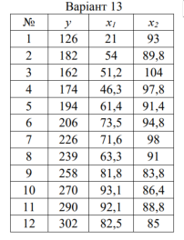
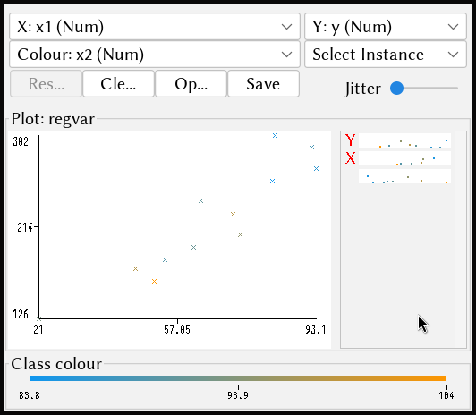

\input{$UNI/.templates/parts/header.tex}
Метою роботи є засвоєння методів графічного(побудова лінії регресії) та математичного
(розрахунок рівняння регресії та обчислення коефіцієнту регресії) проведення регресійного
аналізу даних із застосуванням Weka та табличного процесору MS Excel.

# Варіант завдання

{width=5cm}

# Хід роботи

1. Проведіть однофакторний регресійний аналіз у Weka.
	- Візьміть значення Y та X1 зі свого завдання.
	- Підготуйте дані у Excel і сформуйте після цього arff файл (теж збережіть
	  csv файл для наступних завдань).
	- Вирішіть задачу регресії за допомогою методу Linear regression.

	Використовую SimpleLinearRegression, бо залишив x2 у файлі:

	```
	=== Run information ===

	Scheme:       weka.classifiers.functions.SimpleLinearRegression
	Relation:     regvar
	Instances:    12
	Attributes:   3
              	y
              	x1
              	x2
	Test mode:    10-fold cross-validation

	=== Classifier model (full training set) ===

	Linear regression on x1

	2.4 * x1 + 60.84

	Predicting 0 if attribute value is missing.


	Time taken to build model: 0 seconds

	=== Cross-validation ===
	=== Summary ===

	Correlation coefficient                  0.8929
	Mean absolute error                     19.1386
	Root mean squared error                 23.7991
	Relative absolute error                 37.6856 %
	Root relative squared error             41.1398 %
	Total Number of Instances               12
	```

	- Встановіть форму залежності і напрямок зв'язку між змінними
	- Оцініть якість отриманої регресійної прямої;

	Видно, що залежність пряма, ось, до речі, функція: $y \approx 2.4 * x1 + 60.84$.
	Кореляція досить висока (0.9), майже лінійна.

	- Визначіть відхилення розрахункових даних від даних вхідного набору;

	```
	Mean absolute error                     19.1386
	Root mean squared error                 23.7991
	Relative absolute error                 37.6856 %
	Root relative squared error             41.1398 %
	```

	- Передбачте майбутні значення залежної змінної.

	Обчислимо $y$ для $x=200$:

	```r
	> 2.4 * 200 + 60.84
	[1] 540.84
	```

	- Графічно передставте отримані результати.

	{width=10cm}


2. Проведіть однофакторний регресійний аналіз в Excel
	- Візьміть підготовані дані із завдання 1.
	- Побудуйте лінію регресії.

	{width=13cm}

	- Сформуйте гіпотези щодо ваших даних.

	Графік (рис. 3) досить чітко показує лінійну залежність.

	- Розрахуйте регресійну статистику за допомогою інструменту регресії (1)
	  Data Analysis/Regression та (2) статистичних функції.

	```r
	> reg <- lm(y ~ x1, data = regvar)
	> summary(reg)

	Call:
	lm(formula = y ~ x1, data = regvar)

	Residuals:
    	Min      1Q  Median      3Q     Max
	-31.110 -14.097  -2.784   9.911  43.306

	Coefficients:
            	Estimate Std. Error t value Pr(>|t|)
	(Intercept)  60.8402    21.7619   2.796   0.0189 *
	x1            2.3982     0.3155   7.600 1.84e-05 ***
	---
	Signif. codes:  0 ‘***’ 0.001 ‘**’ 0.01 ‘*’ 0.05 ‘.’ 0.1 ‘ ’ 1

	Residual standard error: 21.93 on 10 degrees of freedom
	Multiple R-squared:  0.8524,    Adjusted R-squared:  0.8377
	F-statistic: 57.76 on 1 and 10 DF,  p-value: 1.84e-05
	```

	$x1$ пояснює 85% значень $y$ та сильна залежність підтверджується ще й низьким p-value.

	- Інтерпретуйте дисперсійний аналіз.
	- Оцініть параметрі і статистику.
	- Проаналізуйте залишки та прогнозовані значення.

	```r
	> fit <- aov(y ~ x1, data = regvar)
	> summary(fit)
            	Df Sum Sq Mean Sq F value   Pr(>F)
	x1           1  27778   27778   57.76 1.84e-05 ***
	Residuals   10   4809     481
	---
	Signif. codes:  0 ‘***’ 0.001 ‘**’ 0.01 ‘*’ 0.05 ‘.’ 0.1 ‘ ’ 1
	```

	* Значення  в  колонці  `Df`  таблиці  вказують  кількість  ступенів
	  свободи  для  кожної частини. Загальна кількість ступенів свободи
	  дорівнює числу спостережень мінус 1. У цьому випадку  загальна  кількість
	  ступенів  свободи  становить  11.  З  цих  1  ступінь  свободи
	  відноситься до регресії, а решта 10 ступенів свободи приписуються
	  випадковій мінливості.
	* Sum Sq --- сума квадратів відстаней передбачуваних значень від середнього, Mean Sq --- SS/Df.
	* Оскільки Pr < 0.05 та F-значення велике, залежність сильна

	---

	- Перевірте регресійну модель.

	```r
	> fit$coefficients
	(Intercept)          x1
  	60.840216    2.398229
	```

	Це значить, що $y = 2.398229 \cdot x1+60.84$, що ми вже бачили в регресійному аналізі

3. Проведіть багатофакторний регресійний аналіз у Weka та Excel.
	- Візьміть значення Y та X1, X2 зі свого завдання.
	- Підготуйте дані у Excel. Сформуйте arff файл для аналізу у Weka.
	- Побудуйте рівняння регресії.

	```
	y =

      	2.0599 * x1 +
     	-2.2362 * x2 +
    	288.8606

	Correlation coefficient                  0.894
	Mean absolute error                     22.2214
	Root mean squared error                 24.0937
	Relative absolute error                 43.756  %
	Root relative squared error             41.6491 %
	Total Number of Instances               12
	```

	```r
	> regdouble <- lm(y ~ x1+x2, data = regvar)
	> summary(regdouble)

	Call:
	lm(formula = y ~ x1 + x2, data = regvar)

	Residuals:
    	Min      1Q  Median      3Q     Max
	-22.268 -17.030   1.046   9.101  33.278

	Coefficients:
            	Estimate Std. Error t value Pr(>|t|)
	(Intercept) 288.8606   121.3677   2.380 0.041225 *
	x1            2.0599     0.3324   6.197 0.000159 ***
	x2           -2.2362     1.1750  -1.903 0.089436 .
	---
	Signif. codes:  0 ‘***’ 0.001 ‘**’ 0.01 ‘*’ 0.05 ‘.’ 0.1 ‘ ’ 1

	Residual standard error: 19.52 on 9 degrees of freedom
	Multiple R-squared:  0.8948,    Adjusted R-squared:  0.8714
	F-statistic: 38.27 on 2 and 9 DF,  p-value: 3.977e-05
	```

	Отже, запишу ще раз рівняння:
	$$
	y = 2.0599 * x1 -2.2362 * x2 + 288.8606
	$$

	- Опишіть отримані моделі і порівняйте їхню ефективність (точність
	  передбачення).

	Точність виявилась однаковою через однакову кількість знаків після коми,
	але це можна змінити, що у Weka, що в R. R видала трохи точніший коефіцієнт
	кореляції.

# Висновок

Я навчився регресійному аналізу в R та Weka та виконав поставлені завдання.
$x1$ та $y$ прямо залежні, $x2$ та $y$ --- обернено.

# Відповіді на контрольні запитання

1. **У чому полягає задача регресії? Наведіть практичний приклад?** Завданням
   регресійного аналізу є підбір математичних формул, які найкращим чином
   можуть описати заданий набір.
2. **Чим задача регресії схожа і чим відрізняється від задачі класифікації?**
   Замість категорії передбачається число.
3. **Що таке навчання з учителем і без учителя? До якого типу належить завдання
   регресії?** Навчання з учителем - це процес, при якому модель навчається на
   основі зв'язку між вхідними та вихідними даними. В навчанні без учителя
   модель намагається знайти структуру у невідомих даних без явних вихідних
   значень. Завдання регресії належить до навчання з учителем.
4. **Задача регресії є описовою або прогнозуючою і чому?** Задача регресії є як описовою, так і прогнозуючою. Вона описує зв'язок між
   незалежними та залежними змінними та може бути використана для прогнозування
   значень залежної змінної на основі нових вхідних даних.

5. **Опишіть один з розглянутих методів, що вирішують завдання регресії.**
   Лінійна регресія полягає в побудові лінійної
   моделі, яка найкращим чином підходить до набору даних шляхом мінімізації
   відхилень між спостережуваними та прогнозованими значеннями.

6. **Як оцінити якість побудованої моделі для завдання регресії?**
   Якість побудованої моделі для завдання регресії можна оцінити за допомогою
   різних метрик, таких як середньоквадратична помилка (RMSE), середня
   абсолютна помилка (MAE) та коефіцієнт детермінації ($R^2$).

7. **Метод найменших квадратів.**
   Метод найменших квадратів - це статистичний метод для оцінки параметрів
   моделі шляхом мінімізації суми квадратів різниць між спостережуваними та
   прогнозованими значеннями.

8. **Закон нормального розподілу.**
   Закон нормального розподілу - це теоретичний закон, який описує розподіл
   деяких випадкових величин, таких як помилки в регресійних моделях. Він
   важливий для перевірки припущень про розподіл помилок у регресійних
   аналізах.
