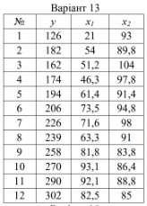
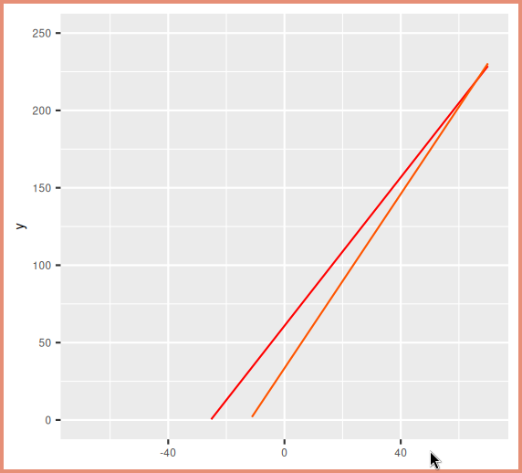

\input{$UNI/.templates/parts/header.tex}
Мета роботи - повторити основні прийоми роботи з функціями Excel, навчитися
обчислювати коефіцієнт кореляції, перевіряти його значимість і надійність за допомогою
функцій Excel, навчитися обчислювати параметри прямого і оберненого прогнозів за
допомогою функцій Excel, навчитися будувати графіки прогнозів за допомогою діаграм Excel,
визначати кут між ними.

# Варіант завдання

{width=5cm}

# Хід виконання роботи

## 1. обчислити коефіцієнт кореляції, перевірити його значимість і надійність

```r
> nums
     y   x1    x2
1  126 21.0  93.0
2  182 54.0  89.8
3  162 51.2 104.0
4  174 46.3  97.8
5  194 61.4  91.4
6  206 73.5  94.8
7  226 71.6  98.0
8  239 63.3  91.0
9  258 81.8  83.8
10 270 93.1  86.4
11 290 92.1  88.8
12 302 82.5  85.0
```

Обчислимо коефіцієнт кореляції для x1  та x2

```r
> cor(nums$x1, nums$y)
[1] 0.9232703
> cor(nums$x2, nums$y)
[1] -0.6676767
```

Обчислимо критерій Стьюдента:

$$
t_1=\frac{r*\sqrt{n-2}}{\sqrt{1-r^2}}
$$

```r
> t_1 <- correlation*sqrt(12-2)/sqrt(1-correlation^2)
> t_1
[1] 7.600234
```

Записав максимальний критерій Стьюдента для власних даних:

$$
t_{999} = 4.178
$$

Оскільки $t_1>t_{999}$, то коефіцієнт кореляції достовірний.

$$
m_1=\frac{\left\lvert r \right\rvert * \sqrt{n-1}}{1-r^2}
$$

```r
> m_1 <- abs(correlation)*sqrt(12-1)/(1-correlation^2)
> m_1
[1] 20.75016
```

Оскільки $m_1 \geq 3$, то коефіцієнт кореляції є дуже надійним.

## 2. обчислити параметри прямого і оберненого прогнозів

$$
a=r*\frac{\sigma_y}{\sigma_x}
$$
$$
b=\overline{y}-a\overline{x}
$$
$$
c=r*\frac{\sigma{x}}{\sigma{y}}
$$
$$
d=\overline{x}-c\overline{y}
$$

```r
> sd_y <- sd(nums$y)
> sd_x <- sd(nums$x1)
> a <- correlation * sd_y/sd_x
> m_y <- mean(nums$y)
> m_x <- mean(nums$x1)
> b <- m_y - a*m_x
> c <- correlation*sd_x/sd_y
> d <- m_x - c*m_y
> a
[1] 2.398229
> b
[1] 60.84022
> c
[1] 0.3554407
> d
[1] -11.8878
> r <- correlation
```

## 3. побудувати графіки прогнозів

$f_1:y_x=ax+b$

$f_2:x_y=cy+d$

```r
> direct <- function (x) { a * x + b }
> inverse <- function (x) { (x-d)/c }

> library(ggplot2)

> funcs <- list (direct, inverse)
> cols <- heat.colors(5,1)
> p <-ggplot()+xlim(c(-70,70))+ylim(c(0,250))
for(i in 1:length(funcs))
    p <- p + stat_function(aes(y=0),fun = funcs[[i]], colour=cols[i])
> print(p)
```

Графіки зображені на рис. 2.

{width=10cm}

## 4. визначити кут між графіками прямого та обернененого прогнозів

$$
\tan(\alpha)=\frac{1-r^2}{r}\frac{\sigma_x*\sigma_y}{\sigma_x^2+\sigma_y^2}
$$

```r
> tan <- (1-r^2)/r * sd_x*sd_y/(sd_x^2+sd_y^2)
> tan
[1] 0.05359102
> atan(tan)
[1] 0.0535398
```

у градусах:
```r
> 0.0535398*180/pi
[1] 3.067605
```

# Висновок
Я здійснив кореляційний аналіз набору даних згідно з варіантом. Обчисливши
коефіцієнти кореляції, продовжив роботу з x1 та y, оскільки там кореляція
сильніша (коефіцієнт 0.9232). Далі перевірив кореляцію: вона виявилася
достовірною та надійною. Кут між графіками прямого й оберненого прогнозів
дорівнює 0.053 радіанів.

# Відповіді на контрольні запитання

1. Які види зв'язків між явищами ви знаєте? Дайте визначення і коротку
	  характеристику.

	  - **Прямий зв'язок**: Змінні змінюються в одному напрямку.
	  - **Зворотний зв'язок**: Значення змінюються у протилежних напрямках.

2. В чому сутність кореляційного зв'язку?

	Кореляційний зв'язок вказує на ступінь взаємозв'язку між двома змінними. Він
	показує, наскільки одна змінна змінюється у відповідь на зміну іншої.

3. Які бувають зв'язку за напрямком? Як вони виражаються?

	Зв'язки за напрямком можуть бути прямими (позитивними) або зворотними
	(негативними). Прямий зв'язок виражається у тому, що значення обох змінних
	змінюються в одному напрямку, тоді як зворотній зв'язок виражається у зміні
	значення змінних в протилежних напрямках.

4. Які методи застосовуються в статистики для встановлення зв'язку між явищами,
в чому їх суть? Навести приклад.

	Методи в статистиці для встановлення зв'язку між явищами включають
	кореляційний аналіз, регресійний аналіз, а також аналіз дисперсії. Наприклад,
	кореляційний аналіз використовується для визначення ступеня взаємозв'язку між
	двома змінними, наприклад, між кількістю витрачених годин на вивчення та
	оцінками студентів.

5. Назвіть основні задачі кореляційного аналізу і варіанти кореляційного
зв'язку.

	Основні задачі кореляційного аналізу включають визначення ступеня та напрямку
	зв'язку між змінними, оцінку сили зв'язку та виявлення викидів або аномалій у
	даних. Варіанти кореляційного зв'язку включають прямий, зворотний та відсутній
	зв'язок.

6. Що розуміють під рівнянням зв'язку і як визначаються його параметри?

	Під рівнянням зв'язку розуміють математичну модель, що виражає зв'язок між
	змінними. Його параметри визначаються зазвичай методами найменших квадратів,
	які мінімізують суму квадратів різниць між спостережуваними та прогнозованими
	значеннями.

7. Що таке щільність зв'язку і як вона визначається для різних форм зв'язку?

	Щільність зв'язку визначає ступінь сукупної залежності між двома змінними. Для
	різних форм зв'язку щільність може вимірюватися різними способами, такими як
	коефіцієнт кореляції Пірсона для лінійного зв'язку, коефіцієнт Спірмена для
	монотонного зв'язку, або коефіцієнт кореляції Кендалла для рангового зв'язку.

8. Як засобами Excel розрахувати коефіцієнт кореляції?

	За допомогою функції `CORREL`.

9. Які властивості має коефіцієнт кореляції?

	  - Значення знаходяться у межах від -1 до 1.
	  - Значення близькі до 1 вказують на сильну позитивну кореляцію, близькі
		до -1 - на сильну негативну кореляцію, а значення близькі до 0 - на її
		відсутність.
	  - Кореляція не завжди означає причинно-наслідковий зв'язок.
	  - Коефіцієнт кореляції чутливий до викидів (аномалій) в даних.

10. Як встановити значимість коефіцієнта кореляції?

	Значимість коефіцієнта кореляції можна встановити за допомогою статистичних
	тестів, таких як тест Стьюдента для перевірки значущості кореляції. Якщо
	отримане значення p-рівняння менше заданого рівня значущості (наприклад, p <
	0.05), то можна вважати, що кореляція є значущою.

11. Як перевірити надійність коефіцієнта кореляції?

	Надійність коефіцієнта кореляції можна перевірити, провівши аналіз стійкості
	результатів до зміни даних або методу обчислення. Також слід перевірити, чи
	виконуються умови застосування обраного методу кореляції (наприклад,
	лінійності для коефіцієнта кореляції Пірсона).
