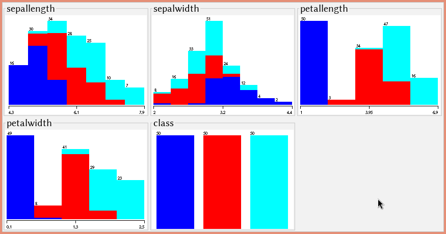
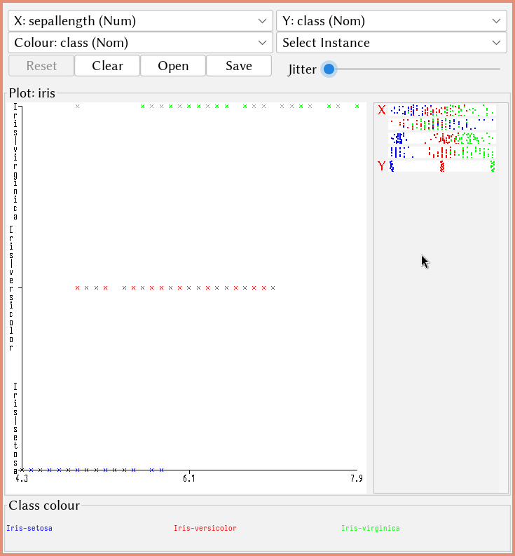
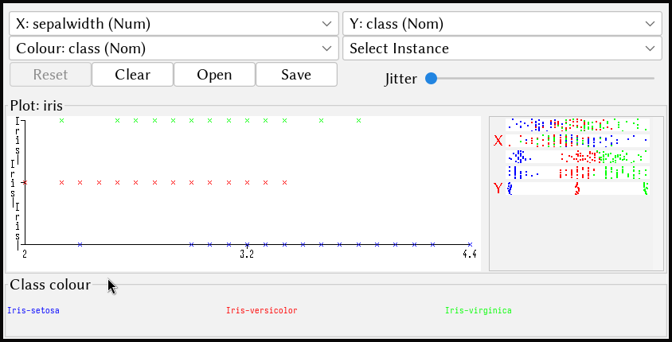
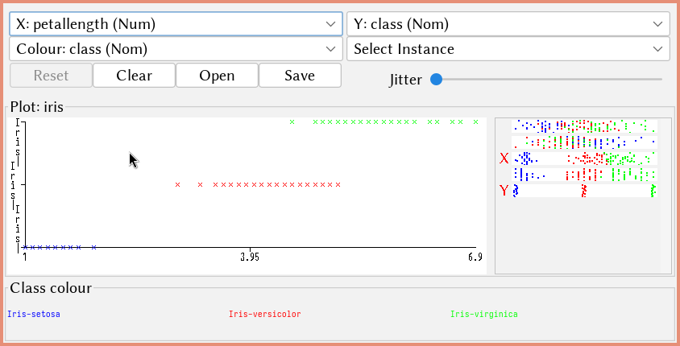
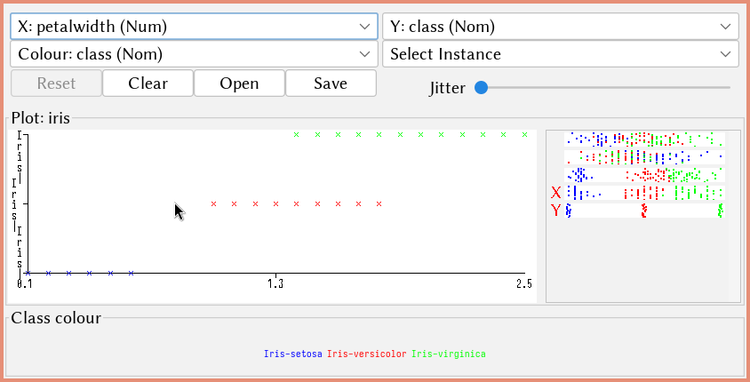

\input{$UNI/.templates/parts/header.tex}
Мета роботи
–
навчитися
класифікувати
дані
за
допомогою
використання баєсівського підходу. Вивчити теоретичні основи методу та
для виконання аналізу даних навчитися використовувати програми WEKA та
Excel.

## Завдання

Ваше перше завдання для цієї лабораторної роботи - оцінити алгоритми
класифікації наївний Баєс за допомогою Weka:

1. Для індивідуального завдання розв’яжіть задачу класифікації за
допомогою алгоритму "наївна Баєсівська класифікація" (bayes.NaiveBayes);
2. Змінюючи параметри налаштування алгоритмів, спробуйте досягти
найвищої якості навчання класифікатора.

Ваше друге завдання – використати Excel для побудови моделі
класифікації наївним Баєсом.

3. Порівняйте результати отримані в обидвох системах.
4. У звіті надайте результати роботи алгоритму, його налаштування.

## Хід роботи
### Наївний Баєс у Weka



Запустивши Наївного Баєса в іриси, я отримав:

\footnotesize

```r
Naive Bayes Classifier

                         Class
Attribute          Iris-setosa Iris-versicolor  Iris-virginica
                        (0.33)          (0.33)          (0.33)
===============================================================
sepallength
  mean                   4.9913          5.9379          6.5795
  std. dev.               0.355          0.5042          0.6353
  weight sum                 50              50              50
  precision              0.1059          0.1059          0.1059

sepalwidth
  mean                   3.4015          2.7687          2.9629
  std. dev.              0.3925          0.3038          0.3088
  weight sum                 50              50              50
  precision              0.1091          0.1091          0.1091

petallength
  mean                   1.4694          4.2452          5.5516
  std. dev.              0.1782          0.4712          0.5529
  weight sum                 50              50              50
  precision              0.1405          0.1405          0.1405

petalwidth
  mean                   0.2743          1.3097          2.0343
  std. dev.              0.1096          0.1915          0.2646
  weight sum                 50              50              50
  precision              0.1143          0.1143          0.1143


Time taken to build model: 0.01 seconds

=== Stratified cross-validation ===
=== Summary ===

Correctly Classified Instances         144               96      %
Incorrectly Classified Instances         6                4      %
Kappa statistic                          0.94
Mean absolute error                      0.0342
Root mean squared error                  0.155
Relative absolute error                  7.6997 %
Root relative squared error             32.8794 %
Total Number of Instances              150

=== Detailed Accuracy By Class ===

                 TP Rate  FP Rate  Precision  Recall   F-Measure  MCC      ROC Area  PRC Area  Class
                 1.000    0.000    1.000      1.000    1.000      1.000    1.000     1.000     Iris-setosa
                 0.960    0.040    0.923      0.960    0.941      0.911    0.992     0.983     Iris-versicolor
                 0.920    0.020    0.958      0.920    0.939      0.910    0.992     0.986     Iris-virginica
Weighted Avg.    0.960    0.020    0.960      0.960    0.960      0.940    0.994     0.989

=== Confusion Matrix ===

  a  b  c   <-- classified as
 50  0  0 |  a = Iris-setosa
  0 48  2 |  b = Iris-versicolor
  0  4 46 |  c = Iris-virginica
```

\normalsize

* tp --- true positive (recall)
* fp --- false positive
* precision = `правильно_класифікованих/всіх_елементів_стовпця`
* F-Measure = `2*Precision*Recall/(Precision+Recall)`, тобто це середнє гармонійне Precision и Recall.

Бачимо, що алгоритм правильно класифікував 96% ірисів.

Ось кілька спостережень:

{width=10cm}

{width=13cm}

{width=13cm}

{width=13cm}

### Наївний Баєс у R
#### Код скрипта

\inputminted{r}{script.r}

#### Робота скрипта

\inputminted{r}{output}

# Висновок

Оскільки я аналізував дані в ході роботи та не бажаю писати у висновку те саме,
напишу порівняння інструментів: В R точність виявилася трохи вищою, але
ненабагато. Але також набагато зручніше виконувати дії завдяки зручному
інтерфейсу командного рядка.

# Відповіді на контрольні запитання

1. **У чому полягає задача класифікації? Наведіть практичний приклад.**
   Задача класифікації полягає в призначенні кожному об'єкту з вхідної множини
   однієї або кількох категорій на основі його характеристик. Наприклад,
   класифікація електронних листів на "спам" та "не спам" - практичний приклад
   класифікації.

2. **Що таке навчання з учителем і без учителя? До якого типу належить задача класифікації?**
   Навчання з учителем передбачає наявність маркованих даних, коли кожен
   приклад має мітку класу. Навчання без учителя відбувається без міток класів
   у вихідних даних. Задача класифікації належить до навчання з учителем,
   оскільки в ній використовуються марковані дані для побудови моделі.

3. **Задача класифікації є описовою або прогнозуючою і чому?**
   Задача класифікації є прогнозуючою, оскільки мета полягає в передбаченні
   класу нового об'єкта на основі його характеристик.

4. **Навіщо потрібні дві вибірки: навчальна і тестова?**
   Навчальна вибірка використовується для навчання моделі, тоді як тестова
   вибірка застосовується для оцінки її продуктивності та узагальнюючої
   здатності на нових даних.

5. **Які існують підходи для поділу вихідної вибірки на навчальну і тестову?**
   Підходи до поділу вихідної вибірки на навчальну і тестову можуть включати
   випадковий відбір, стратифікований відбір або хронологічний відбір.

6. **Як оцінити якість побудованої моделі класифікації?**
   Якість побудованої моделі класифікації можна оцінити за допомогою метрик,
   таких як точність, чутливість, специфічність, F-міра тощо, а також за
   допомогою матриці помилок.


7. **Поясніть роботу наївного баєсівського класифікатора.**
   Наївний баєсівський класифікатор - це метод класифікації, який ґрунтується
   на застосуванні теореми Баєса з наївним припущенням про незалежність між
   характеристиками. Він використовує ймовірності входження кожної
   характеристики у кожен клас для призначення об'єкту його класу.


8. **Поясніть теорему Баєса?**
   Теорема Баєса - це математичний принцип, який описує, як змінюється
   ймовірність виникнення події при настанні нової інформації.

   $$
   P(y|x)=\frac{P(x|y)P(y)}{P(x)}
   $$

9. **Які типи наївного баєсівського класифікатора існують?**
   Існують різні типи наївного баєсівського класифікатора, такі як наївний
   баєсівський класифікатор Бернуллі, наївний баєсівський класифікатор
   Мультиноміального розподілу, наївний баєсівський класифікатор Гаусса тощо.


10. **Де застосовується наївний Баєс?**
    Наївний Баєс застосовується в різних областях, включаючи класифікацію
	текстових даних, фільтрацію спаму, медичну діагностику, рекомендації та
	інші.
