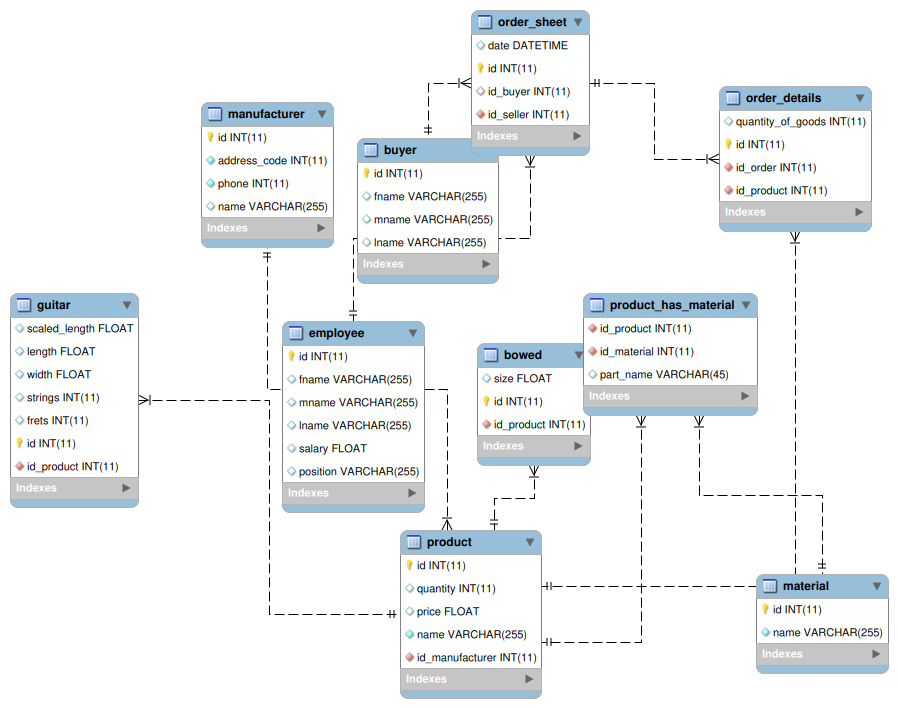

\input{$UNI/.templates/parts/header.tex}
навчитися створювати базу даних в MySQL Workbench


# Індивідуальне завдання

1. Cтворити БД для предметної області, вибраної у лабораторній роботі № 1.
2. Створити таблиці БД та визначити ключові поля в них.
3. Згенерувати EER-модель БД та перевірити її з побудованою раніше моделлю в
середовищі проектування DbDesigner.
4. Наповнити БД даними (точність відношень не менше 10).

# Етапи розв'язку

## Завдання 1

Так я створив базу та перейшов до її редагування:

```sql
MariaDB [(none)]> create schema music_store
    -> ;
Query OK, 1 row affected (0.023 sec)
```

```sql
MariaDB [(none)]> use music_store
Database changed
```

## Завдання 2

Я писав команди через інтерфейс командного рядка `mariadb`, тому коли потрібно було отримати скрипт із того,
що я понаписував, зробив дамп бази. Ось його лістинг:

\inputminted{sql}{dump.sql}

## Завдання 3

Далі я використав цей дамп у новій базі `test`
і написав цей скрипт для її наповнення:

\inputminted{sql}{fill.sql}

## Завдання 4



# Висновок

Я навчився створювати таблиці й наповняти їх даними.
Також у процесі наповнення таблиць даними виявив
деякі помилки, які зробив під час створення. Тут
потрібно бути уважним.
