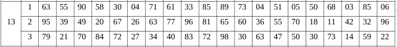

\input{$UNI/.templates/parts/header.tex}
Ознайомитись з поняттями оптимальності за Парето та за Слейтером
при багатокритеріальному виборі [1-3;6;7].

# Варіант завдання

# Короткі теоретичні відомості

Задачу вибору, яка включає множину можливих рішень X та векторний критерій f, зазвичай
називають багатокритеріальною задачею або задачею багатокритеріальної оптимізації.

Парето-оптимальне рішення – це таке можливе рішення, яке не може бути покращене
(збільшене) по жодному з наявних критеріїв без погіршення (зменшення) по будь-якому хоча
б одному іншому критерію. Рішення, що входять до множини Парето, також називають
парето-ефективними.

Рішення x' ∈ X називається оптимальним за Слейтером, якщо не існує такого можливого
вирішення x ∈ X, для якого має місце нерівність $f(x) > f(x')$.

# Виконання роботи
## 6.5 результати побудови значень альтернатив у області критеріїв
\verbatiminput{plot.tsv}

## 6.6 результати визначення множини оптимальних рішень за Парето та за Слейтером
\verbatiminput{data.tsv}

\clearpage

## 6.7  рисунки  з  графічним  визначенням  границі  Парето  та  Слейтера

## 6.8 лістинг програми обчислення множини оптимальних рішень за Парето та за Слейтером;

\inputminted{c++}{alt.cpp}

# Висновки

Я ознайомився з оптимальністю за Парето та Слейтером у
багатокритеріальних задачах. Власноруч розв’язав багатокритеріальну задачу, знайшовши
множини Парето та Слейтера.
За Слейтером більше альтернатив є оптимальними, що є логічно.
Побудував границі та написав програму для
розв’язання багатокритеріальних задач мовою C++.
