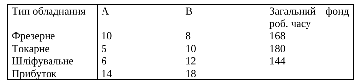
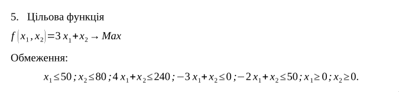
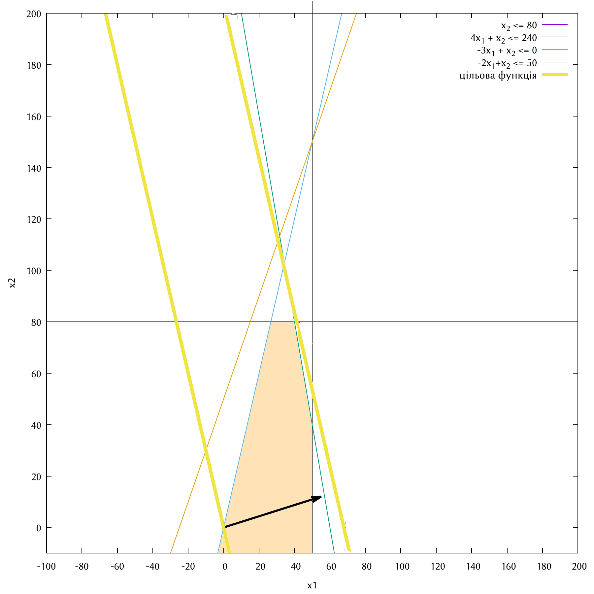

\input{$UNI/.templates/parts/header.tex}
Ознайомитись на практиці із основними поняттями теорії лінійного
програмування, навчитись знаходити оптимальні плани задач лінійного
програмування  графічно,  за  допомогою  симплекс  методу  і  двоїстого
симплекс методу.

# Теоретичні відомості

6.5. Що таке допустимий план?

Це такий розв'язок, який задовольняє обмеження, але необов'язково має
шукане значення функції

# Хід виконання роботи

## Розв’язання задачі з додатку 1 аналітичним методом

> 5. Для виготовлення двох видів виробів A і B використовується
> токарне, фрезерне і шліфувальне обладнання. Норми витрат часу кожного
> з типів обладнання на один виріб кожного виду наведено в таблиці. У ній
> же зазначено загальний фонд робочого часу кожного з типів обладнання, а
> також прибуток від реалізації одного виробу.

{width=13cm}

> Знайти план випуску виробів A і B, що забезпечує максимальний
> прибуток від їх реалізації.

$$
P = 14A + 18B,
\begin{cases}
10A + 8B \leq 168 \\
5A + 10B \leq 180 \\
6A + 12B \leq 144
\end{cases}
\implies
\begin{cases}
10A + 8B + x_1 = 168 \\
5A + 10B + x_2 = 180 \\
6A + 12B + x_3 = 144 \\
% x --- базисні невідомі з коефами 1
% вільні члени > 0
% так це канон
%% Якщо в канонічній системі покласти рівними нулю всі вільні змінні,
%% то базисні змінні дорівнюватимуть невід’ємним вільним членам рівнянь.
%% Отриманий таким чином план називається базисним планом канонічної
%% задачі.
\end{cases}
$$

```r
> iden <- function(n) if (n > 0) diag(rep(1,n)) else NULL
> b <- c(168,180,144)
> func <- c(14,18)
> dat <- c(10,5,6,8,10,12)
> mat <- matrix(dat,3)
> obfun <- -func
> tableau <- rbind(mat, obfun)
> tableau <- cbind(tableau, iden(nrow(tableau)))
> tableau <- cbind(tableau, c(b,0))
> tableau
      [,1] [,2] [,3] [,4] [,5] [,6] [,7]
        10    8    1    0    0    0  168
         5   10    0    1    0    0  180
         6   12    0    0    1    0  144
obfun  -14  -18    0    0    0    1    0
> m <- nrow(tableau)
> n <- ncol(tableau)
```

### Перша ітерація:
```r
> which.min(tableau["obfun",])
[1] 2
> pc <- which.min(tableau["obfun",])
> pr <- which.min(tableau[1:m-1,n]/tableau[1:m-1,pc])

> tableau
      [,1] [,2] [,3] [,4] [,5] [,6] [,7]
        10    8    1    0    0    0  168
         5   10    0    1    0    0  180
         6   12    0    0    1    0  144
obfun  -14  -18    0    0    0    1    0
> tableau[pr,pc]

12
```

Перетворюємо ключовий стовпець на одиничний:

```r
> tableau[pr,] <- tableau[pr,]/tableau[pr,pc]

> tableau[3,1:n] = tableau[3,1:n] - tableau[pr,1:n]*0.5
tableau["obfun",1:n] = tableau["obfun",1:n] + tableau[pr,1:n]*5
tableau[-pr,] + tableau[pr,]*tableau[-pr,pc]
> (1L:m)[-pr]

[1] 1 2 4

> (1L:m)[-pr] -> np
> for (i in np) {
        tableau[i,] <- tableau[i,] - tableau[i,pc]*tableau[pr,]
}
```

### Друга ітерація
```r
> tableau

      [,1] [,2] [,3] [,4]        [,5] [,6] [,7]
       6.0    0    1    0 -0.66666667    0   72
       0.0    0    0    1 -0.83333333    0   60
       0.5    1    0    0  0.08333333    0   12
obfun -5.0    0    0    0  1.50000000    1  216
> pc <- which.min(tableau["obfun",])

> pc

[1] 1
> ind <- which(tableau[1:m-1] > 0)
pr <- which.min(tableau[ind,n]/tableau[ind,pc])
tableau[pr,] <- tableau[pr,]/tableau[pr,pc]
np = (1L:m)[-pr]
for (i in np) {
        tableau[i,] <- tableau[i,] - tableau[i,pc]*tableau[pr,]
}

> tableau

      [,1] [,2]        [,3] [,4]       [,5] [,6] [,7]
         1    0  0.16666667    0 -0.1111111    0   12
         0    0  0.00000000    1 -0.8333333    0   60
         0    1 -0.08333333    0  0.1388889    0    6
obfun    0    0  0.83333333    0  0.9444444    1  276
```

## Текст програми (алгоритм симплекс-методу)

\inputminted{r}{simp.r}

## Вигляд реалізованої програми.

\inputminted{r}{out}

## Розв’язання задачі з Додатку 2 графічним методом

{width=15cm}

На рис. 1 бачимо, що, зважаючи на обмеження, оптимальним розв'язком буде (40:80) зі значенням функції 200.



# Висновок

Я ознайомився на практиці з основними поняттями теорії лінійного
програмування, навчився знаходити оптимальні плани задач лінійного
програмування  графічно,  за  допомогою  симплекс  методу  і  двоїстого
симплекс методу.
