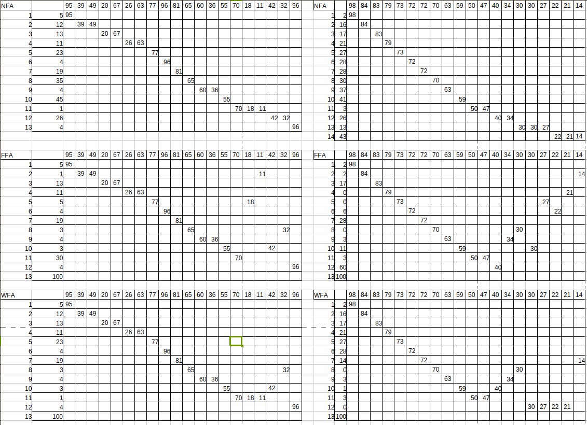
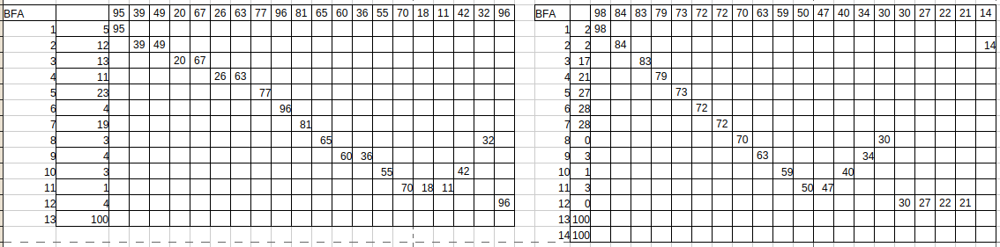
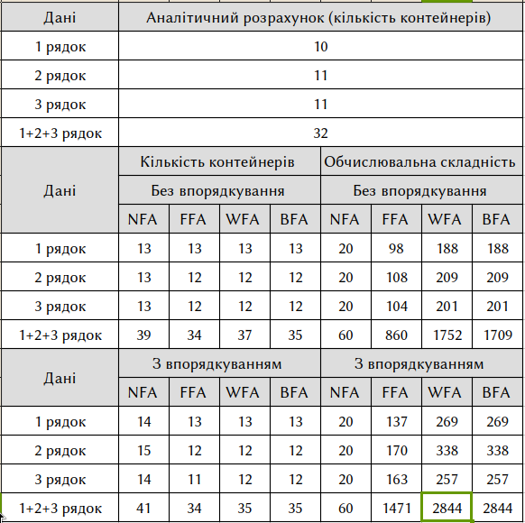

\input{$UNI/.templates/parts/header.tex}
Ознайомитись з методами прийняття рішень в умовах повної
інформації на прикладі задачі про упакування в контейнери та дослідити
особливості їх використання [3-5].

# Варіант 13

2 95 39 49 20 67 26 63 77 96 81 65 60 36 55 70 18 11 42 32 96
```
1 63 55 90 58 30 04 71 61 33 85 89 73 04 51 05 50 68 03 85 06
2 95 39 49 20 67 26 63 77 96 81 65 60 36 55 70 18 11 42 32 96
3 79 21 70 84 72 27 34 40 83 72 98 30 63 47 50 30 73 14 59 22
```

# Короткі теоретичні відомості

Задача  про  упакування  в  контейнери  відноситься  до  NP–важких  комбінаторних  задач.
Завдання  полягає  в  упаковці  об'єктів  зумовленої  форми  в  кінцеве  число  контейнерів
зумовленої форми таким чином, щоб кількість використаних контейнерів була найменшою.

Іноді розглядають зворотну задачу, щоб кількість або обсяг об'єктів, які упаковують, були
найбільшими.

Існує безліч різновидів цієї задачі (двовимірна упаковка, лінійна упаковка, упаковка по вазі,
упаковка по вартості і т.і.), які можуть застосовуватися в різних областях, наприклад, в задачі
оптимального  заповнення  контейнерів,  завантаження  вантажівок  з  обмеженням  по  вазі,
створення резервних копій на змінних накопичувачах і т.і.
Оскільки  задача  є  NP-важкою,  часто  використовують  алгоритми  з  евристичним  та
метаевристичним  методом  вирішення  для  отримання  оптимальних  результатів.  Також
активно використовуються методи штучного інтелекту, як, наприклад, нейронні мережі.

# Хід роботи

## Лістинг програми
Цей скрипт реалізує алгоритми FFA, NFA, WFA, BFA. Також він містить аналітичні розрахунки.

\inputminted{r}{cringeprog.r}

## Аналітичний розрахунок мінімально можливої кількості контейнерів

```r
> ceiling( sum(s1)/100 )
[1] 10
> ceiling( sum(s2)/100 )
[1] 11
> ceiling( sum(s3)/100 )
[1] 11
> ceiling( sum(s4)/100 )
[1] 32
```

## Аналітичний розрахунок розміщення вантажів відповідно до пунктів (4.3 - 4.4)

3. Кількість контейнерів та обчислювальну складність для 20-ти вантажів, за
   допомогою алгоритмів NFA, FFA, WFA, BFA без впорядкування окремо для 2-го
   рядка варіанту (12 значень).

4. Кількість контейнерів та обчислювальну складність для 20-ти вантажів, за
   допомогою алгоритмів NFA, FFA, WFA, BFA з упорядкуванням окремо для 3-го
   рядка варіанту (12 значень).

```sh
> rev(sort(s3))
 [1] 98 84 83 79 73 72 72 70 63 59 50 47 40 34 30 30 27 22 21 14
```




## Таблиці для п 5-6
5.8) результати роботи програми для п. 4.5-4.6 у вигляді таблиць
розміщення вантажів за кожним з алгоритмів, з упорядкуванням та
без нього, для множини вантажів в 1-3 рядках окремо та в 1-3 рядках
сумісно;

\inputminted{r}{tables}

\clearpage

## Сумарні результати

{width=13cm}

# Висновок

В моєму випадку найефективніше спрацював FFA. Очевидно, з більшою кількістю
порівнянь ми отримуємо кращі результати, але й витрачаємо більше ресурсі на
розкладання.
