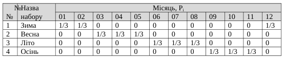
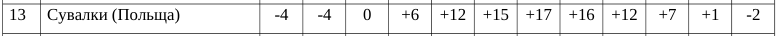
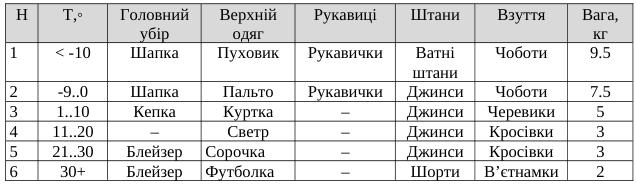

\input{$UNI/.templates/parts/header.tex}
Ознайомитись з методами прийняття рішень в умовах, коли вибір
деякої  стратегії  пов’язаний  з  певним  набором  станів  середовища  з
визначеною ймовірністю [1;2;6;7;9;10].

# Індивідуальне завдання

1. Обрати варіант та дані температури («Додаток Б»).
2. Визначити найкращу стратегію при поверненні протягом одного з 12-ти місяців
   за  умови,  що  ймовірність  повернення  в  кожен  з місяців однакова.
3. Визначити найкращу стратегію за при поверненні протягом одного сезону за
   наданих наборів ймовірностей повернення у кожен з місяців
4. Визначити найкращу стратегію при поверненні протягом одного з 12-ти місяців
   за умови, що ймовірність повернення взимку втричі більша за інші місяці.
5. Визначити найкращу стратегію при поверненні протягом одного з 12-ти місяців
   за умови, що ймовірність повернення залежить від кількості днів у місяці
   (рік вважати не високосним).
6. Визначити найкращу стратегію при поверненні протягом одного з 12-ти  місяців
   за  умови,  що  ймовірність  повернення  в  кожен  з місяців однакова, а
   початкова вартість речей з номерами № 2, 4, 9, 15, 16 (табл. 1.1) зменшилася
   втричі.







## Виконання завдань



### Код програми
\inputminted{r}{risk.r}

### Результат виконання
```r
[1] 2. Рівноймовірні повернення!
h: 1 [1] -150.5
h: 2 [1] -107
h: 3 [1] -84
h: 4 [1] -69.5
h: 5 [1] -73.5
h: 6 [1] -83.33333
[1] 3. 1/3!
[1] Зима
h: 1 [1] -147
h: 2 [1] -75
h: 3 [1] -136
h: 4 [1] -116
h: 5 [1] -116
h: 6 [1] -120
[1] Весна
h: 1 [1] -157
h: 2 [1] -123
h: 3 [1] -60
h: 4 [1] -66
h: 5 [1] -66
h: 6 [1] -74.66667
[1] Літо
h: 1 [1] -141
h: 2 [1] -107
h: 3 [1] -80
h: 4 [1] -30
h: 5 [1] -46
h: 6 [1] -64
[1] Осінь
h: 1 [1] -157
h: 2 [1] -123
h: 3 [1] -60
h: 4 [1] -66
h: 5 [1] -66
h: 6 [1] -74.66667
[1] 4. Зима втричі вірогідніша за решту!
h: 1 [1] -149.3333
h: 2 [1] -96.33333
h: 3 [1] -101.3333
h: 4 [1] -85
h: 5 [1] -87.66667
h: 6 [1] -95.55556
[1] 5. Рахуємо дні!
h: 1 [1] -150.5003
h: 2 [1] -107.1309
h: 3 [1] -83.78012
h: 4 [1] -69.25398
h: 5 [1] -73.28678
h: 6 [1] -83.15488
[1] 6. Однакові ймовірності, дешевші речі!
h: 1 [1] -144.5
h: 2 [1] -107
h: 3 [1] -72
h: 4 [1] -57.5
h: 5 [1] -61.5
h: 6 [1] -71.33333
```

# Висновок

<++>
