\input{$UNI/.templates/parts/header.tex}
Дослідження
методів
вирішення
задачі
ідентифікації
з
використанням апарату багатокритеріальної оптимізації [1;2;7-9].

## Короткі теоретичні відомості
Кароче йопта

## Варіант завдання

```
1. Лінійна згортка
2. Нормована лінійна згортка
3. Максмінна згортка
4. Нормована максмінна згортка
5. Метод "ідеальної" точки
6. Метод лексикографічної оптимізації
7. Метод послідовних поступок
```

| A1  | A2  | A3  | A4  | Метод 1 | Метод 2 |
| --- | --- | --- | --- | ---     | ---     |
| C   | F   | T   | H   | 3       | 5       |

## Розроблена система ознак та параметрів методів

| N     | Ознака                                                        | Графічне подання         |
| --    | --                                                            | ---                      |
| $S_1$ | Кількість перетинів із прямою $y=2$                           | 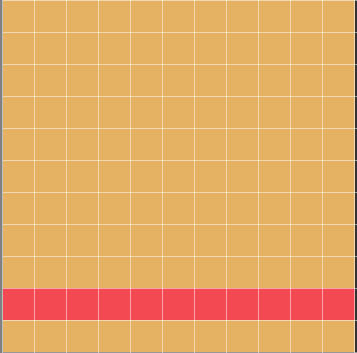{height=3cm} |
| $S_2$ | Кількість перетинів із прямою $x=6$ без точок (6;0) та (6;11) | 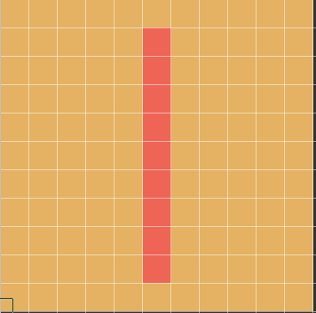{height=3cm} |
| $S_3$ | Кількість перетинів із прямою $y=6$                           | 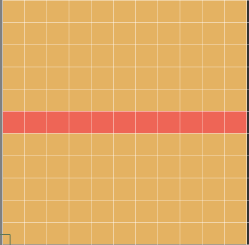{height=3cm} |

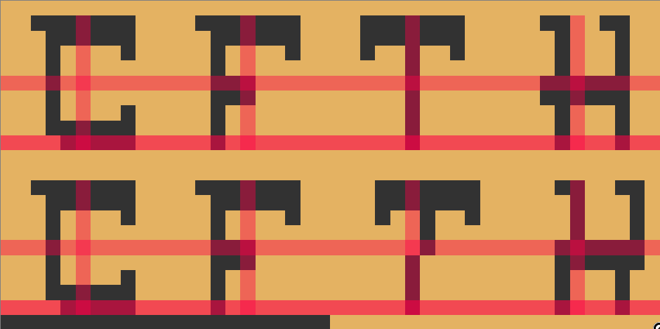

## Значення ознак для символів еталонного набору

| Ознака | A1 (C) | A2 (F) | A3 (T) | A4 (H) |
| --     | ---    | ---    | ---    | ---    |
| S1     | 5      | 1      | 1      | 2      |
| S2     | 4      | 4      | 9      | 2      |
| S3     | 1      | 3      | 1      | 6      |

Жодні значення ознак не співпадають повністю, отже можна однозначно
визначити будь-який символ із набору.

## Сформований набір символів, які потрібно розпізнати

| N  | C  | P       | Зображення C           | Зображення P             |
| -- | -- | --      | ---                    | ---                      |
| 1  | C  | ***C*** | 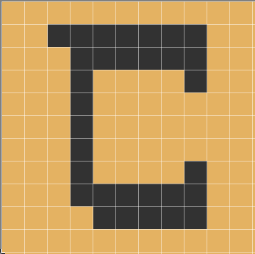{height=3cm} | 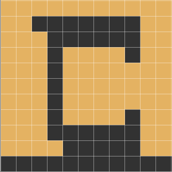{height=3cm} |
| 2  | F  | ***F*** | 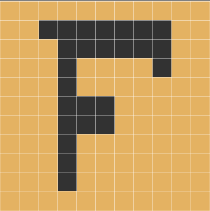{height=3cm} | 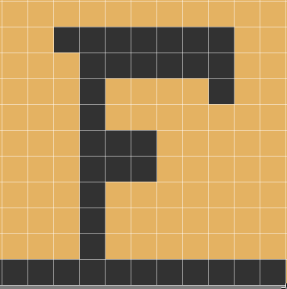{height=3cm} |
| 3  | T  | ***T*** | {height=3cm} | 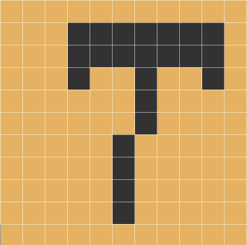{height=3cm} |
| 4  | h  | ***h*** | 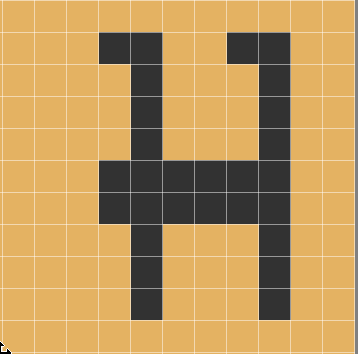{height=3cm} | 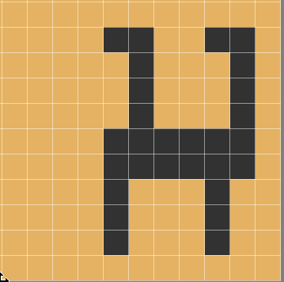{height=3cm} |

## Значення ознак для символів набору, що потрібно розпізнати

| Ознака | A1 (*C*) | A2 (*F*) | A3 ($\texttt{\textit{T}}$) | A4 ($\texttt{\textit{H}}$) |
| --     | ---      | ---      | ---                        | ---                        |
| S1     | 5        | 1        | 1                          | 2                          |
| S2     | 4        | 4        | 6                          | 6                          |
| S3     | 1        | 3        | 1                          | 6                          |

## Перелік символів (альтернатив), що входять до множини Парето та Слейтера для кожного символу

Вставлю для наглядності таблицю еталонних значень:

| Ознака | A1 (C) | A2 (F) | A3 (T) | A4 (H) |
| --     | ---    | ---    | ---    | ---    |
| S1     | 5      | 1      | 1      | 2      |
| S2     | 4      | 4      | 9      | 2      |
| S3     | 1      | 3      | 1      | 6      |

Завантажую таблиці в R, щоб зручно відняти потрібні стовпці та записую це
в файли для подальшого відбору за Парето та Слейтером:
```r
> reference <- read.csv("tab.csv", row.names = 1)
> target <- read.csv("target.csv", row.names = 1)
write.csv(abs(reference-target$c), "c.csv")
write.csv(abs(reference-target$f), "f.csv")
write.csv(abs(reference-target$t), "t.csv")
write.csv(abs(reference-target$h), "h.csv")
```

### A1 (*C*)
\csvautotabular{c.csv}

### A2 (*F*)
\csvautotabular{f.csv}

### A3 ($\texttt{\textit{T}}$)
\csvautotabular{t.csv}

### A4 ($\texttt{\textit{H}}$)
\csvautotabular{h.csv}

Після відбору за Парето залишились:

* A1 (*C*): A1
* A2 (*F*): A2
* A3 ($\texttt{\textit{T}}$): A1,A2,A3
* A4 ($\texttt{\textit{H}}$): A2,A4

## Результати визначення кращої альтернативи з множини Парето для кожного символу
що розпізнається, у вигляді зведених таблиць або опису (аналогічно прикладу у п. 4.5),

### 3 --- Максмінна згортка

У методі максмінного згортання глобальний критерій визначається як
$$
%% Q(x) = \min_{i=\overline{1,n}} \lambda_i Q_i (x) \Rightarrow \max,
Q(x) = \min_{i \in {1,n}} \lambda_i Q_i (x) \Rightarrow \max,
$$
$$
x \in X,
$$
$$
\sum_{i=1}^n \lambda_i = 1,
$$
$$
\lambda_i > 0, i = \overline{1,n}
$$

На значення глобального критерію впливає лише той частковий критерій, який має
у відповідній точці найменше значення. Береться до уваги лише «найгірший»
випадок, тому значення $Q(x)$ визначає гарантовану нижню оцінку для всіх
часткових критеріїв.

<++> Будь ласка таблицьки

```r
Розпізнавання символа T (максмінна згортка)
Коефіцієнти: 0.3333333 0.3333333 0.3333333
       A1.C.     A2.F. A3.T.
S1  4.000000 0.0000000     0
S2  2.000000 2.0000000     3
S3  0.000000 2.0000000     0
max 1.333333 0.6666667     1
A2.F.
    2
```

```r
Розпізнавання символа H (максмінна згортка)
Коефіцієнти: 0.3333333 0.3333333 0.3333333
    A2.F.    A4.H.
S1      1 0.000000
S2      2 4.000000
S3      3 0.000000
max     1 1.333333
A2.F.
    1
```

### 5 --- Метод "ідеальної" точки

$$
Q_i(x) \Rightarrow \max, x \in X, i = \overline{1,n}
$$

$$
Q(x) = \sqrt{\sum_{i=1}^n \left( Q_i(x) - Q^*_i \right)^2} \Rightarrow \min
$$

Використаю таку штуку, щоб не заплутатись
```r
ctar <- read.csv("c.csv", row.names = 1)
ftar <- read.csv("f.csv", row.names = 1)
ttar <- read.csv("t.csv", row.names = 1)
htar <- read.csv("h.csv", row.names = 1)

subsetter <- function (x) {
	head(x[,which(x["Парето",] == "-")], 3)
}
```

```r
> subsetter(ctar)
[1] "0" "0" "0"
> subsetter(ftar)
[1] "0" "0" "0"
> subsetter(ttar)
   A1.C. A2.F. A3.T.
S1     4     0     0
S2     2     2     3
S3     0     2     0
> subsetter(htar)
   A2.F. A4.H.
S1     1     0
S2     2     4
S3     3     0

> twho <- subsetter(ttar)
> hwho <- subsetter(htar)
```

\inputminted{r}{script.r}

#### Розпізнавання A3 й A4

Результати розпізнавання:
```r
Розпізнавання символа T (ідеальна точка)
     A1.C. A2.F. A3.T.
S1       4     0     0
S2       2     2     3
S3       0     2     0
dist     6     4     3
A3.T.
    3
Розпізнавання символа H (ідеальна точка)
     A2.F. A4.H.
S1       1     0
S2       2     4
S3       3     0
dist     6     4
A4.H.
    2
```

Символи правильно розпізнані. Але зроби таблицію <++>
або це

### Результати розпізнавання за змінених параметрів методів або додаткових ознак

Оскільки метод максмінної згортки хибно розпізнав символи T і H, змінюємо коефіцієнти:

#### Розпізнавання T
```r
Коефіцієнти: 0.25 0.25 0.5
    A1.C. A2.F. A3.T.
S1      4     0  0.00
S2      2     2  3.00
S3      0     2  0.00
max     1     1  0.75
A3.T.
    3
```

#### Розпізнавання H
```r
Коефіцієнти: 0.25 0.25 0.5
    A2.F. A4.H.
S1    1.0     0
S2    2.0     4
S3    3.0     0
max   1.5     1
A4.H.
    2
```

<++>

## Зведені результати розпізнавання

| №   | C   | P       | M1   | M2   | Графічне зображення P    | Примітки |
| --- | --- | ---     | ---  | ---  | ---                      | ---      |
| 1   | C   | ***C*** | -    | -    | {height=2cm} |          |
| 2   | F   | ***F*** | -    | -    | {height=2cm} |          |
| 3   | T   | ***T*** | <++> | <++> | {height=2cm} |          |
| 4   | h   | ***h*** | <++> | <++> | {height=2cm} |          |

# Висновки

Зробити висновки щодо результатів ідентифікації, розробленої системи ознак,
   переваг та недоліків методів, що були використані тощо.


<++>
