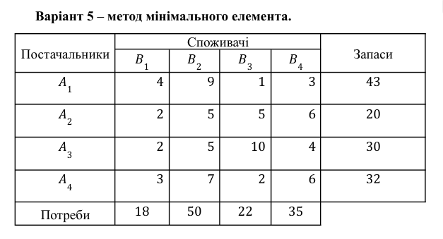
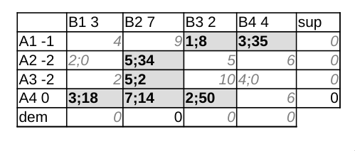

\input{$UNI/.templates/parts/header.tex}
Ознайомитись
із
основними
поняттями
транспортних
задач,
навчитись
знаходити
початкові
опорні
плани
(за
методом
північно-західного кута, мінімального елемента та евристичним методом
Фойгеля) та оптимальні плани задач за допомогою методу потенціалів.

# Завдання
1. Отримати індивідуальний варіант завдання (із Додатка Г)
2. Розв’язати транспортну задачу методом потенціалів (для пошуку опорного
   початкового плану використовувати метод північно-західного кута, метод
   мінімального елемента, евристичний метод Фойгеля) згідно з варіантом.
3. Оформити звіт про виконану роботу.

# Варіант завдання

Є $A_n$ пунктів постачання і $B_m$ пунктів
споживання продукції. Вартість перевезення одиниці
продукції з $i$-го пункту постачання в $j$-й центр
споживання $c_{ij}$ наведена у таблицях. Скласти
план перевезень щодо постачання необхідної
продукції у пункти споживання, який мінімізуватиме
сумарні транспортні витрати. Необхідні дані для
індивідуального варіанта потрібно взяти з таблиць,
наведених нижче.

{width=10cm}

# Короткі теоретичні відомості
(дати відповідь на контрольне запитання у відповідності із номером студента у журналі);

5. Що ви знаєте про закриту модель транспортної задачі?

Транспортна задача називається закритою, якщо сума
запасів дорівнює сумі потреб, тобто
$$
\sum_{i=1}^m a_i =
\sum_{j=1}^n b_j
$$
Це співвідношення називається умовою балансу або закритості. Якщо в моделі
транспортної задачі не виконується це співвідношення, то така модель
називається відкритою моделлю транспортної задачі.

Тут може бути два випадки:

a) сумарні запаси перевищують сумарні потреби;
b) сумарних запасів менше, ніж сумарних потреб.

Відкрита модель зводиться до закритої для випадків вище так:

a) Додається фіктивний споживач $B_{n+1}$ із потребами $b_{n+1} = \sum_{i=1}^m a_i - \sum_{j=1}^n b_j$
b) Додається фіктивний постачальник $A_{m+1}$ із запасами $a_{m+1} = \sum_{j=1}^n b_j - \sum_{i=1}^m a_i$.

Вартості перевезення від(до) фіктивних одиниць --- 0, бо ми нічого не веземо.

# Етапи розв'язку
## Розв’язання транспортної задачі (пошук опорного початкового плану) з описаними усіма послідовними кроками.

Перш за все, необхідно перевірити задачу на закритість (сума потреб має дорівнювати сумі запасів):

data:
```
	b1	b2	b3	b4	sup
A1	4	9	1	3	43
A2	2	5	5	6	20
A3	2	5	10	4	30
A4	3	7	2	6	32
dem	18	50	22	35	0
```

```r
> tabula <- read.table("data")
> tabula
    b1 b2 b3 b4 sup
A1   4  9  1  3  43
A2   2  5  5  6  20
A3   2  5 10  4  30
A4   3  7  2  6  32
dem 18 50 22 35   0
```

```r
> sum(tabula$sup)
[1] 125
> sum(tabula["dem",])
[1] 125
```
Модель закрита.

Пошук опорного плану відображений на рис. 2 та 3.
Ціна отриманого плану:


```r
> 1*22+2*18+3*21+4*14+5*16+5*2+7*32
[1] 491
```

## Розв’язання транспортної задачі за методом потенціалів (пошук оптимального плану)

Є $m + n-1$ зайнятих клітинок, план невироджений, складаємо рівняння

$$
% A = u, b = v
\begin{cases}
a1 = 0 \\
a2 + b1 = 2 \\
a2 + b2 = 5 \\
a3 + b2 = 5 \\
a4 + b2 = 7 \\
a1 + b3 = 1 \\
a1 + b4 = 3 \\
a3 + b4 = 4 \\
\end{cases}
\implies
\begin{cases}
a1 = 0 \\
b1 = 1 \\
a2 = 1 \\
b2 = 4 \\
a4 = 6 \\
b3 = 1 \\
b4 = 3 \\
a3 = 1 \\
\end{cases}
$$

Обчислюємо
$$
\Delta_{ij} = u_i + v_j - c_{ij}
$$
Якщо хоча б одне $\Delta_{ij} > 0$, треба міняти план

$$
\begin{cases}
\Delta_{11} = 0 + 1 - 4 = -3\\
\Delta_{12} = 0 + 4 - 4 = 0 \\
\Delta_{23} = 1 + 1 - 5 = -3 \\
\Delta_{24} = 1 + 3 - 6 = -2 \\
\Delta_{31} = 1 + 1 - 2 = 0 \\
\Delta_{33} = 1 + 1 - 10 = -8 \\
\underline{\Delta_{41} = 6 + 1 - 3 = 4}\\
\underline{\Delta_{43} = 6 + 1 - 2 = 5}\\
\underline{\Delta_{44} = 6 + 3 - 6 = 3}\\
\end{cases}
$$


Завантажуєм $\Delta_{kl} = \max\Delta_{ij} > 0$, тобто $\Delta_{43}$

Знаходимо найменше перевезення у вершинах цієї фігури із знаком "-":
$$
\theta = \min(16;14;22) = 14.
$$

Віднімаємо/додаєм його до клітинок (рис. 4)

$$
\begin{cases}
a1 = 0 \\
a2 + b1 = 2 \\
a2 + b2 = 5 \\
a3 + b2 = 5 \\
a4 + b2 = 7 \\
a1 + b3 = 1 \\
a1 + b4 = 3 \\
%% a3 + b4 = 4 \\
a4 + b3 = 2
\end{cases}
\implies
\begin{cases}
a1 = 0 \\
b1 = 3 \\
a2 = -1 \\
a3 = -1 \\
b2 = 6 \\
b3 = 1 \\
b4 = 3 \\
%% a3 + b4 = 4 \\
a4 = 1
\end{cases}
$$

$$
\begin{cases}
\Delta_{11} = 0 + 1 - 4 = -3\\
\Delta_{12} = 0 + 6 - 9 = -3 \\
\Delta_{23} = -1 + 1 - 5 = -5 \\
\Delta_{24} = -1 + 3 - 6 = -4 \\
\Delta_{31} = -1 + 3 - 2 = 0 \\
\Delta_{33} = -1 + 1 - 10 = -10 \\
\Delta_{34} = -1 + 3 - 4 = -2 \\
\underline{\Delta_{41} = 1 + 3 - 3 = 1}\\
%% \underline{\Delta_{43} = 1 + 1 - 2 = 5}\\
{\Delta_{44} = 1 + 3 - 6 = -2}\\
\end{cases}
$$


{width=9cm}

Завантажуєм $\Delta_{41}$

Знаходимо найменше перевезення у вершинах цієї фігури із знаком "-": $\theta = 18$

$$
\begin{cases}
a4 = 0 \\
a1 + b3 = 1 \\
a1 + b4 = 3 \\
%% a2 + b1 = 2 \\
a2 + b2 = 5 \\
a3 + b2 = 5 \\
a4 + b1 = 3 \\
a4 + b2 = 7 \\
a4 + b3 = 2
%% a3 + b4 = 4 \\
\end{cases}
\implies
\begin{cases}
a4 = 0 \\
a1 = -1 \\
b4 = 4 \\
%% a2 + b1 = 2 \\
a2 = -2 \\
a3 = -2 \\
b1 = 3 \\
b2 = 7 \\
b3 = 2
%% a3 + b4 = 4 \\
\end{cases}
$$

$$
\begin{cases}
\Delta_{11} = -1 + 3 - 4 = -2\\
\Delta_{12} = -1 + 7 - 9 = -3 \\
\Delta_{21} = -2 + 3 - 5 = -4 \\
\Delta_{23} = -2 + 2 - 5 = -5 \\
\Delta_{24} = -2 + 4 - 6 = -4 \\
\Delta_{31} = -2 + 3 - 2 = -1 \\
\Delta_{33} = -2 + 2 - 10 = -10 \\
\Delta_{34} = -2 + 4 - 4 = -2 \\
\Delta_{41} = 0 + 3 - 3 = 0\\
%% \underline{\Delta_{43} = 1 + 1 - 2 = 5}\\
\Delta_{44} = 0 + 4 - 6 = -2\\
\end{cases}
$$

Оптимальний план знайдений!

```r
> 3*18+5*34+5*2+7*14+1*8+2*50+3*35
[1] 545
```


# Висновок

Я ознайомився з основними поняттями транспортних задач, навчився знаходити
початкові опорні плани методом мінімального елемента та оптимальні плани задач
за допомогою методу потенціалів.
