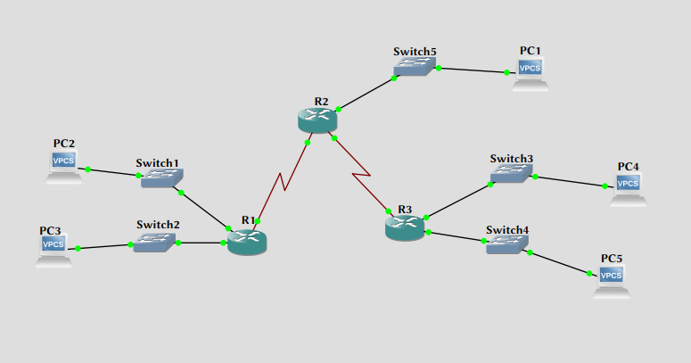

\input{$UNI/.templates/parts/header.tex}
Вивчити призначення та структуру IP-адреси, розглянути правила адресації
мереж різних класів.

# Порядок виконання роботи
## Визначення потрібних значень

```sh
192.168.024.013
^^^^^^^^^^^ ^^^
net         host
```

a) 192.168.024 --- частка мережі
b) 013 --- частка хоста
c) 192.168.024.255 --- broadcast
d) частка хоста займає 8 бітів
e) 254 --- загальна к-сть хостів у мережі

## Двійкові подання

```sh
ip address	11000000.10101000.00011000.00001101
	        192     .168     .024     .013
subnet mask	11111111.11111111.11111111.00000000
	        255     .255     .255     .0
net address	11000000.10101000.00011000.00000000
	        192     .168     .024     .0
broadcast	11000000.10101000.00011000.11111111
        	192     .168     .024     .255
```

## Побудова віртуальної мережі

Топологічна схема мережі, побудована за допомогою GNS3 зображена на рис. 1.



| device  | interface | IP Address | Subnet Mask   | Default Gateway |
| ---     | ---       | ---        | ---           | ---             |
| R2 (HQ) | Fa0/0     | 10.0.0.1   | 255.255.0.0   |                 |
| R2 (HQ) | S0/0/0    | 12.0.0.1   | 255.255.0.0   |                 |
| R2 (HQ) | S0/0/1    | 11.0.0.1   | 255.255.0.0   |                 |
| R1      | Fa0/0     | 137.0.0.1  | 255.255.0.0   |                 |
| R1      | Fa0/1     | 137.1.0.1  | 255.255.0.0   |                 |
| R1      | S0/0/0    | 12.0.0.2   | 255.255.0.0   |                 |
| R3      | Fa0/0     | 138.0.0.1  | 255.255.0.0   |                 |
| R3      | Fa0/1     | 138.1.0.1  | 255.255.0.0   |                 |
| R3      | S0/0/0    | 11.0.0.2   | 255.255.0.0   |                 |
| PC1     | NIC       | 10.0.0.2   | 255.255.255.0 | 10.0.0.1        |
| PC2     | NIC       | 137.1.0.2  | 255.255.255.0 | 137.1.0.1       |
| PC3     | NIC       | 137.0.0.2  | 255.255.255.0 | 137.0.0.1       |
| PC4     | NIC       | 138.0.0.2  | 255.255.255.0 | 138.0.0.1       |
| PC5     | NIC       | 138.1.0.2  | 255.255.255.0 | 138.1.0.1       |

### Конфігурація роутерів

```sh
R3#sh ip int br
Interface                  IP-Address      OK? Method Status                Protocol
FastEthernet0/0            138.0.0.1       YES manual up                    up
Serial0/0                  11.0.0.2        YES manual up                    up
FastEthernet0/1            138.1.0.1       YES manual up                    up
...
Loopback0                  3.3.3.3         YES manual up                    up
```

```sh
R2#sh ip int br
Interface                  IP-Address      OK? Method Status                Protocol
FastEthernet0/0            10.0.0.1        YES NVRAM  up                    up
Serial0/0                  12.0.0.1        YES NVRAM  up                    up
FastEthernet0/1            13.0.0.1        YES manual up                    up
Serial0/1                  11.0.0.1        YES NVRAM  up                    up
...
Loopback0                  2.2.2.2         YES manual up                    up
```

```sh
R1#sh ip int br
Interface                  IP-Address      OK? Method Status                Protocol
FastEthernet0/0            137.0.0.1       YES NVRAM  up                    up
Serial0/0                  12.0.0.2        YES manual up                    up
FastEthernet0/1            137.1.0.1       YES NVRAM  up                    up
...
Loopback0                  1.1.1.1         YES manual up                    up
```


# Висновок

Я навчився основам симуляції мереж та роботи з образами Cisco IOS.
Побудував просту топологію та налаштував роутери з віртуальними комп'ютерами
для коректної взаємодії, зокрема, зробив ospf, щоб роутери між собою спілкувались,
і надав адреси комп'ютерам. Перевірив систему пінгуванням одного комп'ютера з іншого.

# Відповіді на контрольні запитання

1) **Що являє собою IP-адреса? Який розмір IP-адреси?**
	Ідентифікатор комп'ютера в IP-мережі. За розміром IP-адреса для IPv4
	--- 4 байти, IPv6 16 байтів
2) **Як розподіляються адреси за системою класів ІР-адрес? Поясніть різницю між ними?**
	A, B, C, D, E. Для класу A перший біт 0, для наступних класів додається
	бо біту 1 зліва (B, наприклад, починаються з 10).
3) **Які спеціальні угоди щодо IP-адрес вам відомі?**
	Існують загально прийняті ІР-адреси, які використовуються для особливих
	цілей. Жоден номер мережі чи номер вузла не може складатися тільки з
	двійкових “0” чи “1”.
4) **Скільки байтів відведено для позначення номера мережі класу С?**
	3 байти.
5) **Яка максимальна кількість хостів в мережі класу B?**
	Мережі класу В використовують 16 біт для позначення мережі тому
	максимальна кількість хостів --- $2^{16} = 65536$.
6) **Для чого введено автономні ІР-адреси?**
	 Через замалу кількість адрес IPv4. В RFC 1918 описується
	 запровадження адрес для приватних інтернетів, і там це теж вказане, як мотивація.
7) **Які дії покладено на ІР-адресу, перший октет якої є 127?**
	Бути локальним хостом чи лупбеком (тобто пакети з неї повертаються назад у хост). З RFC 990:

	> The class A network number 127 is assigned the "loopback" function, that is,
	> a datagram sent by a higher level protocol to a network 127 address should
	> loop back inside the host. No datagram "sent" to a network 127 address should
	> ever appear on any network anywhere.
