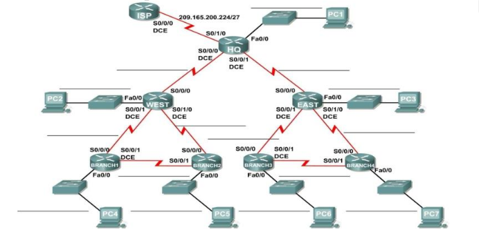
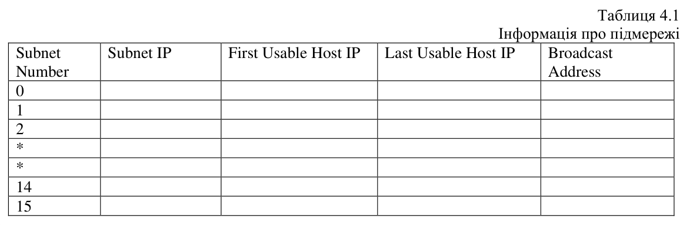
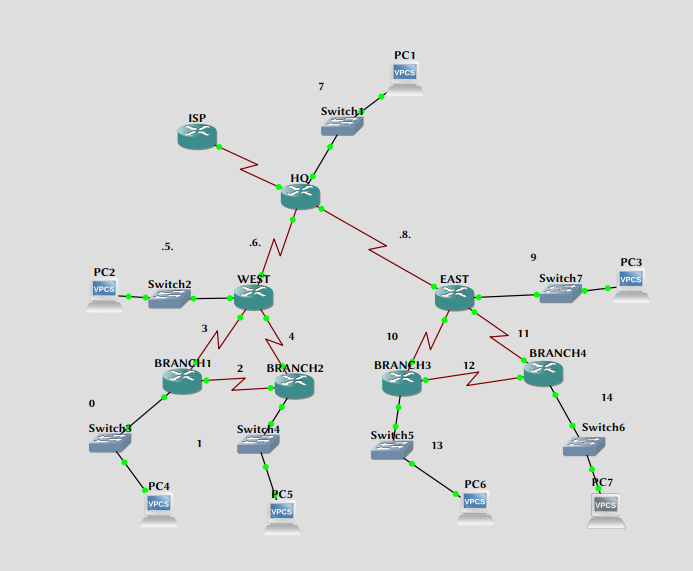

\input{$UNI/.templates/parts/header.tex}
Вивчити принципи безкласової адресації, планування адресного простору
та організації підмереж

```
> mmm=24
> nnn=13
> mmm+nnn
[1] 37
> x <- (nnn / 4)+2
> nnn1 <- 5; y <- nnn1/2 + 4
> z = 30-5-6

> x
[1] 5.25
> y
[1] 6.5
> z
[1] 19
```

IP-адреса
: 192.37.0.0/16

# Індивідуальне завдання

1. Ознайомтеся із теоретичними відомостями до роботи.

2. Отримайте мережеву адресу від викладача (приклад
   172.16.0.0/16) для поділу на підмережі і присвоєння
   IP адрес для мережі, зображеній на топологічній
   схемі рис.4.1.

3. Мережа повинна відповідати вимогам до адресації:
	- Branch 1 LAN  потребуватиме 5 IP адрес.
	- Branch 2 LAN  потребуватиме 5 IP адрес.
	- Branch 3 LAN  потребуватиме 5 IP адрес.
	- Branch 4 LAN  потребуватиме 5 IP адрес.
	- West LAN потребуватиме 6 хостів.
	- East LAN потребуватиме 6 хостів.
	- HQ LAN потребуватиме 19 IP адрес.

З’єднання між кожним з маршрутизаторів буде потребувати ІР адресу для кожного кінця
з’єднання.

*(Примітка: Пам'ятайте, що інтерфейс мережевого пристрою є також  хостом  і IP-адреса
включена у вище зазначені вимоги адресації. X, Y, Z – задає викладач для кожного варіанту)*

## Хід виконання роботи



4. Вивчіть вимоги до мережі:
	a) Скільки підмереж необхідно? **15**
	b) Яка максимальна кількість IP адрес необхідна для однієї підмережі?
	   **19**
	c) Скільки  IP адрес, необхідно для кожної гілки локальних мереж?
	   **5**
	d) Скільки  IP адрес, необхідно для всіх з’єднань між маршрутизаторами?
	   **32** (2 для роутерів, адреса підмережі, широкомовна адреса в тій підмережі)
	e) Яка загальна кількість IP адрес є необхідною ? $19+5*4+32+2*6 = 83$. Поділіть на
	   підмережі (172.16.0.0) мережу, керуючись максимальною кількістю
	   хостів, необхідних для найбільшої підмережі. Заповніть таблицю 4.1.



5. Призначте підмережу для мережі, зображеної на топологічній схемі:
	a) Призначте першу підмережу для Branch 1 LAN subnet: **192.37.0.0/24**
	b) Призначте другу підмережу для Branch 2 LAN subnet: **192.37.1.0/24**
	c) Призначте третю підмережу для з’єднання між маршрутизаторами Branch
	   1 та Branch 2: **192.37.2.0/24**
	d) Призначте четверту підмережу для з’єднання між маршрутизаторами
	   Branch 1 та West: **192.37.3.0/24**
	e) Призначте п’яту підмережу для з’єднання між маршрутизаторами Branch
	   2 та West: **192.37.4.0/24**
	f) Призначте шосту підмережу для West LAN subnet: **192.37.5.0/24**
	g) Призначте сьому підмережу для з’єднання між маршрутизаторами West та
	   HQ: **192.37.6.0/24**
	h) Призначте восьму підмережу для HQ LAN subnet: **192.37.7.0/24**
	i) Призначте дев’яту підмережу для з’єднання між маршрутизаторами HQ та
	   East: **192.37.8.0/24**
	j) Призначте десяту підмережу для East LAN subnet:
	   **192.37.9.0/24**
	k) Призначте дев’яту підмережу для з’єднання між маршрутизаторами
	   Branch 3 та East :
	   **192.37.10.0/24**
	l) Призначте дев’яту підмережу для з’єднання між маршрутизаторами
	   Branch 4 та East :
	   **192.37.11.0/24**
	m) Призначте дев’яту підмережу для з’єднання між маршрутизаторами
	   Branch 3 та Branch 4:
	   **192.37.12.0/24**
	n) Призначте чотирнадцяту підмережу для Branch 3 subnet:
	   **192.37.13.0/24**
	o) Призначте п’ятнадцяту підмережу для Branch 4 subnet:
	   **192.37.14.0/24**

```
subnet number   subnet ip     first usable host ip     last usable host ip     broadcast address
1               192.37.0.0    192.37.0.1                192.37.0.254                192.37.0.255
2               192.37.1.0    192.37.1.1                192.37.1.254                192.37.1.255
3               192.37.2.0    192.37.2.1                192.37.2.254                192.37.2.255
4               192.37.3.0    192.37.3.1                192.37.3.254                192.37.3.255
5               192.37.4.0    192.37.4.1                192.37.4.254                192.37.4.255
6               192.37.5.0    192.37.5.1                192.37.5.254                192.37.5.255
7               192.37.6.0    192.37.6.1                192.37.6.254                192.37.6.255
8               192.37.7.0    192.37.7.1                192.37.7.254                192.37.7.255
9               192.37.8.0    192.37.8.1                192.37.8.254                192.37.8.255
10              192.37.9.0    192.37.9.1                192.37.9.254                192.37.9.255
11              192.37.10.0   192.37.10.1               192.37.10.254               192.37.10.255
12              192.37.11.0   192.37.11.1               192.37.11.254               192.37.11.255
13              192.37.12.0   192.37.12.1               192.37.12.254               192.37.12.255
14              192.37.13.0   192.37.13.1               192.37.13.254               192.37.13.255
15              192.37.14.0   192.37.14.1               192.37.14.254               192.37.14.255
```

6. Призначте адреси для маршрутизатора HQ мережі:
	a) Призначте мережевому інтерфейсу першу дійсну адресу хоста в
	   підмережі HQ LAN: **192.37.7.1/24**
	b) Призначте інтерфейсу S0/0/0 першу дійсну адресу хоста в підмережі
	   з’єднанні від від HQ до West : **192.37.6.1/24**
	c) Призначте інтерфейсу S0/0/1 першу дійсну адресу хоста в підмережі
	   з’єднанні від HQ до East : **192.37.8.1/24**
7. Призначте адреси для маршрутизатора  West:
	a) Призначте мережевому інтерфейсу LAN першу дійсну адресу хоста в
	   підмережі West LAN: **192.37.5.1/24**
	b) Призначте інтерфейсу S0/0/0 першу дійсну адресу хоста в підмережі
	   з’єднанні від HQ до West: **192.37.6.2/24**
	c) Призначте інтерфейсу S0/0/1 першу дійсну адресу хоста в підмережі
	   з’єднанні від West до Branch 3: **192.37.5.2/24**
	d) Призначте інтерфейсу S0/1/0 першу дійсну адресу хоста в підмережі
	   з’єднанні від West до Branch 4: **192.37.4.1/24**
8. Призначте адреси для маршрутизатора East:
	a) Призначте мережевому інтерфейсу LAN першу дійсну адресу хоста в
	   підмережі East LAN: **192.37.9.1/24**
	b) Призначте інтерфейсу S0/0/0 першу дійсну адресу хоста в підмережі
	   з’єднанні від HQ до East: **192.37.8.2/24**
	c) Призначте інтерфейсу S0/0/1 першу дійсну адресу хоста в підмережі
	   з’єднанні від East до Branch 3: **192.37.10.1/24**
	d) Призначте інтерфейсу S0/1/0 першу дійсну адресу хоста в підмережі
	   з’єднанні від East до Branch 4: **192.37.11.1/24**
9. Призначте адреси для маршрутизатора Branch 1:
	a) Призначте мережевому інтерфейсу LAN першу дійсну адресу хоста в
	   підмережі Branch 1 LAN: **192.37.0.1/24**
	b) Призначте інтерфейсу S0/0/0 останню дійсну адресу хоста в підмережі
	   з’єднанні від West до Branch 1: **192.37.3.254/24**
	c) Призначте інтерфейсу S0/0/1 першу дійсну адресу хоста в підмережі
	   з’єднанні від Branch 1  до Branch 2: **192.37.2.1/24**
10. Призначте адреси для маршрутизатора 2:
	a) Призначте мережевому інтерфейсу LAN першу дійсну адресу хоста в
	   підмережі Branch 2 LAN: **192.37.1.1/24**
	b) Призначте інтерфейсу S0/0/0 останню дійсну адресу хоста в підмережі
	   з’єднанні від West до Branch 2: **192.37.4.2/24**
	c) Призначте інтерфейсу S0/0/1 останню дійсну адресу хоста в підмережі
	   з’єднанні від Branch 1  до Branch 2: **192.37.2.2/24**
11. Призначте адреси для маршрутизатора Branch 3:
	a) Призначте мережевому інтерфейсу LAN першу дійсну адресу хоста в
	   підмережі Branch 3: **192.37.13.1/24**
	b) Призначте інтерфейсу S0/0/0 останню дійсну адресу хоста в підмережі
	   з’єднанні від East до Branch 3: **192.37.10.2/24**
	c) Призначте інтерфейсу S0/0/1 першу дійсну адресу хоста в підмережі
	   з’єднанні від Branch 3  до Branch 4: **192.37.12.1/24**
12. Призначте адреси для маршрутизатора Branch 4:
	a) Призначте мережевому інтерфейсу LAN першу дійсну адресу хоста в
	   підмережі Branch 4 LAN: **192.37.14.1/24**
	b) Призначте інтерфейсу S0/0/0 останню дійсну адресу хоста в підмережі
	   з’єднанні від East до Branch 4: **192.37.11.2/24**
	c) Призначте інтерфейсу S0/0/1 останню дійсну адресу хоста в підмережі
	   з’єднанні від Branch 3  до Branch 4: **192.37.12.2/24**
13. Призначте адреси для ПК:
	a) Призначте останню дійсну адресу хоста в підмережі HQ на ПК1: **192.37.7.2**
	b) Призначте останню дійсну адресу хоста в підмережі West LAN на ПК2: **192.37.5.2**
	c) Призначте останню дійсну адресу хоста в підмережі East 1 LAN на ПК3: **192.37.9.2**
	d) Призначте останню дійсну адресу хоста в підмережі BRANCH1 LAN1 на
	   ПК4: **192.37.0.2**
	e) Призначте останню дійсну адресу хоста в підмережі BRANCH2 LAN 1 на
	   ПК5: **192.37.1.2**
	f) Призначте останню дійсну адресу хоста в підмережі BRANCH3 LAN 1 на
	   ПК6: **192.37.13.2**
	g) Призначте останню дійсну адресу хоста в підмережі BRANCH4 LAN 1 на
	   ПК7: **192.37.14.2**


```
ip 192.37.7.2 192.37.7.1
ip 192.37.5.2 192.37.5.1
ip 192.37.9.2 192.37.9.1
ip 192.37.0.2 192.37.0.1
ip 192.37.1.2 192.37.1.1
ip 192.37.13.2 192.37.13.1
ip 192.37.14.2 192.37.14.1
```



# Висновок

Я спроєктував задану мережу та симулював її в GNS3.

# Відповіді на контрольні запитання

1) **Що являє собою IP-адреса? Який розмір IP-адреси?**
IP-адреса - це унікальний числовий ідентифікатор, який призначений кожному пристрою,
підключеному до Інтернету. Він використовується для ідентифікації і взаємодії між
пристроями в мережі. адреса IPv4 складається з 32 бітів, адреса IPv6 --- з 128.

2) **Що таке CIDR?**
CIDR, Classless InterDomain Routing - технологія безкласової міждоменної маршрутизації.

3) **Як встановлюється відповідність між адресами різних типів?**
   Якщо мова про відповідність між адресами MAC та IP, то для цього використовуються протоколи ARP (Adress Resolution Protocol) та RARP, де IP й відповідні MAC записані в ARP-таблицях.

4) **Для чого робиться розбиття на підмережі?**
Розбиття на підмережі використовується для ефективного управління IPадресами та для
зменшення розміру таблиць маршрутизації в мережах. Кожна підмережа має свій власний
діапазон IP-адрес, що дозволяє забезпечити безпеку, контроль доступу і маршрутизацію в
мережі. Крім того, розбиття на підмережі дозволяє економити простір адрес, оскільки
дозволяє використовувати меншу кількість IP-адрес для кожної підмережі, а не виділяти
окремий адрес для кожного пристрою в мережі.

5) **Поясніть поняття маски підмережі. Для чого вони призначені?**
Маска підмережі - це набір бітів, який використовується для ідентифікації мережі та її
підмереж в IP-адресі. Маска підмережі вказує, які біти у IP-адресі призначені для
ідентифікації мережі та її підмереж, а які - для ідентифікації конкретного пристрою в мережі.

6) **Скільки підмереж адресують $n$ біт? Які обмеження вам відомі?**
Для визначення доступного числа ідентифікаторів вузлів залежно від кількості біт, що
залишилися для вузлів, можна використати формулу $2^n-2$. Оскільки в кожної
підмережі дві адреси вузлів зарезервовані, тобто адреси з усіма нулями або всіма одиницями.
Обмеження, пов'язані з адресацією підмереж в мережі: максимальна кількість підмереж, що
можуть бути адресовані в мережі, і максимальна кількість пристроїв, які можуть бути
адресовані в окремій підмережі.

7) **Як відбувається обмін даними між підмережами?**
Обмін даними між підмережами відбувається за допомогою маршрутизаторів, які є
пристроями, що забезпечують пересилання даних між різними мережами. Кожна підмережа
має свій власний діапазон IP-адрес, тому маршрутизатори використовують таблиці
маршрутизації, щоб визначити оптимальний шлях для передачі пакетів між різними
мережами.
