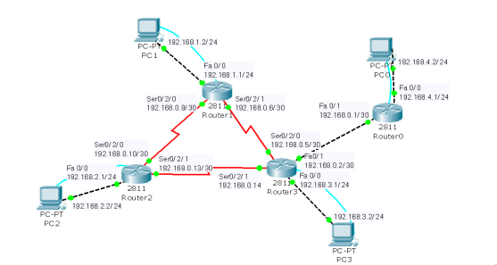
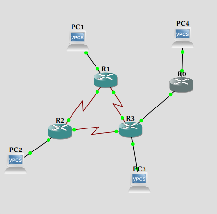

\input{$UNI/.templates/parts/header.tex}
Освоїти принципи конфігурування маршрутизатора, навчитися задавати
ім’я маршрутизатору, паролі доступу та конфігурувати інтерфейси.

# Хід виконання роботи

1. Ознайомтесь з короткими теоретичними відомостями.

2. Створіть віртуальну мережу на емуляторі Packet Tracer. Для побудови мережі
   будемо використовувати 4 маршрутизатори CISCO і 4 персональні комп’ютери
   (рис. 9.3). Комп’ютери з маршрутизаторами з’єднуємо за допомогою консольних
   кабелів та обернених кабелів UTP 5E. Маршрутизатори між собою з’єднуємо за
   допомогою DCE/DTE кабелів. Залишаємо можливість до подальшого нарощування
   мережі.





3. Сконфігуруйте назви маршрутизаторів та призначте IP-адреси інтерфейсам та
   робочим станціям.

4. Налаштування паролю і секретного паролю привілейованого режиму
	a) У режимі глобального налаштування задайте пароль cisco:
	```
	Router0 (config) # enable password cisco
	```
	b) Задайте зашифрований пароль привілейованого режиму cisco123 за допомогою команди
	```
	secret:
	Router0 (config) # enable secret cisco123
	```

	```sh
R0#conf t
Enter configuration commands, one per line.  End with CNTL/Z.
R0(config)#enable password cisco
R0(config)#enable secret cisco123
R0(config)#
	```

5. Налаштування паролю каналу vty для надання доступу telnet до маршрутизатора.
	a) У режимі глобального налаштування, перейдіть у режим налаштування
	   лінії, щоб задати лінії vty:
	```
	Router0 (config) # line vty 0 4
	```
	b) Задайте пароль cisco123, вкажіть, що пароль потрібно вводити при
	   кожному вході в систему, вийдіть з режиму налаштування лінії
	   (команда exit) і завершіть сеанс налаштування:
	```
	Router0 (config-line) # password cisco123
	Router0 (config-line) # login
	Router0 (config-line) # exit
	Router0 (config) #
	```

	```sh
R0(config)#line vty 0 4
R0(config-line)#password cisco123
R0(config-line)#login
R0(config-line)#exit
	```

6. Налаштування шифрування паролю, початкового повідомлення і відключення
   пошуку сервера домену.
	a) Зараз, при перегляді чинної конфігурації паролі лінії і привілейованого
   	режиму представляються відкритим текстом. Для того, щоб переконатися в
   	цьому, введіть команду show running-config. Щоб ніхто не зміг підглянути
   	паролі, всі паролі можна зашифрувати.

	```
	Router0(config) # service password-encryption
	```

	```sh
	R0(config)#service password-encryption
	R0(config)#end
	R0#sh
	*Mar  1 00:03:39.443: %SYS-5-CONFIG_I: Configured from console by console
	R0#sh runn
	R0#sh running-config
	Building configuration...

	Current configuration : 1571 bytes
	!
	version 12.4
	service timestamps debug datetime msec
	service timestamps log datetime msec
	service password-encryption
	!
	hostname R0
	!
	boot-start-marker
	boot-end-marker
	!
	enable secret 5 $1$LYNJ$xroDuVxXaUnByWWfx8EY.0
	enable password 7 045802150C2E
	!
	no aaa new-model
	memory-size iomem 5
	no ip icmp rate-limit unreachable
	ip cef
	!
	!
	!
	```

	Для того, щоб переконатися, що тепер паролі зашифровані, введіть
	команду show running-config.
	b) Для видачі попередження при спробі входу на маршрутизатор налаштуйте повідомлення
	MOTD.

	```
	Router0 (config) # banner motd $ Authorized Access Only! $
	```

	```sh
	R0(config)#banner motd $ Authorized Access Only! $
	```

	c) Перевірте повідомлення і паролі. Вийдіть з маршрутизатора (для цього двічі введіть
	команду exit). Перед запитом паролю виводиться початкове повідомлення. Введіть пароль і знову
	увійдіть в систему маршрутизатора.
	d) Можливо, Ви помітили, що при некоректному введенні команди в користувацькому або
	привілейованому режимі EXEC маршрутизатор призупиняється, намагаючись знайти IP-адресу,
	що відповідає неправильно введеним словам. Наприклад, нижче показано, що відбувається в разі
	помилки в команді enable.

	```
	Router0> emable
	Translating “emable” ... domain server (255.255.255.255)
	```

	Для того, щоб цього не відбувалося, наступна команда дозволяє відключити пошук в DNS
	з командного рядка маршрутизатора.

	```
	Router0 (config) # no ip domain-lookup
	```

	```sh
	R0(config)#no ip domain-lookup
	```

	e) Збережіть поточну конфігурацію в якості початкової:

	```
	Router0 (config) # end
	Router0 # copy run start
	```

	```sh
	R0(config)#end
	R0#wr
	Building configuration...
	[OK]
	R0#
	*Mar  1 00:04:11.943: %SYS-5-CONFIG_I: Configured from console by console
	```

7. Виконайте пункти 4-6 на інших маршрутизаторах.

**Просто копіюю конфігураційний файл роутера зі зміною імені хоста**

8. Конфігурування послідовного інтерфейсу на маршрутизаторі. Для конфігурації
   потрібно виконати такі дії:
	a) Увійти в режим глобальної конфігурації.
	b) Увійти в режим налаштування потрібного інтерфейсу.
	c) Сконфігурувати IP-адресу для інтерфейсу і маску підмережі.
	d) Вказати полосу пропускання каналу (необов’язковий етап).
	e) Встановити частоту синхронізуючих імпульсів передаючого (DCE) пристрою (для
   	приймаючого пристрою DTE цей етап потрібно пропустити).
	f) Включити інтерфейс.


```sh
R1#conf t
Enter configuration commands, one per line.  End with CNTL/Z.
R1(config)#interface serial 2/1
R1(config-if)#ip address 192.168.0.6 255.255.255.252
R1(config-if)#no shutdown
R1(config-if)#interface serial 2/0
R1(config-if)#ip address 192.168.0.9 255.255.255.252
R1(config-if)#no shutdown
R1(config-if)#
*Mar  1 00:21:05.335: %LINK-3-UPDOWN: Interface Serial2/1, changed state to up
*Mar  1 00:21:05.379: %LINK-3-UPDOWN: Interface Serial2/0, changed state to up
R1(config-if)#
*Mar  1 00:21:06.339: %LINEPROTO-5-UPDOWN: Line protocol on Interface Serial2/1, changed state to up
*Mar  1 00:21:06.383: %LINEPROTO-5-UPDOWN: Line protocol on Interface Serial2/0, changed state to up
R1(config-if)#
```

```sh
R1#sh ip int br
Interface                  IP-Address      OK? Method Status                Protocol
FastEthernet0/0            unassigned      YES NVRAM  administratively down down
Serial0/0                  unassigned      YES NVRAM  administratively down down
FastEthernet0/1            unassigned      YES NVRAM  administratively down down
Serial0/1                  unassigned      YES NVRAM  administratively down down
Serial0/2                  unassigned      YES NVRAM  administratively down down
FastEthernet1/0            unassigned      YES NVRAM  administratively down down
Serial2/0                  192.168.0.9     YES manual up                    up
Serial2/1                  192.168.0.6     YES manual up                    up
Serial2/2                  unassigned      YES NVRAM  administratively down down
Serial2/3                  unassigned      YES NVRAM  administratively down down
```

9. Налаштування інтерфейсу Ethernet. Для налаштування потрібно виконати дії,
   вказані нижче (приклад 11.7):
	a) Увійти в режим глобальної конфігурації.
	b) Увійти в режим налаштування потрібного інтерфейсу.
	c) Сконфігурувати IP-адресу для інтерфейсу і маску підмережі.
	d) Включити інтерфейс

```sh
R1(config)#int fa0/0
R1(config-if)#ip add 192.168.1.1 255.255.255.0

R1(config-if)#no shut
*Mar  1 00:30:56.751: %LINK-3-UPDOWN: Interface FastEthernet0/0, changed state to up
*Mar  1 00:30:57.751: %LINEPROTO-5-UPDOWN: Line protocol on Interface FastEthernet0/0, changed state to up
```

```sh
R1#sh ip int br
Interface                  IP-Address      OK? Method Status                Protocol
FastEthernet0/0            192.168.1.1     YES manual up                    up
Serial0/0                  unassigned      YES NVRAM  administratively down down
FastEthernet0/1            unassigned      YES NVRAM  administratively down down
Serial0/1                  unassigned      YES NVRAM  administratively down down
Serial0/2                  unassigned      YES NVRAM  administratively down down
FastEthernet1/0            unassigned      YES NVRAM  administratively down down
Serial2/0                  192.168.0.9     YES manual up                    down
Serial2/1                  192.168.0.6     YES manual up                    down
Serial2/2                  unassigned      YES NVRAM  administratively down down
Serial2/3                  unassigned      YES NVRAM  administratively down down
```

10. Вище приведені приклади конфігурування інтерфейсів застосуємо до всіх
маршрутизаторів.


```sh
R2(config)#int s2/0
R2(config-if)#ip add 192.168.0.10 255.255.255.252
R2(config-if)#no shut
R2(config-if)#int fa0/0
R2(config-if)#ip add 192.168.3.1 255.255.255.0
R2(config-if)#no shut
```

```sh
R2#sh ip int br
Interface                  IP-Address      OK? Method Status                Protocol
FastEthernet0/0            192.168.3.1     YES manual up                    up
Serial0/0                  unassigned      YES NVRAM  administratively down down
FastEthernet0/1            unassigned      YES NVRAM  administratively down down
Serial0/1                  unassigned      YES NVRAM  administratively down down
Serial0/2                  unassigned      YES NVRAM  administratively down down
FastEthernet1/0            unassigned      YES NVRAM  administratively down down
Serial2/0                  192.168.0.10    YES manual up                    up
Serial2/1                  192.168.2.2     YES manual up                    up
Serial2/2                  unassigned      YES NVRAM  administratively down down
Serial2/3                  unassigned      YES NVRAM  administratively down down
```

R3

```sh
R3(config)#int s2/0
R3(config-if)#ip add 192.168.0.5 255.255.255.252
R3(config-if)#no shut
R3(config-if)#int fa0/0
R3(config-if)#ip add 192.168.4.1 255.255.255.0
R3(config-if)#no shut
R3(config-if)#
*Mar  1 01:09:47.743: %LINK-3-UPDOWN: Interface FastEthernet0/0, changed state to up
*Mar  1 01:09:48.743: %LINEPROTO-5-UPDOWN: Line protocol on Interface FastEthernet0/0, changed state to up
R3(config)#int fa0/1
R3(config-if)#ip add 192.168.5.1 255.255.255.0
R3(config-if)#no shut
R3(config-if)#end
R3#
*Mar  1 01:11:35.775: %SYS-5-CONFIG_I: Configured from console by console
R3#
*Mar  1 01:11:35.911: %LINK-3-UPDOWN: Interface FastEthernet0/1, changed state to up
*Mar  1 01:11:36.911: %LINEPROTO-5-UPDOWN: Line protocol on Interface FastEthernet0/1, changed state to up
R3#sh ip int br
Interface                  IP-Address      OK? Method Status                Protocol
FastEthernet0/0            192.168.4.1     YES manual up                    up
Serial0/0                  unassigned      YES NVRAM  administratively down down
FastEthernet0/1            192.168.5.1     YES manual up                    up
Serial0/1                  unassigned      YES NVRAM  administratively down down
Serial0/2                  unassigned      YES NVRAM  administratively down down
FastEthernet1/0            unassigned      YES NVRAM  administratively down down
Serial2/0                  192.168.0.5     YES manual up                    up
Serial2/1                  192.168.2.1     YES manual up                    up
Serial2/2                  unassigned      YES NVRAM  administratively down down
Serial2/3                  unassigned      YES NVRAM  administratively down down
```

```sh
R0(config)#int fa0/1
R0(config-if)#ip add 192.168.5.2 255.255.255.0
R0(config-if)#no shut
R0(config-if)#int f
*Mar  1 01:18:23.771: %LINK-3-UPDOWN: Interface FastEthernet0/1, changed state to up
*Mar  1 01:18:24.771: %LINEPROTO-5-UPDOWN: Line protocol on Interface FastEthernet0/1, changed state to up
R0(config-if)#int fa0/0
R0(config-if)#ip add 192.168.6.1 255.255.255.0
R0(config-if)#no sh
R0(config-if)#
*Mar  1 01:18:45.279: %LINK-3-UPDOWN: Interface FastEthernet0/0, changed state to up
*Mar  1 01:18:46.279: %LINEPROTO-5-UPDOWN: Line protocol on Interface FastEthernet0/0, changed state to up
R0(config-if)#end
R0#
*Mar  1 01:18:58.087: %SYS-5-CONFIG_I: Configured from console by console
R0#sh ip int br
Interface                  IP-Address      OK? Method Status                Protocol
FastEthernet0/0            192.168.6.1     YES manual up                    up
Serial0/0                  unassigned      YES NVRAM  administratively down down
FastEthernet0/1            192.168.5.2     YES manual up                    up
Serial0/1                  unassigned      YES NVRAM  administratively down down
Serial0/2                  unassigned      YES NVRAM  administratively down down
FastEthernet1/0            unassigned      YES NVRAM  administratively down down
Serial2/0                  unassigned      YES NVRAM  administratively down down
Serial2/1                  unassigned      YES NVRAM  administratively down down
Serial2/2                  unassigned      YES NVRAM  administratively down down
Serial2/3                  unassigned      YES NVRAM  administratively down down
```

# Висновок

Я налаштував маршрутизатор Cisco.

# Відповіді на контрольні запитання

1) **На якому рівні працює маршрутизатор та які функції він виконує?** L3
2) **Як відбувається процес завантаження маршрутизатора?** Відбувається самотестування (POST, Power on self-test) --- перевірка, чи нічого не відпало на фізичному рівні. Далі завантажувач системи, bootloader, шукає образ операційки в енергонезалежній пам'яті та запускає. Операційна система після запуску читає файл початкової конфігурації, або, якщо його нема, переходить у режим налаштування.
3) **Які способи налаштування маршрутизатора Ви знаєте?** Через вебінтерфейс, командний рядок, під'єднатись через серійний кабель чи UART, паяльником.
4) **Перечисліть режими конфігурування маршрутизатора?** Привілейований, звичайний, режим глобальної конфігурації.
5) **Як повинно виглядати запрошення командної стрічки, якщо Ви хочете виконати налаштування інтерфейсу?** hostname (config-інтерфейс)#
6) **Які дві частини мережевої адреси використовуються маршрутизатором для пересилки даних по мережі?** IP-адреса та маска підмережі
7) **Який протокол використовує для свого функціонування команда ping?** ICMP.
