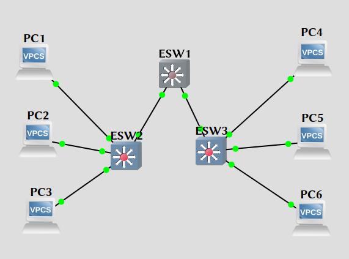

\input{$UNI/.templates/parts/header.tex}
Вивчити принципи конфігурування VLAN на комутаторах Cisco Catalyst
2960.

# Хід роботи

## Завдання 1: Зібрати схему для виконання лабораторної роботи




### Крок 1: Видаліть існуючу конфігурацію та перезавантажте комутатори.

1.  Зайти в exec-mode (пароль cisco).

```
S1>enable
```

2.  Видалити файл з інформацією про VLAN.

```
S1# delete flash:vlan.dat
Delete filename [vlan.dat]?[Enter]
Delete flash:vlan.dat? [confirm] [Enter]
Якщо файл vlan.dat відсутній на комутаторі буде виведено повідомлення:
%Error deleting flash:vlan.dat (No such file or directory)
```

```sh
ESW1#delete flash:vlan.dat
Delete filename [vlan.dat]?
Delete flash:vlan.dat? [confirm]
%Error deleting flash:vlan.dat (File not found)
```

3.  Видалити файл конфігурації з NVRAM.

```
S1# erase startup-config
```

В результаті введення команди буде виведено повідомлення:

```
Erasing the nvram filesystem will remove all files! Continue? [confirm]
```

Натиснути Enter для підтвердження.

```sh
ESW1#erase startup-config
Erasing the nvram filesystem will remove all configuration files! Continue? [confirm]
[OK]
Erase of nvram: complete
ESW1#
*Mar  1 00:02:32.479: %SYS-7-NV_BLOCK_INIT: Initialized the geometry of nvram
ESW1#
```

4.  Перевірити видалення інформації про VLAN.

```
S1# show vlan
```
Якщо інформація видалена, перезавантажити комутатор за допомогою команди:
```
S1# reload
```

```sh
ESW1#show vlan
% Ambiguous command:  "show vlan"
ESW1#vl

VLAN Name                             Status    Ports
---- -------------------------------- --------- -------------------------------
1    default                          active    Fa1/0, Fa1/1, Fa1/2, Fa1/3
                                                Fa1/4, Fa1/5, Fa1/6, Fa1/7
                                                Fa1/8, Fa1/9, Fa1/10, Fa1/11
                                                Fa1/12, Fa1/13, Fa1/14, Fa1/15
                                                Fa2/0, Fa2/1, Fa2/2, Fa2/3
                                                Fa2/4, Fa2/5, Fa2/6, Fa2/7
                                                Fa2/8, Fa2/9, Fa2/10, Fa2/11
                                                Fa2/12, Fa2/13, Fa2/14, Fa2/15
1002 fddi-default                     act/unsup
1003 token-ring-default               act/unsup
1004 fddinet-default                  act/unsup
1005 trnet-default                    act/unsup
```

## Завдання 2: Задайте базові налаштування комутатора.
### Крок  1:  Встановіть  ім’я  комутатора,  пароль  на  вхід  на  консолі,  пароль  на  віртуальний термінал.

```
Switch#conf t
Switch(config)#hostname S1
S1(config)#enable password cisco
Switch1(config)#enable secret class
Switch1(config)#line console 0
Switch1(config-line)#password cisco
Switch1(config-line)#login
Switch1(config-line)#line vty 0 15
Switch1(config-line)#password cisco
Switch1(config-line)#login
Switch1(config-line)#end
```

не змінюю ім'я хоста, щоб легше було відрізнити

```sh
ESW1(config)#enable password cisco
ESW1(config)#enable secret class
ESW1(config)#line console 0
ESW1(config-line)#password cisco
ESW1(config-line)#login
ESW1(config-line)#line vty 0 15
ESW1(config-line)#password cisco
ESW1(config-line)#login
ESW1(config-line)#end
ESW1#
*Mar  1 00:08:50.951: %SYS-5-CONFIG_I: Configured from console by console
```

### Крок 2: Задайте ір-адресу vlan 1 та шлюз.

```
S1(config)#int vlan 1
S1(config-if)#ip address 172.16.0.2 255.255.0.0
S1(config-if)#no shutdown
S1(config-if)#exit
S1(config)#ip default-gateway 172.16.0.1
S1(config)#end
```

```sh
ESW1(config)#int vlan 1
ESW1(config-if)#ip address 172.16.0.2 255.255.0.0
ESW1(config-if)#no shutdown
ESW1(config-if)#exit
ESW1(config)#ip default-gateway 172.16.0.1
ESW1(config)#end
ESW1#
*Mar  1 00:18:53.915: %SYS-5-CONFIG_I: Configured from console by console
ESW1#
*Mar  1 00:18:55.863: %LINK-3-UPDOWN: Interface Vlan1, changed state to up
*Mar  1 00:18:56.863: %LINEPROTO-5-UPDOWN: Line protocol on Interface Vlan1, changed state to up
```

## Завдання 3: Виконайте аналогічні налаштування для комутаторів S2 та S3.

## Завдання 4: Налаштуйте VLAN на комутаторі за допомогою команди vlan vlan-id.
У цій лабораторній роботі потрібно налаштувати 4 мережі VLAN: VLAN 10 (staff);
VLAN 20  (students);  VLAN  30  (guest);  і  VLAN  99  (management).  Після
створення  VLAN,  в  режимі конфігурації vlan, призначити ім’я для VLAN за
допомогою команди name vlan name.

```
S1(config)#vlan 10
S1(config-vlan)#name staff
S1(config-vlan)#exit
S1(config-vlan)#vlan 20
S1(config-vlan)#name students
S1(config-vlan)#exit
S1(config-vlan)#vlan 30
S1(config-vlan)#name guest
S1(config-vlan)#exit
S1(config-vlan)#vlan 99
S1(config-vlan)#name management
S1(config-vlan)#end
```

```sh
ESW1#conf t
Enter configuration commands, one per line.  End with CNTL/Z.
ESW1(config)#vlan 10
ESW1(config-vlan)#name staff
ESW1(config-vlan)#exit
ESW1(config)#vlan 20
ESW1(config-vlan)#name students
ESW1(config-vlan)#exit
ESW1(config)#vlan 30
ESW1(config-vlan)#name guest
ESW1(config-vlan)#exit
ESW1(config)#vlan 99
ESW1(config-vlan)#name management
ESW1(config-vlan)#end
ESW1#
*Mar  1 00:25:20.683: %SYS-5-CONFIG_I: Configured from console
by console
```

Перевірте створення VLAN на комутаторі S1.

```sh
ESW1#vl

VLAN Name                             Status    Ports
---- -------------------------------- --------- -------------------------------
1    default                          active    Fa1/0, Fa1/1, Fa1/2, Fa1/3
                                                Fa1/4, Fa1/5, Fa1/6, Fa1/7
                                                Fa1/8, Fa1/9, Fa1/10, Fa1/11
                                                Fa1/12, Fa1/13, Fa1/14, Fa1/15
                                                Fa2/0, Fa2/1, Fa2/2, Fa2/3
                                                Fa2/4, Fa2/5, Fa2/6, Fa2/7
                                                Fa2/8, Fa2/9, Fa2/10, Fa2/11
                                                Fa2/12, Fa2/13, Fa2/14, Fa2/15
10   staff                            active
20   students                         active
30   guest                            active
99   management                       active
1002 fddi-default                     act/unsup
1003 token-ring-default               act/unsup
1004 fddinet-default                  act/unsup
1005 trnet-default                    act/unsup
```

## Завдання 5: Виконайте аналогічні налаштування для комутаторів S2 та S3.

### s2

```sh
ESW2#conf t
Enter configuration commands, one per line.  End with CNTL/Z.
ESW2(config)#enable password cisco
ESW2(config)#enable secret class
ESW2(config)#line console 0
ESW2(config-line)#password cisco
ESW2(config-line)#login
ESW2(config-line)#line vty 0 15
ESW2(config-line)#password cisco
ESW2(config-line)#login
ESW2(config-line)#end
```

```sh
ESW2#conf t
Enter configuration commands, one per line.  End with CNTL/Z.
ESW2(config)#int vlan 1
ESW2(config-if)#ip address 172.16.0.2 255.255.0.0
ESW2(config-if)#no shutdown
ESW2(config-if)#exit
ESW2(config)#ip default-gateway 172.16.0.1
ESW2(config)#end
ESW2#
ESW2#conf t
Enter configuration commands, one per line.  End with CNTL/Z.
ESW2(config)#vlan 10
ESW2(config-vlan)#name staff
ESW2(config-vlan)#exit
ESW2(config)#vlan 20
ESW2(config-vlan)#name students
ESW2(config-vlan)#exit
ESW2(config)#vlan 30
ESW2(config-vlan)#name guest
ESW2(config-vlan)#exit
ESW2(config)#vlan 99
ESW2(config-vlan)#name management
ESW2(config-vlan)#end
ESW2#
*Mar  1 00:45:10.471: %SYS-5-CONFIG_I: Configured from console by console
*Mar  1 00:45:11.039: %SYS-5-CONFIG_I: Configured from console by console
ESW2#
*Mar  1 00:45:12.207: %LINK-3-UPDOWN: Interface Vlan1, changed state to up
*Mar  1 00:45:13.207: %LINEPROTO-5-UPDOWN: Line protocol on Interface Vlan1, changed state to up
ESW2#
ESW2#vl
VLAN Name                             Status    Ports
---- -------------------------------- --------- -------------------------------
1    default                          active    Fa1/0, Fa1/1, Fa1/2, Fa1/3
                                                Fa1/4, Fa1/5, Fa1/6, Fa1/7
                                                Fa1/8, Fa1/9, Fa1/10, Fa1/11
                                                Fa1/12, Fa1/13, Fa1/14, Fa1/15
                                                Fa2/0, Fa2/1, Fa2/2, Fa2/3
                                                Fa2/4, Fa2/5, Fa2/6, Fa2/7
                                                Fa2/8, Fa2/9, Fa2/10, Fa2/11
                                                Fa2/12, Fa2/13, Fa2/14, Fa2/15
10   staff                            active
20   students                         active
30   guest                            active
99   management                       active
1002 fddi-default                     act/unsup
1003 token-ring-default               act/unsup
1004 fddinet-default                  act/unsup
1005 trnet-default                    act/unsup
```

### s3

```sh
ESW3#conf t
Enter configuration commands, one per line.  End with CNTL/Z.
ESW3(config)#enable password cisco
ESW3(config)#enable secret class
ESW3(config)#line console 0
ESW3(config-line)#password cisco
ESW3(config-line)#login
ESW3(config-line)#line vty 0 15
ESW3(config-line)#password cisco
ESW3(config-line)#login
ESW3(config-line)#end
ESW3#
ESW3#conf t
Enter configuration commands, one per line.  End with CNTL/Z.
ESW3(config)#int vlan 1
ESW3(config-if)#ip address 172.16.0.2 255.255.0.0
ESW3(config-if)#no shutdown
ESW3(config-if)#exit
ESW3(config)#ip default-gateway 172.16.0.1
ESW3(config)#end
ESW3#
ESW3#conf t
Enter configuration commands, one per line.  End with CNTL/Z.
ESW3(config)#vlan 10
ESW3(config-vlan)#name staff
ESW3(config-vlan)#exit
ESW3(config)#vlan 20
ESW3(config-vlan)#name students
ESW3(config-vlan)#exit
ESW3(config)#vlan 30
ESW3(config-vlan)#name guest
ESW3(config-vlan)#exit
ESW3(config)#vlan 99
ESW3(config-vlan)#name management
ESW3(config-vlan)#end
ESW3#
*Mar  1 00:26:03.871: %SYS-5-CONFIG_I: Configured from console by console
*Mar  1 00:26:04.607: %SYS-5-CONFIG_I: Configured from console by console
ESW3#
*Mar  1 00:26:05.139: %SYS-5-CONFIG_I: Configured from console by console
ESW3#
*Mar  1 00:26:06.523: %LINK-3-UPDOWN: Interface Vlan1, changed state to up
*Mar  1 00:26:07.523: %LINEPROTO-5-UPDOWN: Line protocol on Interface Vlan1, changed state to up
ESW3#vl
VLAN Name                             Status    Ports
---- -------------------------------- --------- -------------------------------
1    default                          active    Fa1/0, Fa1/1, Fa1/2, Fa1/3
                                                Fa1/4, Fa1/5, Fa1/6, Fa1/7
                                                Fa1/8, Fa1/9, Fa1/10, Fa1/11
                                                Fa1/12, Fa1/13, Fa1/14, Fa1/15
                                                Fa2/0, Fa2/1, Fa2/2, Fa2/3
                                                Fa2/4, Fa2/5, Fa2/6, Fa2/7
                                                Fa2/8, Fa2/9, Fa2/10, Fa2/11
                                                Fa2/12, Fa2/13, Fa2/14, Fa2/15
10   staff                            active
20   students                         active
30   guest                            active
99   management                       active
1002 fddi-default                     act/unsup
1003 token-ring-default               act/unsup
1004 fddinet-default                  act/unsup
1005 trnet-default                    act/unsup
```

## Завдання  6:  Призначте  порти  комутатора  до  VLAN  мереж  на  S2  і  S3,  використовуючи команду switchport access vlan vlan-id.

Кожен  порт  можна  призначати  індивідуально,  або  груповим  методом,
використовуючи команду interface range. Після завершення зберегти конфігурацію.

### Крок 1: Для комутатора S2.

```
S2(config)#interface range fa0/6-10
S2(config-if-range)#switchport access vlan 30
S2(config-if-range)#interface range fa0/11-17
S2(config-if-range)#switchport access vlan 10
S2(config-if-range)#interface range fa0/18-24
S2(config-if-range)#switchport access vlan 20
S2(config-if-range)#end
S2#copy running-config startup-config
Destination filename [startup-config]? [enter]
Building configuration...
[OK]
```

```sh
ESW2#conf t
Enter configuration commands, one per line.  End with CNTL/Z.
ESW2(config)#int fa1/6
ESW2(config-if)#switchport access vlan 30
ESW2(config-if)#int fa1/11
ESW2(config-if)#switchport access vlan 10
ESW2(config-if)#interface fa1/12
ESW2(config-if)#switchport access vlan 20
ESW2(config-if)#end
ESW2#copy running-config startup-config
Destination filename [startup-config]?
Building configuration...

*Mar  1 01:30:51.731: %SYS-5-CONFIG_I: Configured from console by console[OK]
ESW2#
```

### Крок 2: Для комутатора S3.

```
S3(config)#interface range fa0/6-10
S3(config-if-range)#switchport access vlan 30
S3(config-if-range)#interface range fa0/11-17
S3(config-if-range)#switchport access vlan 10
S3(config-if-range)#interface range fa0/18-24
S3(config-if-range)#switchport access vlan 20
S3(config-if-range)#end
S3#copy running-config startup-config
Destination filename [startup-config]? [enter]
Building configuration...
[OK]
```

```sh
ESW3(config)#int fa1/6
ESW3(config-if)#switchport access vlan 30
ESW3(config-if)#int fa1/11
ESW3(config-if)#switchport access vlan 10
ESW3(config-if)#interface fa1/12
ESW3(config-if)#switchport access vlan 20
ESW3(config-if)#end
ESW3#copy running-config startup-config
Destination filename [startup-config]?
*Mar  1 01:07:31.691: %SYS-5-CONFIG_I: Configured from console by console

Building configuration...
[OK]
```

### Крок 3: Перегляньте призначені порти.
Для перегляду призначених портів використати команду  show vlan id vlan-number. Також,

можна використати команду show vlan name vlan-name .

1.  Для комутатора S2.

```
S2#show vlan id 30
S2#show vlan name guest
```

```sh
ESW2#show vlan-switch id 30

VLAN Name                             Status    Ports
---- -------------------------------- --------- -------------------------------
30   guest                            active    Fa1/6

VLAN Type  SAID       MTU   Parent RingNo BridgeNo Stp  BrdgMode Trans1 Trans2
---- ----- ---------- ----- ------ ------ -------- ---- -------- ------ ------
30   enet  100030     1500  -      -      -        -    -        0      0
ESW2#show vlan-switch name guest

VLAN Name                             Status    Ports
---- -------------------------------- --------- -------------------------------
30   guest                            active    Fa1/6

VLAN Type  SAID       MTU   Parent RingNo BridgeNo Stp  BrdgMode Trans1 Trans2
---- ----- ---------- ----- ------ ------ -------- ---- -------- ------ ------
30   enet  100030     1500  -      -      -        -    -        0      0
```

2.  Для комутатора S3.

```
S3#show vlan id 30
S3#show vlan name guest
```

```sh
ESW3#show vlan-switch id 30

VLAN Name                             Status    Ports
---- -------------------------------- --------- -------------------------------
30   guest                            active    Fa1/6

VLAN Type  SAID       MTU   Parent RingNo BridgeNo Stp  BrdgMode Trans1 Trans2
---- ----- ---------- ----- ------ ------ -------- ---- -------- ------ ------
30   enet  100030     1500  -      -      -        -    -        0      0
ESW3#show vlan-switch name guest

VLAN Name                             Status    Ports
---- -------------------------------- --------- -------------------------------
30   guest                            active    Fa1/6

VLAN Type  SAID       MTU   Parent RingNo BridgeNo Stp  BrdgMode Trans1 Trans2
---- ----- ---------- ----- ------ ------ -------- ---- -------- ------ ------
30   enet  100030     1500  -      -      -        -    -        0      0
```

## Завдання 7: Призначте IP-адреси на VLAN керування.
У режимі налаштування інтерфейсу, використовують команду ip address, щоб призначити

IP-адреси для керування комутаторами через vty.

```
S1(config)#interface vlan 99
S1(config-if)#ip address 172.17.99.11 255.255.255.0
S1(config-if)#no shutdown
S2(config)#interface vlan 99
S2(config-if)#ip address 172.17.99.12 255.255.255.0
S2(config-if)#no shutdown
S3(config)#interface vlan 99
S3(config-if)#ip address 172.17.99.13 255.255.255.0
S3(config-if)#no shutdown
```

Скопіювати поточну конфігурацію в стартову конфігурацію.
```
S1#copy running-config startup-config
```

```sh
ESW1#conf t
Enter configuration commands, one per line.  End with CNTL/Z.
ESW1(config)#interface vlan 99
ESW1(config-if)#ip address 172.17.99.11 255.255.255.0
ESW1(config-if)#no shutdown
ESW1(config-if)#end
ESW1#wr
*Mar  1 01:37:17.867: %SYS-5-CONFIG_I: Configured from console by console
ESW1#wr
Building configuration...
[OK]
```

```sh
ESW2#conf t
Enter configuration commands, one per line.  End with CNTL/Z.
ESW2(config)#interface vlan 99
ESW2(config-if)#ip address 172.17.99.12 255.255.255.0
ESW2(config-if)#no shutdown
ESW2(config-if)#end
ESW2#
*Mar  1 01:42:56.323: %SYS-5-CONFIG_I: Configured from console by console
ESW2#
```

```sh
ESW3#conf t
Enter configuration commands, one per line.  End with CNTL/Z.
ESW3(config)#interface vlan 99
ESW3(config-if)#ip address 172.17.99.13 255.255.255.0
ESW3(config-if)#no shutdown
ESW3(config-if)#end
ESW3#wr
Building configuration...

*Mar  1 01:22:48.635: %SYS-5-CONFIG_I: Configured from console by console[OK]
ESW3#
```

## Завдання  8:  Налаштуйте  транкінг  і  первинну  VLAN  для  магістральних  портів  на  усіх комутаторах.

Транки  –  це  з'єднання  між  комутаторами,  що  дозволяє  комутаторам
обмінюватись інформацією для усіх VLAN. По замовчуванню, транк порт належить
усім VLAN, як протилежний до  порту  доступу,  який  може  належати  тільки
одній  VLAN.  Якщо  комутатор  підтримує  ISL  і 802.1Q VLAN інкапсуляцію,
транкам необхідно вказати, який метод використовувати. Комутатор 2960 підтримує
тільки 802.1Q транкінг.

Первинна  VLAN  призначається  для  802.1Q  транк  порту.  Відповідно  до
завдання  на лабораторну роботу, первинною VLAN є VLAN 99. Номер первинної VLAN
використовується, як загальний  ідентифікатор  на  протилежних  кінцях  транк
з’єднання.  Небажано  використовувати VLAN1 як первинну VLAN.

Використайте команду interface range в глобальному режимі конфігурації для
спрощення

конфігурації транкінгу.

```
S1(config)#interface range fa0/1-5
S1(config-if-range)#switchport mode trunk
S1(config-if-range)#switchport trunk native vlan 99
S1(config-if-range)#no shutdown
S1(config-if-range)#end
S2(config)# interface range fa0/1-5
S2(config-if-range)#switchport mode trunk
S2(config-if-range)#switchport trunk native vlan 99
S2(config-if-range)#no shutdown
S2(config-if-range)#end
S3(config)# interface range fa0/1-5
S3(config-if-range)#switchport mode trunk
S3(config-if-range)#switchport trunk native vlan 99
S3(config-if-range)#no shutdown
S3(config-if-range)#end
```

```sh
ESW1#conf t
Enter configuration commands, one per line.  End with CNTL/Z.
ESW1(config)#int fa1/1
ESW1(config-if)#switchport mode trunk
ESW1(config-if)#switchport trunk native vlan 99
ESW1(config-if)#no shutdown
ESW1(config-if)#int fa1/2
ESW1(config-if)#switchport mode trunk
ESW1(config-if)#
*Mar  1 02:09:36.811: %DTP-5-TRUNKPORTON: Port Fa1/1 has become dot1q trunk
*Mar  1 02:09:37.319: %LINEPROTO-5-UPDOWN: Line protocol on Interface Vlan99, changed state to upswitchport trunk native vlan 99
ESW1(config-if)#
*Mar  1 02:09:40.075: %DTP-5-TRUNKPORTON: Port Fa1/2 has become dot1q trunkno shutdown
ESW1(config-if)#end
ESW1#
ESW1#
*Mar  1 02:09:42.175: %SYS-5-CONFIG_I: Configured from console by console
```

```sh
ESW2#conf t
Enter configuration commands, one per line.  End with CNTL/Z.
ESW2(config)#int fa1/1
ESW2(config-if)#switchport mode trunk
ESW2(config-if)#switchport trunk native vlan 99

*Mar  1 02:15:45.167: %SPANTREE-2-RECV_PVID_ERR: Received BPDU with inconsistent peer vlan id 99 on
FastEthernet1/1 VLAN1.
*Mar  1 02:15:45.171: %SPANTREE-2-BLOCK_PVID_PEER: Blocking FastEthernet1/1 on VLAN99. Inconsistent
peer vlan.
*Mar  1 02:15:45.175: %SPANTREE-2-BLOCK_PVID_LOCAL: Blocking FastEthernet1/1 on VLAN1. Inconsistent
local vlan.PVST+: restarted the forward delay timer for FastEthernet1/1

ESW2(config-if)#no shutdown
ESW2(config-if)#end
ESW2#
*Mar  1 02:15:45.451: %DTP-5-TRUNKPORTON: Port Fa1/1 has become dot1q trunk
*Mar  1 02:15:45.951: %LINEPROTO-5-UPDOWN: Line protocol on Interface Vlan99, changed state to up
ESW2#
*Mar  1 02:15:47.199: %SYS-5-CONFIG_I: Configured from console by console
ESW2#
```

```sh
ESW3(config)#int fa1/2
ESW3(config-if)#switchport mode trunk
ESW3(config-if)#switchport trunk native vlan 99

*Mar  1 01:55:10.699: %SPANTREE-2-RECV_PVID_ERR: Received BPDU with inconsistent peer vlan id 99 on
FastEthernet1/2 VLAN1.
*Mar  1 01:55:10.699: %SPANTREE-2-BLOCK_PVID_PEER: Blocking FastEthernet1/2 on VLAN99. Inconsistent
peer vlan.
*Mar  1 01:55:10.711: %SPANTREE-2-BLOCK_PVID_LOCAL: Blocking FastEthernet1/2 on VLAN1. Inconsistent
local vlan.PVST+: restarted the forward delay timer for FastEthernet1/2

*Mar  1 01:55:10.999: %DTP-5-TRUNKPORTON: Port Fa1/2 has become dot1q trunk
*Mar  1 01:55:11.499: %LINEPROTO-5-UPDOWN: Line protocol on Interface Vlan99, changed state to up
ESW3(config-if)#no shutdown
ESW3(config-if)#end
ESW3#
*Mar  1 01:55:12.639: %SYS-5-CONFIG_I: Configured from console by console
```

Переконайтесь, що транки були налаштовані за допомогою команди show interface trunk.

```
S1#show interface trunk
Port       Mode         Encapsulation  Status        Native vlan
Fa0/1       on           802.1q         trunking      99
Fa0/2       on           802.1q         trunking      99
Port       Vlans allowed on trunk
Fa0/1       1-4094
Fa0/2       1-4094
Port       Vlans allowed and active in management domain
Fa0/1       1,10,20,30,99
Fa0/2       1,10,20,30,99
Port       Vlans in spanning tree forwarding state and not pruned
Fa0/1       1,10,20,30,99
Fa0/2       1,10,20,30,99
```

```sh
ESW3#sh int trunk

Port      Mode         Encapsulation  Status        Native vlan
Fa1/2     on           802.1q         trunking      99

Port      Vlans allowed on trunk
Fa1/2     1-4094

Port      Vlans allowed and active in management domain
Fa1/2     1,10,20,30,99

Port      Vlans in spanning tree forwarding state and not pruned
Fa1/2     none
```

```sh
ESW2#sh int trunk

Port      Mode         Encapsulation  Status        Native vlan
Fa1/1     on           802.1q         trunking      99

Port      Vlans allowed on trunk
Fa1/1     1-4094

Port      Vlans allowed and active in management domain
Fa1/1     1,10,20,30,99

Port      Vlans in spanning tree forwarding state and not pruned
Fa1/1     1,10,20,30,99
```

```sh
ESW1#sh int trunk

Port      Mode         Encapsulation  Status        Native vlan
Fa1/1     on           802.1q         trunking      99
Fa1/2     on           802.1q         trunking      99

Port      Vlans allowed on trunk
Fa1/1     1-4094
Fa1/2     1-4094

Port      Vlans allowed and active in management domain
Fa1/1     1,10,20,30,99
Fa1/2     1,10,20,30,99

Port      Vlans in spanning tree forwarding state and not pruned
Fa1/1     1,10,20,30,99
Fa1/2     1,10,20,30,99
```

## Завдання 9: Перевірте наявність зв’язку між комутаторами та між хостами.

З S1, пропінгуйте адресу керування на S2 і S3.
```
S1#ping 172.17.99.12
Type escape sequence to abort.
Sending 5, 100-byte ICMP Echos to 172.17.99.12, timeout is 2 seconds:!!!!!
S1#ping 172.17.99.13
Type escape sequence to abort.
Sending 5, 100-byte ICMP Echos to 172.17.99.13, timeout is 2 seconds:.!!!!
```

Не пінгує:
```sh
ESW1#ping 172.17.99.13

Type escape sequence to abort.
Sending 5, 100-byte ICMP Echos to 172.17.99.13, timeout is 2 seconds:
.
```

Вдалося пропінгувати тільки після під'єднання роутерів через інтерфейси, відведені для маршрутизації:
```sh
ESW2(config-if)#int fa0/1
ESW2(config-if)#ip add 172.17.99.12
% Incomplete command.

ESW2(config-if)#ip add 172.17.99.12 255.255.255.0
ESW2(config-if)#no sh
ESW2(config-if)#
*Mar  1 04:22:40.394: %LINK-3-UPDOWN: Interface FastEthernet0/1, changed state to up
*Mar  1 04:22:41.394: %LINEPROTO-5-UPDOWN: Line protocol on Interface FastEthernet0/1, changed state to up
ESW2(config-if)#
ESW1(config-if)#int fa0/1
ESW1(config-if)#int fa0/1
ESW1(config-if)#ip add 172.17.99.11 255.255.255.0
ESW1(config-if)#no sh
ESW1(config-if)#
*Mar  1 04:18:47.754: %LINK-3-UPDOWN: Interface FastEthernet0/1, changed state to up
*Mar  1 04:18:48.754: %LINEPROTO-5-UPDOWN: Line protocol on Interface FastEthernet0/1, changed state to up
ESW1(config-if)#do ping 172.17.99.12

Type escape sequence to abort.
Sending 5, 100-byte ICMP Echos to 172.17.99.12, timeout is 2 seconds:
.!!!!
Success rate is 80 percent (4/5), round-trip min/avg/max = 88/219/604 ms
ESW1(config-if)#
```

pc1 -> pc4

```sh
PC1> ip 172.17.99.14
PC2> ip 172.17.99.16
PC3> ip 172.17.99.18
PC4> ip 172.17.99.15
PC5> ip 172.17.99.19
PC6> ip 172.17.99.20
PC1> ping 172.17.99.15

84 bytes from 172.17.99.15 icmp_seq=1 ttl=64 time=0.757 ms
84 bytes from 172.17.99.15 icmp_seq=2 ttl=64 time=1.358 ms
84 bytes from 172.17.99.15 icmp_seq=3 ttl=64 time=1.015 ms
84 bytes from 172.17.99.15 icmp_seq=4 ttl=64 time=1.436 ms
84 bytes from 172.17.99.15 icmp_seq=5 ttl=64 time=1.623 ms
```

* Пропінгуйте з хоста PC2 хост PC1 (172.17.10.21). Чи є пінг-запит успішним? Обгрунтуйте
свою відповідь.

```sh
PC2> ping 172.17.99.14

host (172.17.99.14) not reachable
```
PC1 недоступний, бо в іншій VLAN.


* Пропінгуйте  з  хоста  PC2  комутатор  VLAN  99  IP  адресу  172.17.99.12.  Чи  є  пінг-запит
успішним? Обгрунтуйте свою відповідь.

```sh
PC2> ping 172.17.99.12

host (172.17.99.12) not reachable
```
Очевидно, ні, бо різні VLAN.

* Пропінгуйте з хоста PC2 хост PC5. Чи є пінг-запит успішним? Обґрунтуйте свою відповідь.

```sh
PC2> ping 172.17.99.19

84 bytes from 172.17.99.19 icmp_seq=1 ttl=64 time=0.581 ms
84 bytes from 172.17.99.19 icmp_seq=2 ttl=64 time=0.969 ms
84 bytes from 172.17.99.19 icmp_seq=3 ttl=64 time=1.173 ms
84 bytes from 172.17.99.19 icmp_seq=4 ttl=64 time=1.472 ms
84 bytes from 172.17.99.19 icmp_seq=5 ttl=64 time=0.820 ms
```
З'єднується, адже хости в одній VLAN.

### Крок 1: Переміщення PC1 в одну VLAN із PC2.
Порт, до якого підключений PC2 (S2 Fa0/18), назначений для VLAN 20, і порт, до
якого підключений  PC1 (S2 Fa0/11), назначений для VLAN 10. Перепризначте S2
Fa0/11 порт для VLAN 20.

```
S2#configure terminal
S2(config)#interface fastethernet 0/11
S2(config-if)#switchport access vlan 20
S2(config-if)#end
```
Пропінгуйте з хоста PC2 хост PC1. Чи є пінг-запит успішним? Обґрунтуйте свою
відповідь.

### Крок 2: Зміна IP адреси і мережі на PC1.
Змініть IP-адресу для PC1 на 172.17.20.21. Маска підмережі і шлюз по
замовчуванню можна не змінювати. Знову пропінгуйте з хоста PC2 хост PC1,
використовуючи щойно змінену IP-адресу.

```sh
PC1> ip 172.17.20.21
Checking for duplicate address...
PC1 : 172.17.20.21 255.255.255.0
```

Чи є пінг-запит успішним? Обґрунтуйте свою відповідь.

```sh
PC1> ping 172.17.99.16

No gateway found
```
Нема шлюзу, і взагалі, тепер цей комп'ютер в іншій мережі, тому, очевидно, пінгування не працює.

## Завдання 10: Документація налаштувань комутатора.
На кожному комутаторі, скопіюйте робочу конфігурацію у текстовий файл і
збережіть файл для використання у майбутньому.

Зберіг.

# Висновок

Статичні VLAN незручно налаштовувати, але загалом це дає класно організувати свою мережу.

# Відповіді на контрольні запитання

1) **Для чого використовуються VLAN?** Щоб ізолювати хости в мережі, зокрема для покращення її ефективності та захищеності.
2) Які типи створення VLAN? Статичні, динамічні, L3.
3) **Які основні характеристики VLAN на основі портів, на основі MAC-адрес та на основі протоколів рівня 3 Ви знаєте?** На основі портів незручно налаштовувати, динамічні зручніше.
4) **Що таке статичні VLAN?** Під статичними VLAN розуміються порти комутатора, яким вручну призначаються мережі
VLAN шляхом використання програмного забезпечення, що управляє безпосередньою
конфігурацією комутатора. Ці порти підтримують призначену конфігурацію VLAN доти, поки
вона не буде змінена системним адміністратором.
5) **Що таке динамічні VLAN?** Динамічні VLAN, на відміну від статичних, не покладаються на порти, яким призначаються
конкретні VLAN мережі. Призначення VLAN-мереж портам грунтується на МАС-адресах,
логічній адресації або типі протоколу обладнання що підключається до відповідного порту.
6) **Переваги та недоліки використання VLAN?** Переваги в тім, що не потрібно витрачати кошти на нові комутатори та маршрутизатори, кабелі, а недоліки в тому, що через неправильне налаштування зловмисник може перестрибнути з однієї VLAN в іншу, та й таке.
