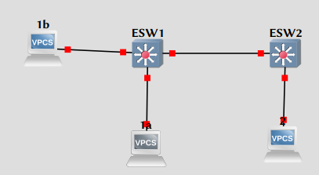
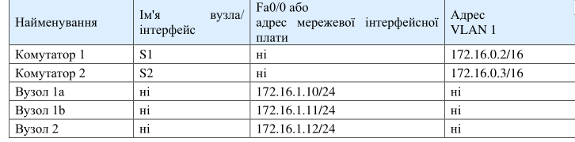

\input{$UNI/.templates/parts/header.tex}
Навчитись налаштовувати магістральні транкові порти на комутаторах.

# Хід роботи

## Завдання 1: Зібрати схему для виконання лабораторної роботи

Видалити існуючу конфігурацію та перезавантажити комутатори.

### Крок 1: Під'єднайте пристрої.

1.  Під'єднайте  інтерфейс  Fa0/1  комутатора  до  інтерфейсу  Fa0/1
    комутатора  2  за допомогою прямого кабелю.

2.  Під'єднайте  інтерфейс  Ethernet  вузла  1а  до  інтерфейсу  Fa0/2
    комутатора  1  за допомогою прямого кабелю.

3.  Під'єднайте  інтерфейс  Ethernet  вузла  1b  до  інтерфейсу  Fa0/3
    комутатора  1  за допомогою прямого кабелю.

4.  Під'єднайте  інтерфейс  Ethernet  вузла  1а  до  інтерфейсу  Fa0/2
    комутатора  2  за допомогою прямого кабелю.

5.  Під'єднайте ПК за допомогою консольного кабелю для налаштування
    конфігурації маршрутизатора і комутаторів.

6.  Задайте IP-адреси на вузлах згідно таблиці.



## Завдання 2: Здійсніть початкову  конфігурацію комутатора S1.
Під'єднайте  ПК  до  консольного  порту  комутаторів  для  налаштування  конфігурації  за
допомогою програми емуляції терміналу.

### Крок 1: Задайте ім’я комутатора, пароль на вхід в консоль, пароль на віртуальні термінали (vty).

```sh
ESW1#config terminal
Enter configuration commands, one per line.  End with CNTL/Z.
ESW1(config)#hostname S1
S1(config)#enable password cisco
S1(config)#enable secret class
S1(config)#line console 0
S1(config-line)#password cisco
S1(config-line)#login
S1(config-line)#line vty 0 15
S1(config-line)#password cisco
S1(config-line)#login
S1(config-line)#end
S1#
S1#
*Mar  1 00:00:37.555: %SYS-5-CONFIG_I: Configured from console by console
S1#
```

### Крок 2: Задайте ір-адресу vlan 1 та шлюз

```sh
S1#conf t
Enter configuration commands, one per line.  End with CNTL/Z.
S1(config)#int vlan 1
S1(config-if)#ip address 172.16.0.2 255.255.0.0
S1(config-if)#no shutdown
S1(config-if)#exit
S1(config)#ip default-gateway 172.16.0.1
S1(config)#end
S1#
*Mar  1 00:01:36.595: %SYS-5-CONFIG_I: Configured from console by console
S1#
*Mar  1 00:01:38.531: %LINK-3-UPDOWN: Interface Vlan1, changed state to up
*Mar  1 00:01:39.531: %LINEPROTO-5-UPDOWN: Line protocol on Interface Vlan1, changed state to up
S1#
```

## Завдання 3: Здійсніть початкову  конфігурацію комутатора S2.

Під'єднайте  ПК  до  консольного  порту  комутаторів  для  налаштування  конфігурації  за
допомогою програми емуляції терміналу. Здійсніть налаштування по аналогії до S1.

```sh
ESW2#config terminal
Enter configuration commands, one per line.  End with CNTL/Z.
ESW2(config)#hostname S2
S2(config)#enable password cisco
S2(config)#enable secret class
S2(config)#line console 0
S2(config-line)#password cisco
S2(config-line)#login
S2(config-line)#line vty 0 15
S2(config-line)#password cisco
S2(config-line)#login
S2(config-line)#end
S2#
S2#conf t
Enter configuration commands, one per line.  End with CNTL/Z.
S2(config)#int vlan 1
S2(config-if)#ip address 172.16.0.3 255.255.0.0
S2(config-if)#no shutdown
S2(config-if)#exit
S2(config)#ip default-gateway 172.16.0.1
S2(config)#end
S2#
*Mar  1 00:02:16.947: %SYS-5-CONFIG_I: Configured from console by console
*Mar  1 00:02:17.211: %SYS-5-CONFIG_I: Configured from console by console
S2#
*Mar  1 00:02:19.131: %LINK-3-UPDOWN: Interface Vlan1, changed state to up
*Mar  1 00:02:20.131: %LINEPROTO-5-UPDOWN: Line protocol on Interface Vlan1, changed state to up
S2#
```

## Завдання 4: Налаштуйте вузли та відповідні порти комутаторів у потрібні VLAN.
### Крок 1: Налаштування вузлів.
Виконайте налаштування вузлів згідно інформації в таблиці і на схемі топології.



```sh
1b> ip 172.16.1.11
Checking for duplicate address...
1b : 172.16.1.11 255.255.255.0

1a> ip 172.16.1.10
Checking for duplicate address...
1a : 172.16.1.10 255.255.255.0

2> ip 172.16.1.12
Checking for duplicate address...
2 : 172.16.1.12 255.255.255.0
```

```sh
S1(config)#int vlan 1
S1(config-if)#ip add
S1(config-if)#ip address 172.16.0.2 255.255.0.0
S1(config-if)#no hs
                  ^
% Invalid input detected at '^' marker.

S1(config-if)#no sh
```

```sh
S2(config)#int vlan 1
S2(config-if)#ip add 172.16.0.3 255.255.0.0
S2(config-if)#no sh
```

### Крок 2: Переведення портів комутатора в режим доступу.
При  безпосередньому  підключенні  деяких  комутаторів,  як,  наприклад,  в  даній
лабораторній  роботі,  порти  комутаторів  автоматично  налаштуються  на  магістральний  режим
зв'язку. Щоб запобігти цьому, виконайте ручне налаштування портів комутатора і переведіть їх в
режим нормального зв'язку на комутаторі 1 і 2.

```sh
S1(config)#interface fa1/1
S1(config-if)#switchport mode access
S1(config-if)#end
S1#
*Mar  1 00:46:15.139: %SYS-5-CONFIG_I: Configured from console by console
```

```sh
S2(config-if)#interface fa1/1
S2(config-if)#switchport mode access
S2(config-if)#end
S2#
*Mar  1 00:44:59.315: %SYS-5-CONFIG_I: Configured from console by console
```

### Крок  3:  Перевірте  налаштування  VLAN  по  замовчуванню  на  обох  комутаторах  за допомогою команди show vlan.

S1#show vlan
S2#show vlan

```sh
S1#show vlan-switch

VLAN Name                             Status    Ports
---- -------------------------------- --------- -------------------------------
1    default                          active    Fa1/0, Fa1/1, Fa1/2, Fa1/3
                                                Fa1/4, Fa1/5, Fa1/6, Fa1/7
                                                Fa1/8, Fa1/9, Fa1/10, Fa1/11
                                                Fa1/12, Fa1/13, Fa1/14, Fa1/15
                                                Fa2/0, Fa2/1, Fa2/2, Fa2/3
                                                Fa2/4, Fa2/5, Fa2/6, Fa2/7
                                                Fa2/8, Fa2/9, Fa2/10, Fa2/11
                                                Fa2/12, Fa2/13, Fa2/14, Fa2/15
1002 fddi-default                     act/unsup
1003 token-ring-default               act/unsup
1004 fddinet-default                  act/unsup
1005 trnet-default                    act/unsup

VLAN Type  SAID       MTU   Parent RingNo BridgeNo Stp  BrdgMode Trans1 Trans2
---- ----- ---------- ----- ------ ------ -------- ---- -------- ------ ------
1    enet  100001     1500  -      -      -        -    -        1002   1003
1002 fddi  101002     1500  -      -      -        -    -        1      1003
1003 tr    101003     1500  1005   0      -        -    srb      1      1002
1004 fdnet 101004     1500  -      -      1        ibm  -        0      0
1005 trnet 101005     1500  -      -      1        ibm  -        0      0
```

```sh
S2#show vlan-switch

VLAN Name                             Status    Ports
---- -------------------------------- --------- -------------------------------
1    default                          active    Fa1/0, Fa1/1, Fa1/2, Fa1/3
                                                Fa1/4, Fa1/5, Fa1/6, Fa1/7
                                                Fa1/8, Fa1/9, Fa1/10, Fa1/11
                                                Fa1/12, Fa1/13, Fa1/14, Fa1/15
                                                Fa2/0, Fa2/1, Fa2/2, Fa2/3
                                                Fa2/4, Fa2/5, Fa2/6, Fa2/7
                                                Fa2/8, Fa2/9, Fa2/10, Fa2/11
                                                Fa2/12, Fa2/13, Fa2/14, Fa2/15
1002 fddi-default                     act/unsup
1003 token-ring-default               act/unsup
1004 fddinet-default                  act/unsup
1005 trnet-default                    act/unsup

VLAN Type  SAID       MTU   Parent RingNo BridgeNo Stp  BrdgMode Trans1 Trans2
---- ----- ---------- ----- ------ ------ -------- ---- -------- ------ ------
1    enet  100001     1500  -      -      -        -    -        1002   1003
1002 fddi  101002     1500  -      -      -        -    -        1      1003
1003 tr    101003     1500  1005   0      -        -    srb      1      1002
1004 fdnet 101004     1500  -      -      1        ibm  -        0      0
1005 trnet 101005     1500  -      -      1        ibm  -        0      0
```

Чи всі порти комутатора призначені VLAN? **Так.**

У якій VLAN знаходяться порти? **1 (default)**
Чи  може  будь-який  комутатор  провести  ехо-тестування  будь-якого  іншого  вузла  або
комутатора в цей час?
Перевірте це, виконавши ехо-запит з вузла 1a на всі інші вузли і комутатори?

```sh
1b> ping 172.16.1.12

84 bytes from 172.16.1.12 icmp_seq=1 ttl=64 time=1.356 ms
84 bytes from 172.16.1.12 icmp_seq=2 ttl=64 time=1.133 ms
84 bytes from 172.16.1.12 icmp_seq=3 ttl=64 time=1.138 ms
^C
1b> ping 172.16.1.11

172.16.1.11 icmp_seq=1 ttl=64 time=0.001 ms
172.16.1.11 icmp_seq=2 ttl=64 time=0.001 ms
172.16.1.11 icmp_seq=3 ttl=64 time=0.001 ms
172.16.1.11 icmp_seq=4 ttl=64 time=0.001 ms
172.16.1.11 icmp_seq=5 ttl=64 time=0.001 ms

1b> ping 172.16.1.10

84 bytes from 172.16.1.10 icmp_seq=1 ttl=64 time=0.321 ms
84 bytes from 172.16.1.10 icmp_seq=2 ttl=64 time=0.510 ms
84 bytes from 172.16.1.10 icmp_seq=3 ttl=64 time=0.540 ms
^C
1b>
```

### Крок 4: Створення і перевірка налаштувань VLAN.
Створіть VLAN 2 і VLAN 3 і надайте їм імена.

```sh
S2(config-if)#vlan 2
S2(config-vlan)#name fred
S2(config-vlan)#exit
S2(config)#vlan 3
S2(config-vlan)#name wilma
S2(config-vlan)#exit

S1(config-if)#vlan 2
S1(config-vlan)#name fred
S1(config-vlan)#exit
S1(config)#vlan 3
S1(config-vlan)#name wilma
S1(config-vlan)#exit
S1(config)#
```

Призначте мережам VLAN відповідні інтерфейси комутатора. Порти, що
підключаються до  вузлів  1a  і  2,  будуть  призначені  VLAN  2,  а  порт,  що
підключається  до  вузла  1b,  буде призначений VLAN 3. Збережіть конфігурацію.

```sh
S1(config)#int fa1/2
S1(config-if)#switchport access vlan 2
S1(config-if)#exit
S1(config)#interface fa1/3
S1(config-if)#switchport access vlan 3
S1(config-if)#end
S1#copy running-config startup-config
Destination filename [startup-config]?
Building configuration...

*Mar  1 02:22:35.111: %SYS-5-CONFIG_I: Configured from console by console[OK]
```

```sh
S2(config)#int fa1/2
S2(config-if)#switchport access vlan 2
S2(config-if)#end
S2#copy running-config startup-config
Destination filename [startup-config]?
Building configuration...

*Mar  1 02:21:20.359: %SYS-5-CONFIG_I: Configured from console by console[OK]
```

Перевірте зв'язок між пристроями:
Відправте ехо-запит з комутатора 1 на комутатор 2.

```sh
S1#ping 172.16.0.3

Type escape sequence to abort.
Sending 5, 100-byte ICMP Echos to 172.16.0.3, timeout is 2 seconds:
.....
Success rate is 0 percent (0/5)
```

a)  Чи успішно виконані ехо-запити? **Ні**
b)  Якій мережі VLAN належать інтерфейси управління комутаторів 1 і 2?**vlan 1**

Відправте ехо-запит з  вузла 1а на вузол 2.

c)  Чи успішно виконані ехо-запити? **Так.**

Відправте ехо-запит з вузла 1а на комутатор S1.

```sh
1a> ping 172.16.0.2

No gateway found

1a>
```

d)  Чи успішно виконані ехо-запити? **Ні.**
e)  Чому вузол 1a не може встановити зв'язок з комутатором S1? **Він в іншій VLAN**

## Завдання 5: Налаштуйте і перевірте магістральний зв'язок.
Виконайте  налаштування  магістрального  зв'язку  на  комутаторах  S1  і  S2.  Порт  Fa0/1  на
комутаторі 1 вже підключений до порту Fa0/1 комутатора S2.


```sh
S2(config)#int Fa1/1
S2(config-if)#switchport mode trunk
S2(config-if)#
*Mar  1 02:32:15.559: %DTP-5-TRUNKPORTON: Port Fa1/1 has become dot1q trunk

S1(config)#int Fa1/1
S1(config-if)#switchport mode trunk
S1(config-if)#
*Mar  1 02:34:26.635: %DTP-5-TRUNKPORTON: Port Fa1/1 has become dot1q trunk
```

Перевірте створення магістралі.

```sh
S1(config-if)#do show interfaces trunk

Port      Mode         Encapsulation  Status        Native vlan
Fa1/1     on           802.1q         trunking      1

Port      Vlans allowed on trunk
Fa1/1     1-4094

Port      Vlans allowed and active in management domain
Fa1/1     1-3

Port      Vlans in spanning tree forwarding state and not pruned
Fa1/1     1-3
```

```sh
S2(config-if)#do show interfaces trunk

Port      Mode         Encapsulation  Status        Native vlan
Fa1/1     on           802.1q         trunking      1

Port      Vlans allowed on trunk
Fa1/1     1-4094

Port      Vlans allowed and active in management domain
Fa1/1     1-3

Port      Vlans in spanning tree forwarding state and not pruned
Fa1/1     1-3
```

a)  Чи з'являються у вихідних даних магістральні інтерфейси? **Так**
b)  Яка VLAN задана в якості вихідної VLAN? **1-3**
c)  Які VLAN можуть здійснювати зв'язок за допомогою магістралі?**1-4094**

Перевірте налаштування VLAN на обох комутаторах.

```sh
S1#sh vlan-switch

VLAN Name                             Status    Ports
---- -------------------------------- --------- -------------------------------
1    default                          active    Fa1/0, Fa1/4, Fa1/5, Fa1/6
                                                Fa1/7, Fa1/8, Fa1/9, Fa1/10
                                                Fa1/11, Fa1/12, Fa1/13, Fa1/14
                                                Fa1/15, Fa2/0, Fa2/1, Fa2/2
                                                Fa2/3, Fa2/4, Fa2/5, Fa2/6
                                                Fa2/7, Fa2/8, Fa2/9, Fa2/10
                                                Fa2/11, Fa2/12, Fa2/13, Fa2/14
                                                Fa2/15
2    fred                             active    Fa1/2
3    wilma                            active    Fa1/3
1002 fddi-default                     act/unsup
1003 token-ring-default               act/unsup
1004 fddinet-default                  act/unsup
1005 trnet-default                    act/unsup

VLAN Type  SAID       MTU   Parent RingNo BridgeNo Stp  BrdgMode Trans1 Trans2
---- ----- ---------- ----- ------ ------ -------- ---- -------- ------ ------
1    enet  100001     1500  -      -      -        -    -        1002   1003
2    enet  100002     1500  -      -      -        -    -        0      0
3    enet  100003     1500  -      -      -        -    -        0      0
```

```sh
S2#sh vlan-switch

VLAN Name                             Status    Ports
---- -------------------------------- --------- -------------------------------
1    default                          active    Fa1/0, Fa1/3, Fa1/4, Fa1/5
                                                Fa1/6, Fa1/7, Fa1/8, Fa1/9
                                                Fa1/10, Fa1/11, Fa1/12, Fa1/13
                                                Fa1/14, Fa1/15, Fa2/0, Fa2/1
                                                Fa2/2, Fa2/3, Fa2/4, Fa2/5
                                                Fa2/6, Fa2/7, Fa2/8, Fa2/9
                                                Fa2/10, Fa2/11, Fa2/12, Fa2/13
                                                Fa2/14, Fa2/15
2    fred                             active    Fa1/2
3    wilma                            active
1002 fddi-default                     act/unsup
1003 token-ring-default               act/unsup
1004 fddinet-default                  act/unsup
1005 trnet-default                    act/unsup

VLAN Type  SAID       MTU   Parent RingNo BridgeNo Stp  BrdgMode Trans1 Trans2
---- ----- ---------- ----- ------ ------ -------- ---- -------- ------ ------
1    enet  100001     1500  -      -      -        -    -        1002   1003
2    enet  100002     1500  -      -      -        -    -        0      0
3    enet  100003     1500  -      -      -        -    -        0      0
```

Чи з'являються інтерфейси Fa0/1 комутатора S1 і S2 у VLAN? Обґрунтуйте свою
відповідь. **Ні (бо вони тепер транкові)**

Перевірте зв'язок між пристроями знову.
Відправте ехо-запит з комутатора S1 на комутатор S2.

a)  Чи успішно виконані ехо-запити? **Ні**

Відправте ехо-запит з вузла 1а на вузол 2.

b)  Чи успішно виконані ехо-запити? **Так**

Відправте ехо-запит з вузла 1b на вузол 2.

c)  Чи успішно виконані ехо-запити? **Ні**

Відправте ехо-запит з вузла 1а на комутатор 1.

d)  Чи успішно виконані ехо-запити? **Ні.**

Для видалення магістрального зв’язку на комутаторах необхідно провести такі дії.
Раніше  в  даній  лабораторній  роботі  інтерфейси  Fa0/1  на  комутаторах  були  вручну
налаштовані  на  магістральний  зв'язок.  Видаліть  цю  конфігурацію  за  допомогою  команди  no
switchport mode trunk.

```
S1(config)#int Fa0/1
S1(config-if)#no switchport mode trunk
S1(config-if)#end
S2(config)#int Fa0/1
S2(config-if)#no switchport mode trunk
S2(config-if)#end
```

```sh
S1(config)#int fa1/1
S1(config-if)#no switchport mode trunk
S1(config-if)#
*Mar  1 00:20:43.547: %DTP-5-NONTRUNKPORTON: Port Fa1/1 has become non-trunk
S1(config-if)#end

S2(config)#int fa1/1
S2(config-if)#no sw
S2(config-if)#no switchport mode trunk
S2(config-if)#end
*Mar  1 00:17:25.047: %DTP-5-NONTRUNKPORTON: Port Fa1/1 has become non-trunk
S2(config-if)#end
```

Перегляньте статус магістрального зв'язку на портах комутаторів.

```
S1#show interfaces trunk
S2#show interface trunk
```

```sh
S1#sh int trunk

S1#

S2#sh int trunk

S2#
```

## Завдання 6: Документація налаштувань комутатора.
На кожному комутаторі, скопіюйте робочу конфігурацію у текстовий файл і збережіть файл
для використання у майбутньому.

Збережено.

# Висновок

Я налаштував три VLAN-и та транковий порт для пропуску їх усіх.

# Відповіді на контрольні запитання

1) **Для чого налаштовувати магістральні канали в мережі?** Щоб передавати трафік багатьох VLAN через один канал.
2) **В яких режимах може працювати порт комутатора?** access, trunk
3) **Що таке транковий порт?** Транковий порт – це канал типу “точка-точка” між комутатором та іншим мережевим
пристроєм. Через нього можна прокидати багато VLAN.
4) **Які методи маркування кадрів використовуються на комутаторах Cisco?** стандартний метод IEEE 802.1Q та пропрієтарний ISL.
5) **В якому режимі працюють порти комутатора по замовчуванню?** access.
6) **Яка інкапсуляція магістрального зв'язку по замовчуванню?** negotiate.
