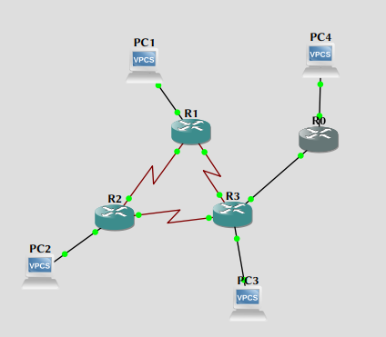

\input{$UNI/.templates/parts/header.tex}
Освоїти принципи конфігурування статичних маршрутів та маршрутів по замовчуванню.

# Хід роботи

1. Створити на емуляторі Packet Tracer конфігурацію мережі відповідно до рис.
   12.3. Для побудови мережі використати 4 маршрутизатори CISCO і 4 персональні
   комп’ютери. Комп’ютери з маршрутизаторами з’єднати за допомогою консольних
   кабелів та “обернених” кабелів UTP 5E. Маршрутизатори між собою з’єднати за
   допомогою DCE/DTE кабелів.

   {width=10cm}

2. Конфігурування статичних маршрутів для Router1.

```sh
R1#configure terminal
Enter configuration commands, one per line.  End with CNTL/Z.
R1(config)#Enter configuration commands, one per line. End with CNTL/Z.
             ^
% Invalid input detected at '^' marker.

R1(config)#ip route 192.168.2.0 255.255.255.0 192.168.0.10
R1(config)#ip route 192.168.3.0 255.255.255.0 192.168.0.5
R1(config)#exit
R1#copy running-config startup-config
Destination filename [startup-config]?
*Mar  1 00:09:10.731: %SYS-5-CONFIG_I: Configured from console by console

Building configuration...
[OK]
```

3. Конфігурування статичних маршрутів для Router0.

```sh
R0#conf t
Enter configuration commands, one per line.  End with CNTL/Z.
R0(config)#ip route 192.168.1.0 255.255.255.0 192.168.0.2
R0(config)#ip route 192.168.2.0 255.255.255.0 192.168.0.2
R0(config)#ip route 192.168.3.0 255.255.255.0 192.168.0.2
R0(config)#ip route 192.168.0.4 255.255.255.252 192.168.0.2
R0(config)#ip route 192.168.0.8 255.255.255.252 192.168.0.2
R0(config)#ip route 192.168.0.12 255.255.255.252 192.168.0.2
```


4. Статичні маршрути для Router2 та Router3 сконфігуруйте самостійно.

```sh
R2(config)#ip route 192.168.1.0 255.255.255.0 192.168.0.9
R2(config)#ip route 192.168.3.0 255.255.255.0 192.168.0.14
```

```sh
R3(config)#ip route 192.168.2.0 255.255.255.0 192.168.0.13
R3(config)#ip route 192.168.1.0 255.255.255.0 192.168.0.6
```

5. Конфігуруємо маршрути по замовчуванню.

```sh
R1#configure terminal
Enter configuration commands, one per line.  End with CNTL/Z.
R1(config)#ip route 0.0.0.0 0.0.0.0 s 2/1
R1(config)#exit
R1#copy running-config startup-config
Destination filename [startup-config]?
*Mar  1 00:21:26.851: %SYS-5-CONFIG_I: Configured from console by console

Building configuration...
[OK]
```

6. Сконфігуруйте маршрути по замовчуванню для інших маршрутизаторів самостійно.


```sh
R2(config)#ip route 0.0.0.0 0.0.0.0 s 2/0
R2(config)#exit
R2#copy running-config startup-config
Destination filename [startup-config]?
*Mar  1 00:30:56.383: %SYS-5-CONFIG_I: Configured from console by console

Building configuration...
[OK]
```

```sh
R3(config)#ip route 0.0.0.0 0.0.0.0 s 2/1
R3(config)#exit
R3#copy running-config startup-config
Destination filename [startup-config]?
*Mar  1 00:30:58.551: %SYS-5-CONFIG_I: Configured from console by console

Building configuration...
[OK]
```

7. Призначимо кожному комп’ютеру відповідну IP-адресу з маскою підмережі та
   відповідним шлюзом. Тобто IP-адреси 192.168.Х.2/24 і шлюзи 192.168.Х.1, де Х
   – номер підмережі. Рис. 12.3.

```sh
PC3> ip 192.168.3.2 192.168.3.1
Checking for duplicate address...
PC3 : 192.168.3.2 255.255.255.0 gateway 192.168.3.1

PC2> ip 192.168.2.2 192.168.2.1
Checking for duplicate address...
PC2 : 192.168.2.2 255.255.255.0 gateway 192.168.2.1

PC1> ip 192.168.1.2 192.168.1.1
Checking for duplicate address...
PC1 : 192.168.1.2 255.255.255.0 gateway 192.168.1.1

PC4> ip 192.168.4.2 192.168.4.1
Checking for duplicate address...
PC4 : 192.168.4.2 255.255.255.0 gateway 192.168.4.1
```

10. Перевіряємо створену конфігурацію та видаляємо несправності.


```sh
PC1> ping 192.168.3.2

192.168.3.2 icmp_seq=1 timeout
84 bytes from 192.168.3.2 icmp_seq=2 ttl=62 time=36.316 ms
84 bytes from 192.168.3.2 icmp_seq=3 ttl=62 time=37.830 ms
84 bytes from 192.168.3.2 icmp_seq=4 ttl=62 time=38.347 ms
84 bytes from 192.168.3.2 icmp_seq=5 ttl=62 time=38.278 ms
```

Виявив, що не можна пропінгувати PC4 з PC2 й навпаки.
Виявляється, не налаштував маршрут (тому динамічна маршрутизація краща,
бо бере це все на себе).
Отже, додав маршрути й усе запрацювало:

```sh
R2(config)#ip route 192.168.4.0 255.255.255.0 192.168.0.14
R3(config)#ip route 192.168.4.0 255.255.255.0 192.168.0.1
```

```sh
PC2> ping 192.168.4.1

84 bytes from 192.168.4.1 icmp_seq=1 ttl=253 time=29.428 ms
84 bytes from 192.168.4.1 icmp_seq=2 ttl=253 time=28.735 ms
84 bytes from 192.168.4.1 icmp_seq=3 ttl=253 time=27.950 ms
84 bytes from 192.168.4.1 icmp_seq=4 ttl=253 time=27.654 ms
84 bytes from 192.168.4.1 icmp_seq=5 ttl=253 time=29.187 ms
```

# Висновок

Я налаштував статичну маршрутизацію в заданій мережі. Статична маршрутизація незручна в налаштуванні, порівняно з динамічною.

# Відповіді на контрольні запитання

1) **Для чого використовується маршрутизація?** Щоб хости з різних мереж могли знайти шлях один до одного та комунікувати.
2) **Назвіть переваги та недоліки статичної маршрутизації по відношенню до
динамічної?** Статичну складно налаштовувати, довго.
3) **Як повинно виглядати запрошення командної стрічки, якщо Ви хочете виконати налаштування інтерфейсу?** hostname (config-інтерфейс)#
4) **Яка основна функція використання маршруту по замовчуванню?** Вказати шлях пакету, адреса призначення якого не присутня в таблиці маршрутизації.
5) **Які дві частини мережевої адреси використовуються маршрутизатором для пересилки даних по мережі?** IP-адреса та маска підмережі
6) **Який протокол використовує для свого функціонування команда ping?** ICMP.
7) **Як називається мережа, що є кінцевою і має тільки один маршрут до наступного маршрутизатора?** Тупикова
