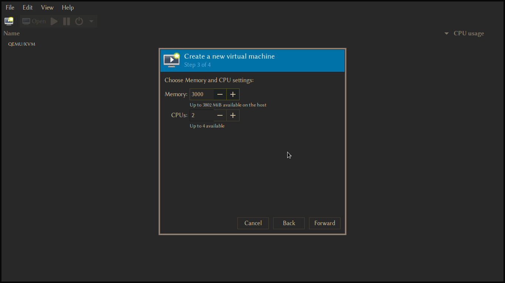
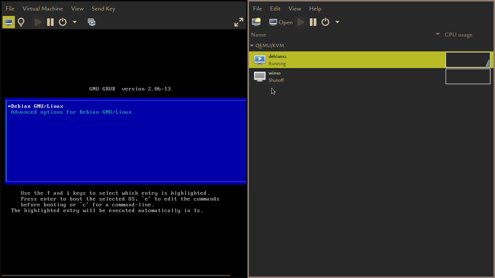
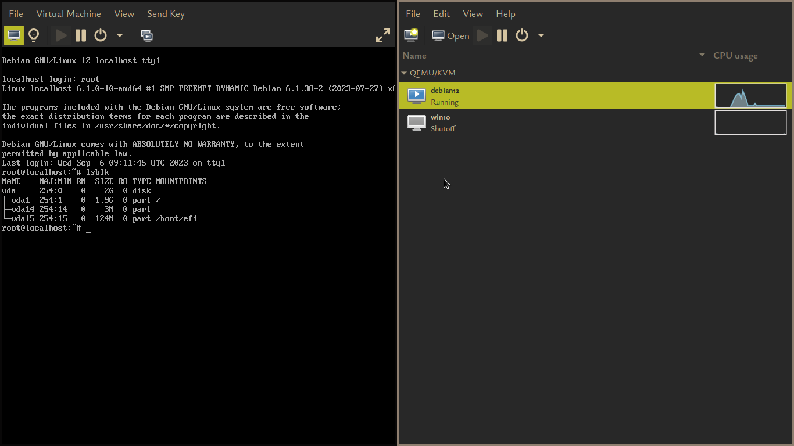
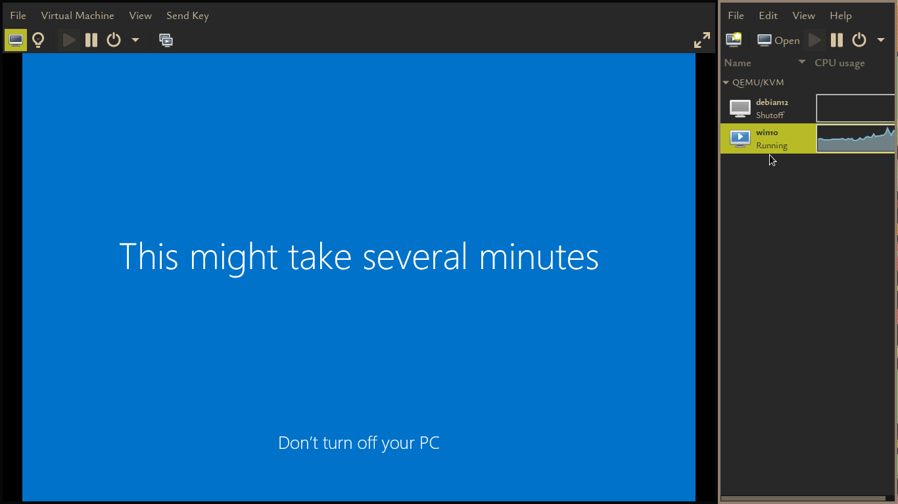
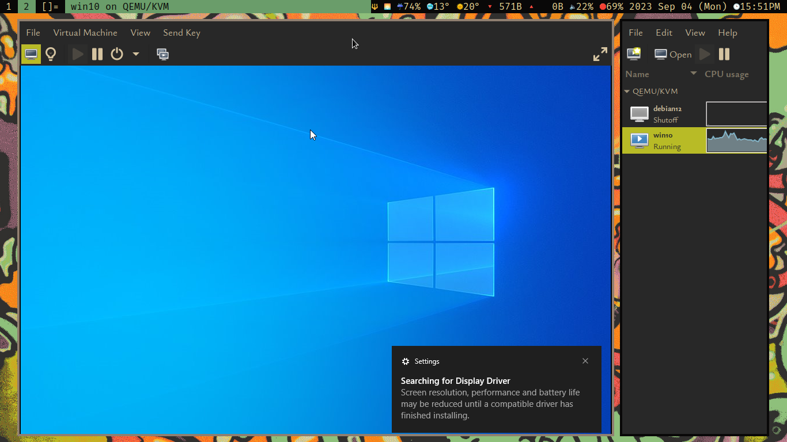

\input{$UNI/.templates/parts/header.tex}
виявити особливості установки програмної віртуальної машини; виявити
особливості установки операційної системи на програмну віртуальну машину.

# Індивідуальне завдання

## Завдання 1

Виявити особливості процесу встановлення програми створення віртуальної
машини Virtual Box.

## Завдання 2

З’ясувати порядок імпортування образу операційної системи Windows ХР
на віртуальний комп’ютер.

# Етапи розв'язку

Я встановив QEMU замість VirtualBox,
а керувати машинами буду за допомогою
`virtual manager`.

\clearpage

Встановлюю Tiny10 --- врізану версію Windows 10.

{width=15cm}

{width=15cm}

# Висновок

Я встановив віртуальні Windows 10 та Debian 12.
Встановити дебіан було значно простіше, я ще більше
спростив процес, завантаживши готову машину в форматі
`qcow`.

# Відповіді на контрольні запитання

1. Що є операційною системою?
2. Які основні функції ОС в обчислювальній системі?
3. За якими показниками здійснюється класифікація операційних систем?
4. Що являє собою програмне забезпечення «віртуальна машина»?

---

1. ОС - це програмне забезпечення, яке керує роботою обчислювальної системи. Вона відповідає за управління ресурсами комп'ютера і забезпечення взаємодії між користувачами та апаратним обладнанням. Операційна система є проміжним шаром між апаратним обладнанням і програмами, що дозволяє користувачам використовувати комп'ютерну систему.

2. Основні функції операційної системи в обчислювальній системі включають:

   a. Управління ресурсами: ОС відповідає за управління процесором, пам'яттю, введенням/виведенням, мережами та іншими ресурсами, розподіляючи їх між різними програмами і завданнями.

   b. Взаємодія з користувачами: ОС надає інтерфейси для користувачів, щоб вони могли запускати програми, працювати з файлами та виконувати інші завдання.

   c. Управління файлами: ОС відповідає за створення, зберігання та управління файлами та каталогами на дисках.

   d. Забезпечення безпеки: ОС включає механізми для захисту системи від несанкціонованого доступу та зловмисних програм.

   e. Планування та управління процесами: ОС визначає, які процеси отримують доступ до процесора та в якому порядку вони виконуються.

3. Операційні системи можна класифікувати за різними показниками, такими як:

   a. Тип апаратного обладнання: ОС можуть бути спеціалізованими для певних архітектур (наприклад, ОС для x86, ARM, і т.д.) або бути універсальними.

   b. Спосіб взаємодії з користувачем: ОС можуть мати текстовий інтерфейс (наприклад, командний рядок) або графічний інтерфейс.

   c. Методи планування задач: ОС можуть використовувати різні алгоритми для планування виконання завдань, такі як FIFO, приоритети, або інші.

   d. Властивості безпеки: ОС можуть бути класифіковані за рівнем безпеки, наприклад, однокористувацькі або багатокористувацькі, з різними рівнями прав доступу.

4. Програмне забезпечення "віртуальна машина" - це середовище виконання, яке дозволяє запускати програми на віртуальному комп'ютері, який моделюється або емулюється на фізичному обладнанні. Віртуальна машина може мати власну операційну систему та власні ресурси, і вона ізолює виконання програм від фізичного обладнання.
