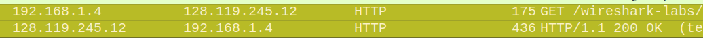
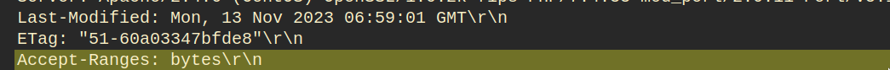
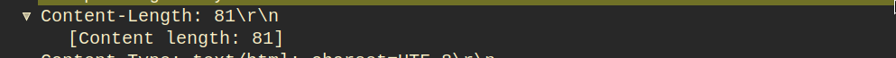
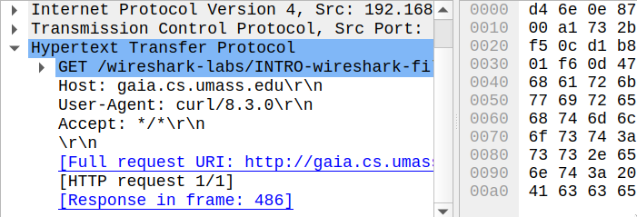
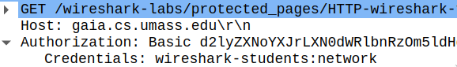

\input{$UNI/.templates/parts/header.tex}
Вивчити роботу мережного сніфера та роботу проколу HTTP

## Завдання 1
6. Перелічіть будь-які 3 протоколи, які можуть бути відображені в стовпці Protocol (Протокол) при відключеному фільтрі пакетів і показаному на рис. 1. Скільки часу пройшло від моменту відправлення повідомлення GET протоколу HTTP до одержання відповідного повідомлення OK? ( За замовчуванням, значення поля Time (Час) у вікні списку являє собою час у секундах від початку трасування)

- TCP
- ARP
- DHCP

Пройшло 12 мс.

7. Яка Ip-Адреса сервера gaia.cs.umass.edu (також відомого як wwwnet.cs.umass.edu)? Яка адреса вашого комп'ютера?

```
192.168.1.4           128.119.245.12
^^^^^^^^^^^           ^^^^^^^^^^^^^^
комп'ютер (локальна)  вебсервер
```

8. Роздрукуйте повідомлення протоколу HTTP (GET і OK), отримані вами при відповіді на попереднє питання. Для цього виберіть команду меню File  Print (Файл  Печатка), установите перемикачі в положення Selected Packet Only (Тільки обраний пакет) і Print as displayed (Друкувати у форматі відображення), відповідно, і потім натисніть кнопку OK.

\small
```
No.     Time           Source                Destination           Protocol Length Info
    166 4.598579236    192.168.1.4           128.119.245.12        HTTP     175    GET /wireshark-labs/INTRO-wireshark-file1.html HTTP/
1.1

...

Frame 166: 175 bytes on wire (1400 bits), 175 bytes captured (1400 bits) on interface wlan0, id 0
No.     Time           Source                Destination           Protocol Length Info
    170 4.727657065    128.119.245.12        192.168.1.4           HTTP     436    HTTP/1.1 200 OK  (text/html)

...
```
\normalsize

## Завдання 2
### Взаємодія за допомогою звичайних get-запитів
Ґрунтуючись на інформації, що втримується в Getр-запиті й відповіднім повідомленні,
відповідайте на наступні питання.

0. Яку версію HTTP використовує ваш браузер -1.0 або 1.1? А яку - сервер?

Браузер --- 1.1, як і сервер.

1. Що вказує браузер серверу щодо підтримуваних мов?

`en-US`

2. Яка Ip-адреса в сервера gaia.cs.umass.edu? Яка адреса вашого комп'ютера?

	1. 192.168.1.4
	2. 128.119.245.12



3. Який код стану повернення сервер браузеру?

`304 Not Modified`

4. Яка дата останньої зміни на сервері Html-Файлу, який ви запитуєте?



5. Який розмір вмісту, який повернув сервер браузеру?

81 байт.



6. Проаналізувавши вихідні дані у вікні вмісту пакетів, чи бачите ви які- або заголовки, не відображені у вікні списку пакетів? Якщо так, то які?

Хост, UA й інший уміст пакетів.

{width=13cm}

### Взаємодія за допомогою умовних Get-запитів
- Відкрийте браузер і переконаєтеся, що його кеш очищений, як тільки що
обговорили.
- Запустіть аналізатор пакетів Wireshark.
- Введіть в адресний рядок браузера значення http://gaia.cs.umass.edu/wireshark-labs/HTTP-wireshark-file2.html
Ваш браузер повинен відобразити простий Html-документ, що складається з 5 рядків.
- Введіть той же адреса в рядок ще раз (або натисніть кнопку відновлення сторінки
в браузері, або клавішу F5)
- Зупиніть захвата пакетів в Wireshark і введіть http у поле фільтра, щоб у вікні
списку після цього відображалися тільки Http-повідомлення.

#### Дайте  відповідь на наступні питання:
7. Вивчіть вміст першого Get-Запиту від вашого браузера серверу. чи бачите ви
рядок IF-MODIFIED-SINCE у запиті?

Ні, тільки у другому запиті.

8. Перевірте відповідь сервера. чи повертає він вміст файлу?

Так.

9. Тепер вивчіть вміст другого Get-запиту серверу. чи бачите ви тепер рядок IF-MODIFIED-SINCE у запиті? Якщо так, то яка інформація йде після заголовка IF-MODIFIED-SINCE?

Бачу, `Mon, 13 Nov 2023 06:39:01 GMT`.

10. Що повертає сервер у відповідь на другий запит (код стану й фраза)? Чи повертає
він вміст файлу?

Повертає код `304 Not Modified`,
відповідно, вміст не повертає.

### Запит великих документів
- Відкрийте браузер і переконаєтеся, що його кеш очищений, як уже
обговорювалося.
- Запустіть аналізатор пакетів Wireshark.
- Введіть в адресний рядок браузера значення
- http://gaia.cs.umass.edu/wireshark-labs/HTTP-wireshark-file3.html
- Ваш браузер повинен відобразити досить довгий документ «Білль про права США».
- Зупиніть захват пакетів в Wireshark і введіть http у поле фільтра, щоб у вікні
списку після цього відображалися тільки Http-повідомлення.

#### Дайте відповідь на наступні питання:
11. Скільки Get-Запитів відправив ваш браузер? У пакеті з яким номером
утримується запит Білля про права у файлі результатів?

Один запит. У 1-му.

12. Який пакет у результатах трасування містить код стану й фразу, пов'язані з
Get-Запитом?

7-ий.

13. Який код стану й фраза у відповіднім повідомленні?

```
200 OK
```

14. Скільки необхідно сегментів TCP для передачі одного Http-відповіді й тексту Білля про права?

5. Якщо враховувати http-марковані, тоді 7.


### Html-документи, що включають вбудовані об'єкти

- Відкрийте браузер і переконаєтеся, що його кеш очищений, як обговорювалося вище.
- Запустіть Wireshark.
- Введіть в адресний рядок наступний UrlдАдреса:
- http://gaia.cs.umass.edu/wireshark-labs/HTTP-wireshark-file4.html
- Ваш браузер повинен відобразити короткий документ HTML, у якім є посилання на два зображення, тобто в, що завантажується HTML утримуються не самі ці зображення, а їх UrlрАдреси. Ваш браузер повинен завантажити ці логотипи із зазначених веб-сайтів. У нашому випадку логотип завантажується з вебсайта www.aw-bc.com, а зображення обкладинки книги зберігається на сервері manic.cs.umass.edu.
- Зупиніть захват пакетів в Wireshark і введіть http у поле фільтра, щоб у вікні списку відображалися тільки Http-повідомлення.

#### Дайте відповідь на наступні питання:
15. Скільки Get-запитів відправив ваш браузер? На які Ip-адреси в Інтернеті були
відправлені ці запити?

3 запити, ip-адреси в лістингу:
```
 1674 55.386535357  192.168.1.4 → 128.119.245.12 HTTP 547 GET /wireshark-labs/HTTP-wireshark-file4.html HTTP/1.1
 1676 55.522040296 128.119.245.12 → 192.168.1.4  HTTP 1355 HTTP/1.1 200 OK  (text/html)
 1678 55.559887583  192.168.1.4 → 128.119.245.12 HTTP 493 GET /pearson.png HTTP/1.1
 1687 55.695815610 128.119.245.12 → 192.168.1.4  HTTP 745 HTTP/1.1 200 OK  (PNG)
 1694 55.948366591  192.168.1.4 → 178.79.137.164 HTTP 472 GET /8E_cover_small.jpg HTTP/1.1
 1696 55.991512762 178.79.137.164 → 192.168.1.4  HTTP 237 HTTP/1.1 301 Moved Permanently
```

16. чи можете ви сказати, яким способом ваш браузер завантажив зображення із
двох веб-сайтів - паралельно або один за іншим? Поясните.

Одне за іншим, бачимо,
що запити йдуть послідовно.

### Http-аутентифікація

- Переконаєтеся, що кеш вашого браузера очищений, як обговорювалося вище,
потім закрийте браузер і знову відкрийте його.
- Запустіть програму Wireshark.
- Введіть в адресний рядок наступний URL: http://gaia.cs.umass.edu/wireshark-labs/protected_pages/HTTP-wireshark-file5.html Введіть запитувані облікові дані.
- Зупиніть захват пакетів в Wireshark і введіть http у поле фільтра, щоб у вікні списку відображалися тільки Http-повідомлення.

#### Дайте відповідь на на наступні питання:
17. Яку первісну відповідь сервера (код стану й фраза) на перший Get-запит вашого
браузера?

`401 Unauthorized`

18. Які нові поля додаються в Get-повідомлення при другому запиті браузера?

```
Authorization: дані для автентифікації.
```

{width=13cm}

# Висновок

`Wireshark` --- зручна програма для аналізу мережевого трафіку.
