\setcounter{topnumber}{8}
\setcounter{bottomnumber}{8}
\setcounter{totalnumber}{8}

\input{$UNI/.templates/parts/header.tex}
Ознайомитись із основними особливостями запуску та
налаштування Docker контейнерів та параметрами запуску.

# Хід роботи

## 1. Встановлення Docker

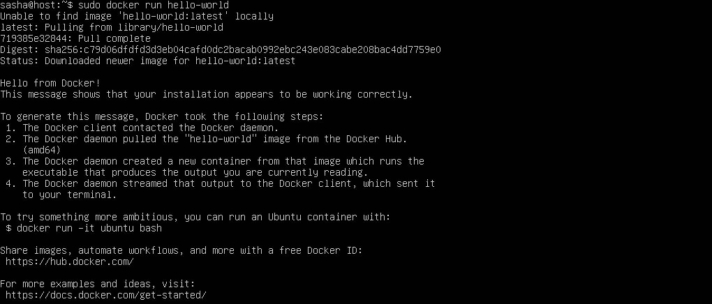

## 2. Перегляд основ контейнера: Виконати, Список, Видалити

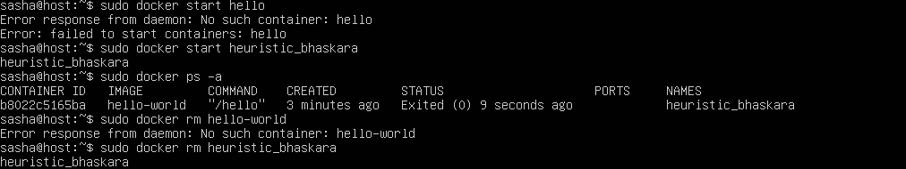

## 3. Налаштування порту

a) Встановлення образу з `nginx`

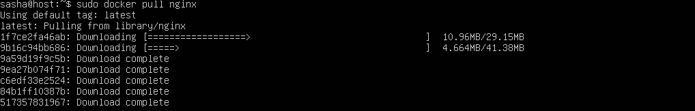

b) Запуск контейнера `docker-nginx`:

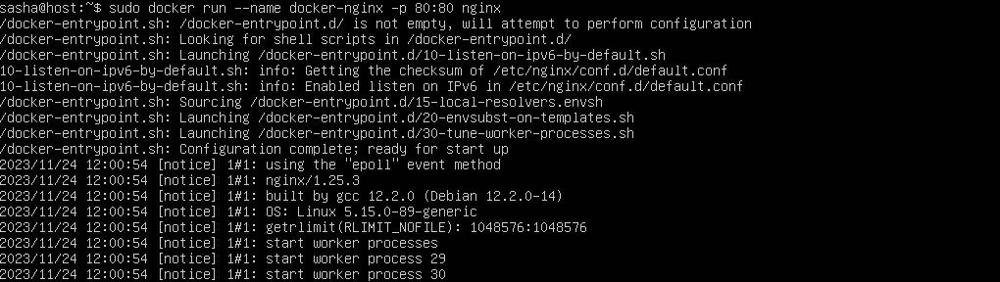

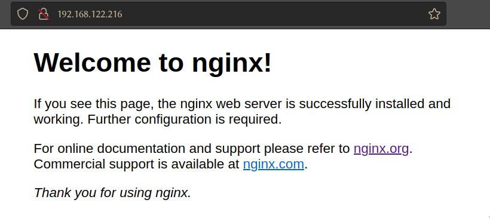

\clearpage

## 4. Робота в автономному режимі

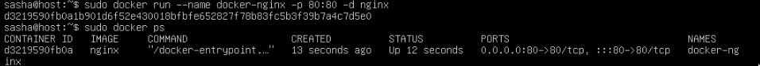

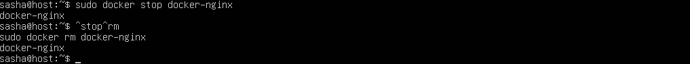

## 5. Створення веб-сторінки для обслуговування на Nginx

## 6. Зв’язок контейнера з локальною файловою системою

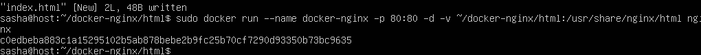

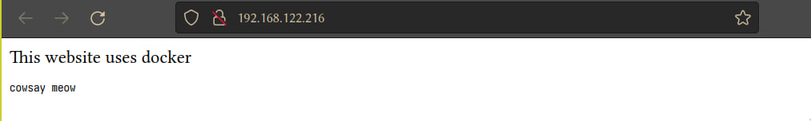

\clearpage

## 7. Використання власного файла конфігурації Nginx

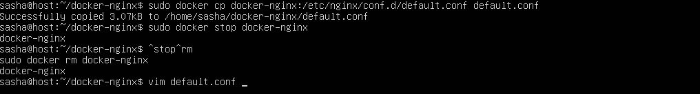

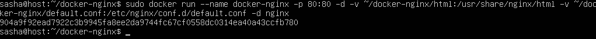

# Висновок

Я ознайомився з основними особливостями запуску та налаштування Docker
контейнерів та параметрами запуску.
