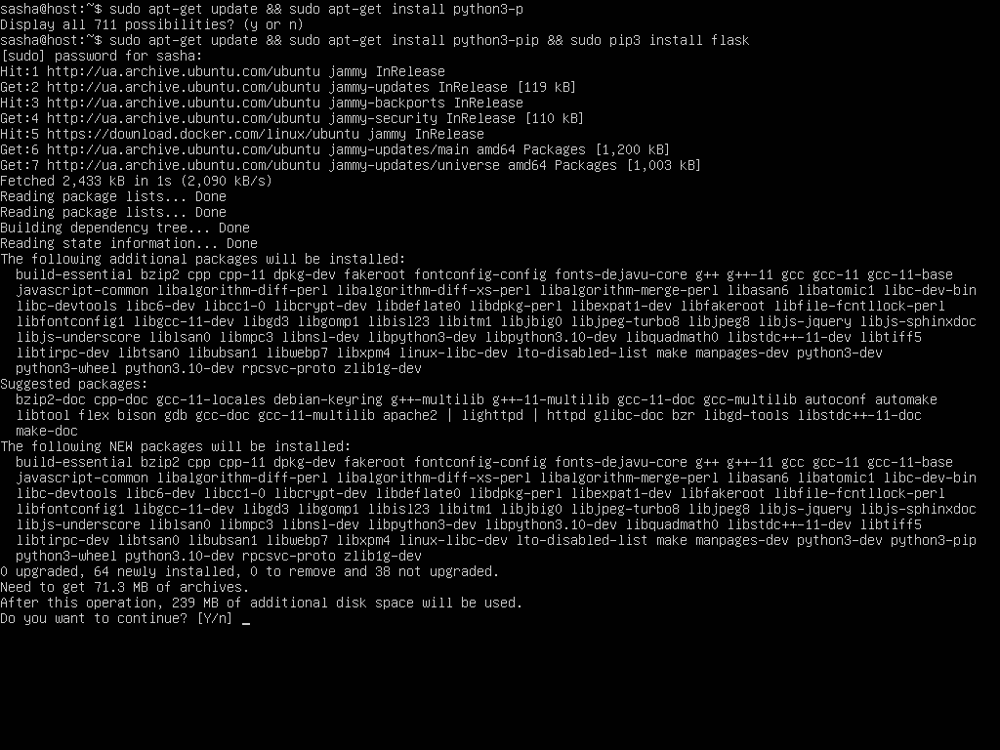
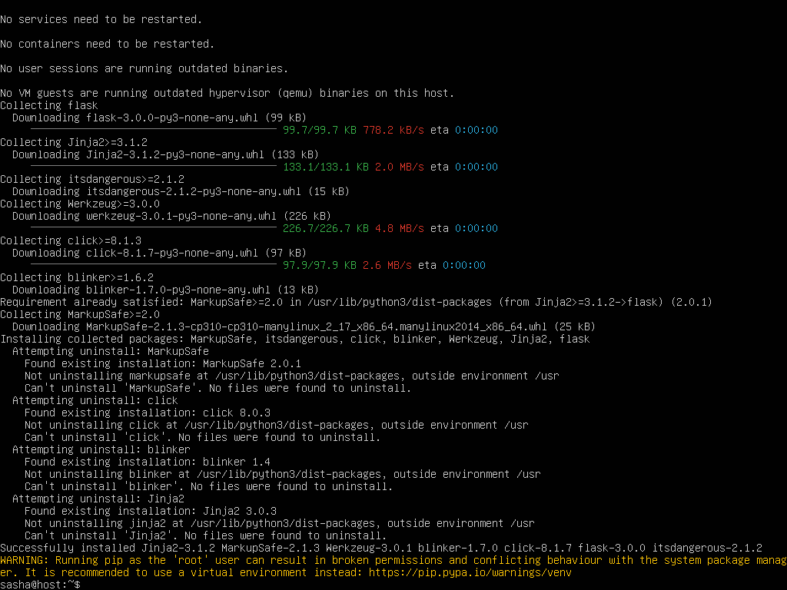
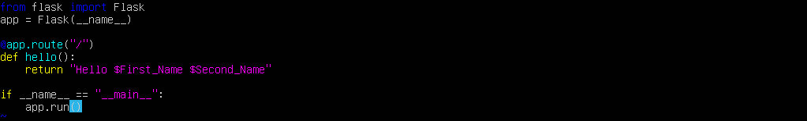
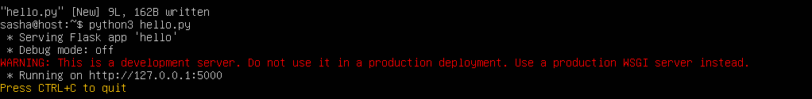
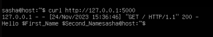
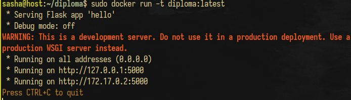
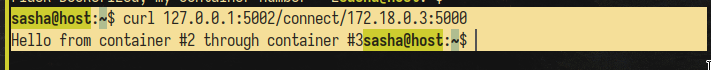

\input{$UNI/.templates/parts/header.tex}
Ознайомитись із особливостями створення docker іміджі та запуску
мікросервісів в контейнері.

# Хід роботи

## 1. Виконуємо наступні команди в терміналі Ubuntu:





## 2. Налаштування Docker для запуску контейнерів Flask додатку.







Я згадав, що можу `ssh`-итись у віртуальну машину, тому
далі надаю в більшості лістинги, а не скріншоти, бо так краще.


## 3. Створення образу

```sh
sasha@host:~/diploma$ sudo !!
sudo docker build -t diploma:latest .
[sudo] password for sasha:
[+] Building 121.7s (13/13) FINISHED                                    docker:default
 => [internal] load .dockerignore                                                 0.3s
 => => transferring context: 75B                                                  0.0s
 => [internal] load build definition from dockerfile                              0.2s
 => => transferring dockerfile: 354B                                              0.0s
 => [internal] load metadata for docker.io/library/ubuntu:latest                  2.0s
 => [1/8] FROM docker.io/library/ubuntu:latest@sha256:2b7412e6465c3c7fc5bb21d3e6  8.3s
 => => resolve docker.io/library/ubuntu:latest@sha256:2b7412e6465c3c7fc5bb21d3e6  0.1s
 => => sha256:2b7412e6465c3c7fc5bb21d3e6f1917c167358449fecac8176 1.13kB / 1.13kB  0.0s
 => => sha256:c9cf959fd83770dfdefd8fb42cfef0761432af36a764c077aed54b 424B / 424B  0.0s
 => => sha256:e4c58958181a5925816faa528ce959e487632f4cfd192f8132 2.30kB / 2.30kB  0.0s
 => => sha256:aece8493d3972efa43bfd4ee3cdba659c0f787f8f59c82fb 29.54MB / 29.54MB  5.4s
 => => extracting sha256:aece8493d3972efa43bfd4ee3cdba659c0f787f8f59c82fb3e48c87  2.2s
 => [internal] load build context                                                 0.2s
 => => transferring context: 37.13kB                                              0.0s
 => [2/8] RUN mkdir app                                                           1.2s
 => [3/8] COPY . /app                                                             0.3s
 => [4/8] WORKDIR /app                                                            0.2s
 => [5/8] RUN apt-get update -y                                                   8.7s
 => [6/8] RUN apt-get install -y python3-pip                                     77.3s
 => [7/8] RUN pip3 install --upgrade pip                                          6.0s
 => [8/8] RUN pip3 install -r requirements.txt                                    8.2s
 => exporting to image                                                            8.7s
 => => exporting layers                                                           8.7s
 => => writing image sha256:47b5d8590a394192c053eb4b10dfe41c371d6082965c701807d2  0.0s
 => => naming to docker.io/library/diploma:latest                                 0.0s
 ```

## 4. Запуск та управління контейнерами

### 4.1. Налаштування мережі

```sh
sasha@host:~/diploma$ sudo !!
sudo docker network create --subnet=172.18.0.0/16 flasknet
d2599065df015c9aa9ce4b3c046b036f0858d945f36117ffb4765227efaad204
```

### 4.2. Запуск контейнера з перенаправленим портом

```sh
sasha@host:~/diploma$ sudo docker run -t diploma:latest
Traceback (most recent call last):
  File "/app/hello.py", line 4, in <module>
    from flask import Flask
  File "/usr/local/lib/python3.10/dist-packages/flask/__init__.py", line 19, in <module>
    from jinja2 import Markup, escape
ImportError: cannot import name 'Markup' from 'jinja2' (/usr/local/lib/python3.10/dist-packages/jinja2/__init__.py)
```
Після отримання цієї помилки я спробував змінити версію фласку в `requirements.txt`,
і після кількох експериментів виявив, що все працює з версією >=2.0.3



```sh
sasha@host:~$ curl 127.0.0.1:5001
Flask Dockerized, my container number = 1sasha@host:~$
```

### 4.3. З’єднання двох контейнерів всередині Docker мережі

Запуск контейнерів:
```sh
sasha@host:~$ sudo !!
sudo docker run -t -e "container_number=2" --net flasknet --ip 172.18.0.2 -p 5002:5000
-d diploma:latest
6360f51f4945250bafd1bedcd5923d3f0d003e61c8a989110796f0b508b01df4
sasha@host:~$ docker run -t -e "container_number=3" --net flasknet --ip 172.18.0.3 -d diploma:latest
docker: permission denied while trying to connect to the Docker daemon socket at unix:///var/run/docker.sock: Post "http://%2Fvar%2Frun%2Fdocker.sock/v1.24/containers/create": dial unix /var/run/docker.sock: connect: permission denied.
See 'docker run --help'.
sasha@host:~$ sudo !!
sudo docker run -t -e "container_number=3" --net flasknet --ip 172.18.0.3 -d diploma:latest
6454fbfaffb3915db70f236f1ddebc0843b2e0d8105d58eacf71159edbc96e90
```

З'єднання з ними:
```sh
sasha@host:~$ curl 127.0.0.1:5002
Flask Dockerized, my container number = 2sasha@host:~$
sasha@host:~$ curl 127.0.0.1:5002/connect/172.18.0.3:5000
Hello from container #2 through container #3sasha@host:~$
```



### 4.4. З’єднання контейнера з локальним хостом

Запуск контейнера 2:
```sh
sasha@host:~$ sudo !!
sudo docker run -t -e "container_number=2" --net flasknet --ip 172.18.0.2 -p 5002:5000 -d diploma:latest
dde42018b6f9fe4743ec34eb6c2c1acc91a2a18f265dcd69e2da9c534f49e1af
```

Запуск скрипта з установленням номера 1:
```sh
sasha@host:~/diploma$ python3 hello.py -C 1
 * Serving Flask app 'hello'
 * Debug mode: off
WARNING: This is a development server. Do not use it in a production deployment. Use a production WSGI server instead.
 * Running on all addresses (0.0.0.0)
 * Running on http://127.0.0.1:5000
 * Running on http://192.168.122.216:5000
Press CTRL+C to quit
^Z
[1]+  Stopped                 python3 hello.py -C 1
sasha@host:~/diploma$ bg
[1]+ python3 hello.py -C 1 &
sasha@host:~/diploma$ curl 127.0.0.1:5000
127.0.0.1 - - [24/Nov/2023 18:37:35] "GET / HTTP/1.1" 200 -
Flask Dockerized, my container number = 1sasha@host:~/diploma$
sasha@host:~/diploma$
```

Визначення шлюзу мережі контейнера:
```sh
sasha@host:~$ sudo docker inspect dde42018b6f9 | grep -i gateway
            "Gateway": "",
            "IPv6Gateway": "",
                    "Gateway": "172.18.0.1",
                    "IPv6Gateway": "",
sasha@host:~$ curl http://127.0.0.1:5002/connect/172.18.0.1:5000
Hello from container #2 through container #1sasha@host:~$
```

# Висновок

Я ознайомився з особливостями створення docker іміджі та запуску
мікросервісів в контейнері.
