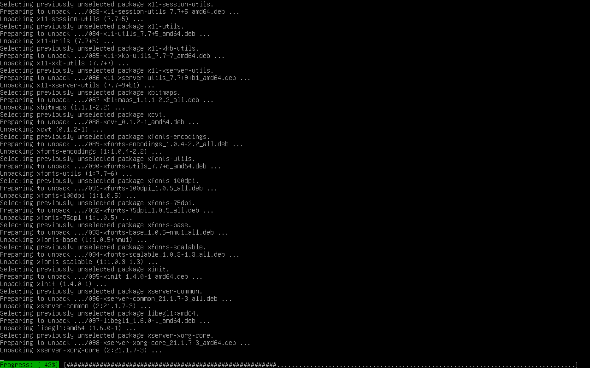

\input{$UNI/.templates/parts/header.tex}
виявити особливості установки операційної системи
Ubuntu на віртуальний комп’ютер; дослідити можливості графічних
інтерфейсів та інтерфейсів командного рядка операційної системи Windows
10 (або будь-якої наявної ОС родини Windows NT) і Ubuntu.

# Індивідуальне завдання

1. Виявити особливості процесу установки операційної системи Ubuntu на віртуальному комп’ютері (пропонується Ubuntu 18 - www.ubuntu.com/download/desktop).
2. Виявити склад, з’ясувати призначення та особливості реалізації елементів, що надаються користувачу графічним інтерфейсом ОС Ubuntu. Дослідити: елементи робочого столу, панелі запуску, головного меню; порядок переміщення та упорядкування вікон; складових системи; параметрів системи.
3. Виявити та з’ясувати особливості елементів що надаються користувачу графічним інтерфейсом ОС Windows 10 (або будь-якої наявної ОС родини Windows NT). Дослідити: елементи робочого столу, панелі запуску, головного меню; порядок переміщення та упорядкування вікон; складових системи; параметрів системи.
4. Виявити та з’ясувати порядок зміни графічних інтерфейсів та інтерфейсів командного рядка в ОС Ubuntu та Windows 10 (або будь-якої наявної ОС родини Windows NT).
5. Додаткове завдання - виявити особливості процесу установки операційної системи Ubuntu Server на віртуальному комп’ютері, виявити та з’ясувати особливості інтерфейсу командного рядка. (Для виконання завдання пропонується Ubuntu Server 18 - www.ubuntu.com/download/server)

# Етапи розв'язку

## Завдання 1

З першої лабораторної роботи я вже маю Debian,
і тому просто встановлю для нього сервер вікон
та менеджер вікон.

\clearpage

## Завдання 2

1. Фонове зображення
2. Панель з інформацією про вікна та елементами керування
3. Док із посиланнями на програми.

## Завдання 3

Теж є панель запуску, також піктограми на
робочому столі. Меню "Пуск" зі списком програм
та кнопками для запуску "налаштувань", cmd, powershell та інших. Вікна переміщаються за допомогою миші,
їх можна підносити до країв екрану й симулювати тайлінг. Для зміни параметрів системи можна використовувати графічну програму "Налаштування".

## Завдання 4

Говорити про порівняння інтерфейсу Windows та
навіть Ubuntu не зовсім коректно, бо є різні
середовища стільниці й менеджери вікон, різні програми,
які кожен обирає для себе. Тому тут я обмежу
порівняння до Windows і Debian, де нема жодних графічних програм, окрім тих, що з `Xorg` і `fvwm`.

\clearpage

{width=15cm}

{width=15cm}

\clearpage

{width=15cm}

{width=15cm}

\clearpage

{width=15cm}

{width=15cm}

| ОС           | Графічний інтерфейс                                        |                             | Командний рядок                   |
| -----------: | -----------------------------------                        | --------------------------- | --------------------------------- |
| GNU/Linux    | поля в налаштунках KDE, наприклад                          | інформація про батарею      | файли в `/sys/class/power_supply` |
|              |                                                            | вебкамера                   | відкрити у плеєрі `/dev/video*`   |
|              | теж у графічній програмі для налаштувань                   | про процесор                | `/proc/cpuinfo`                   |
|              | зазвичай натиснути на розділ у графічному менеджері файлів | монтувати файлову систему   | команда `mount`                   |
|              | можна скористатися можливостями менеджера файлів           | знайти файл                 | `find, grep, ls, locate`          |
| Windows 10   | провідник                                                  | навігація деревом каталогів | dir, cd                           |
|              | посилання на "Калькулятор", наприклад, у меню "Пуск"       | запустити калькулятор       | команда `calc`                    |

## Завдання 5

Debian --- значно кращий вибір для встановлення серверів, ніж
Ubuntu, навіть Ubuntu Server. Якщо мені в майбутньому знадобиться
встановити Ubuntu Server, у чому я сумніваюсь, я, скоріш за все,
зможу це зробити.

# Висновок

У GNU/Linux набагато більше можливостей налаштування як
графічного, так і текстового інтерфейсу, тому кожен може
зробити так, як йому зручно. Цього, на жаль, я не можу
написати про Windows, яка нав'язує всім користувачам свою
монолітну графічну оболонку та дуже обмежений інтерфейс командного
рядка.
