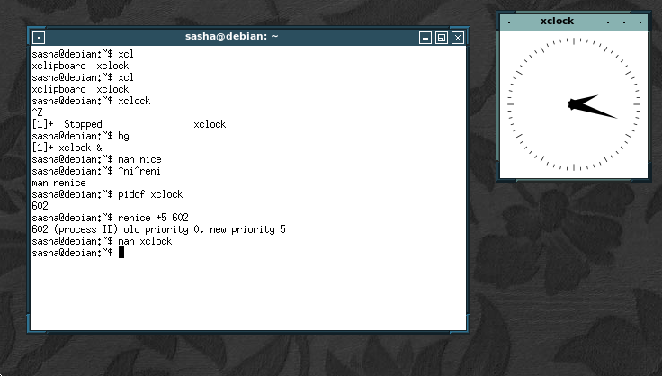
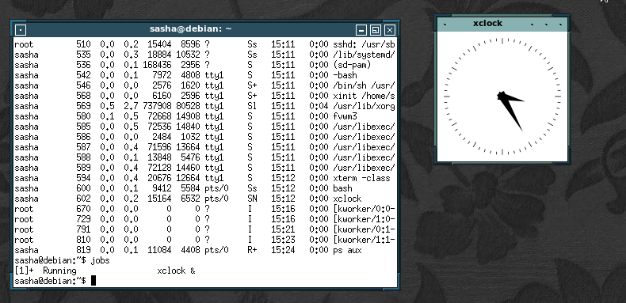
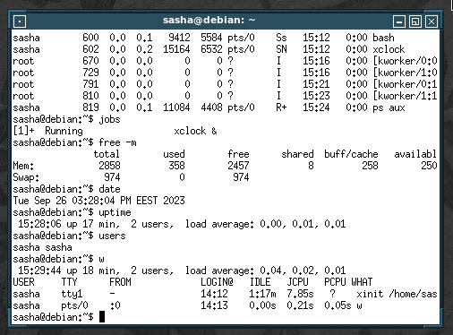
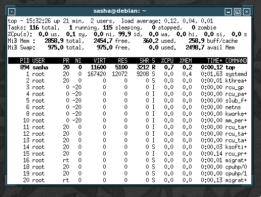
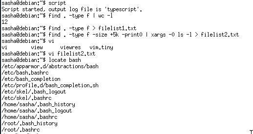
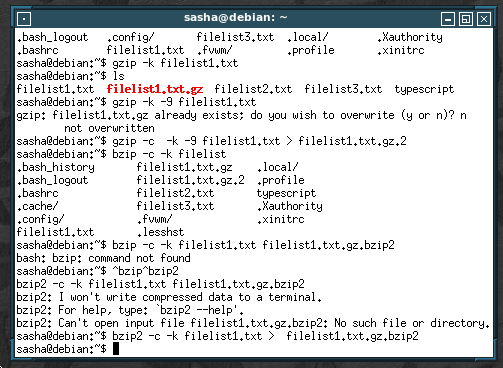
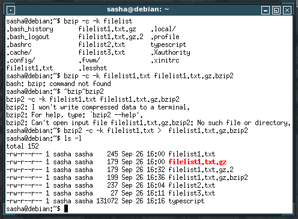
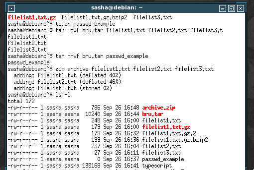
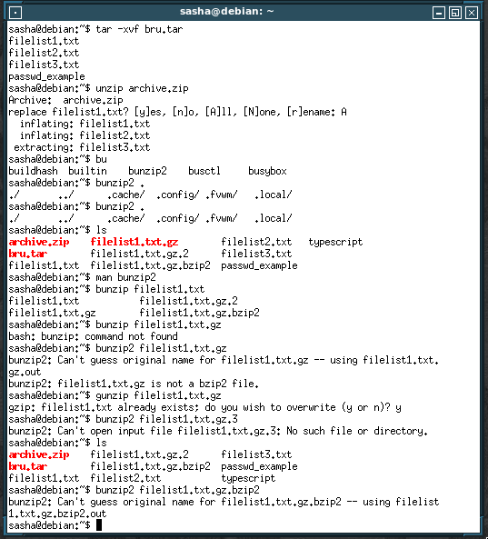

\input{$UNI/.templates/parts/header.tex}
засвоїти основні команди терміналу Linux. Дізнатися, як керувати процесами
в Linux. Навчитися переводити процеси із фонового режиму в пріоритетний і навпаки, слід-
кувати за працюючими процесами, зупиняти процеси і запускати їх так, щоб вони продов-
жували працювати у вашу відсутність.

# Етапи розв'язку

## Завдання 1

Я виконав половину роботи, а потім згадав,
що потрібно звітувати, а відобразити сесію
вже не міг, тому дістав з історії оболонки
команди та сформував сценарій:

\inputminted{sh}{script}

\inputminted{sh}{results}

Далі вже вивід такий, як передбачалось:

\inputminted{sh}{output}

## Завдання 2

Попередні завдання я виконував на хості, а наступні ---
у віртуальній машині.

\clearpage

## Завдання 3

find
: для пошуку в ієрархії директорій

grep
: шукає зразок у файлі та виводить рядки, де знайшла

tar
: утиліта для архівування

{width=15cm}

\clearpage

# Висновок

За допомогою зручних інструментів командного рядка
GNU/Linux можна легко працювати з файлами, процесами,
керувати поведінку заліза та моніторити його стан,
і виконувати багато інших завдань, а також, написавши сценарій, змусити комп'ютер робити це все автоматично.
