\input{$UNI/.templates/parts/header.tex}
набути
практичні
навички
з
використання
основних команд
консольного
режиму операційної системи Windows для роботи з файлами та каталогами.
 Засвоїти способи створення та керування облікових записів користувачів

# Індивідуальне завдання

## Завдання 1

Ознайомитися з структурою файлової системи дисків, роботою
внутрішніх команд консольного режиму ОС Windows, для цього виконайте наступні дії за
допомогою команд командного рядка, які вказані через дефіс від дії.

## Завдання 2

Виконати самостійно наступні дії за допомогою команд консольного
режиму. Самостійно побудувати і записати формат команд, що задають ці дії.

## Завдання 3

Засвоїти способи створення та керування облікових записів користувачів.

# Етапи розв'язку

## Завдання 1

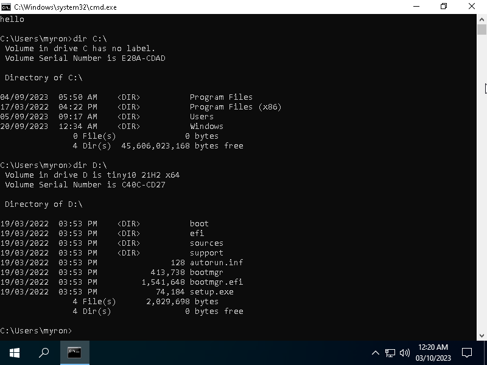{width=14cm}

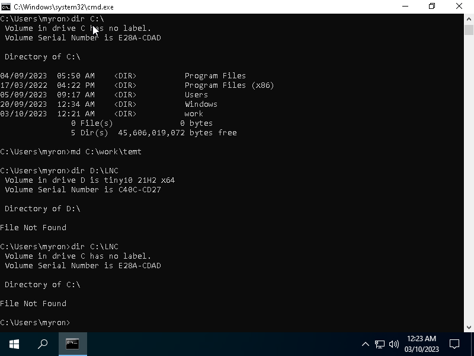{width=14cm}

{width=14cm}

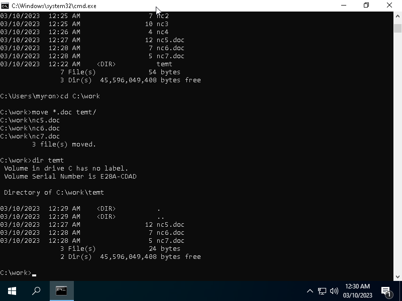{width=14cm}

\clearpage

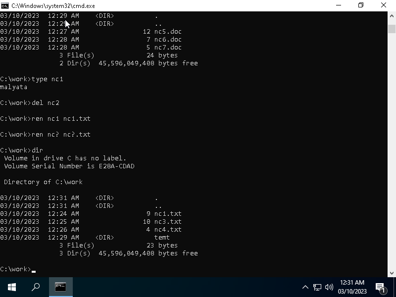{width=14cm}

{width=14cm}

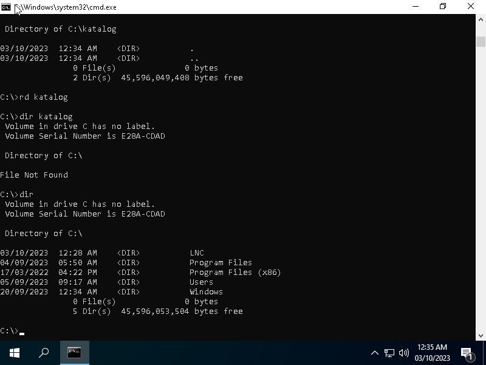{width=14cm}

\clearpage

## Завдання 2

Перейшов у PowerShell, бо так зручніше

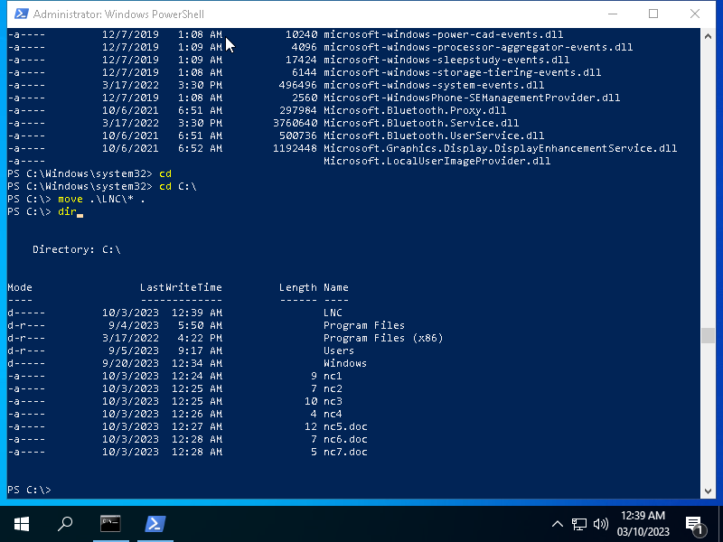{width=14cm}

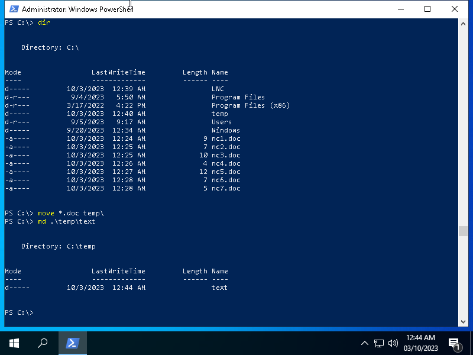{width=14cm}

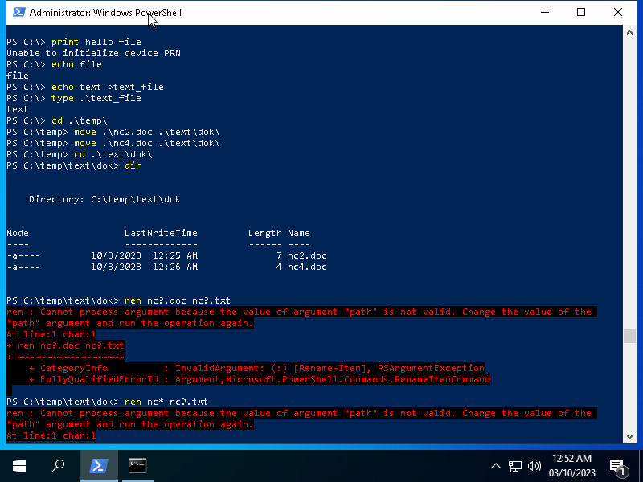{width=14cm}

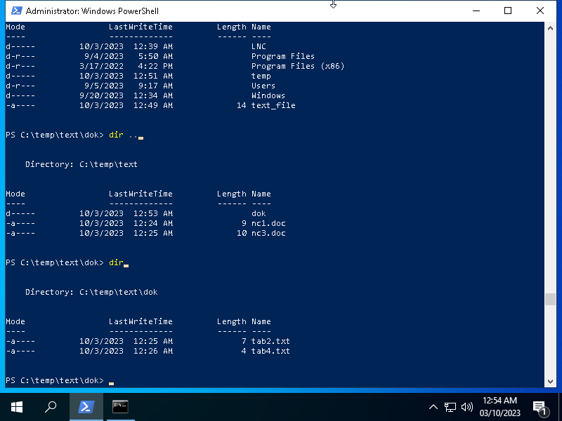{width=14cm}

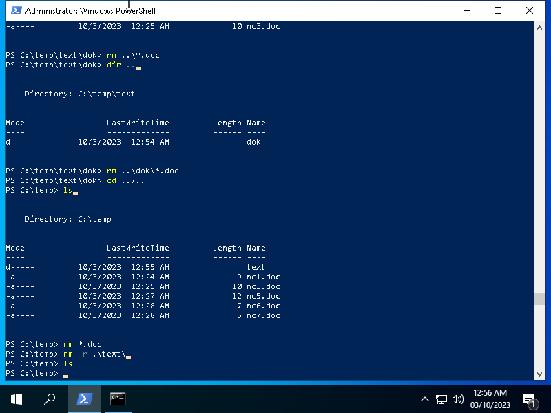{width=14cm}

\clearpage

## Завдання 3

1. За допомогою утиліти "Облікові записи користуачів" створити обліковий запис, названий
своїм прізвищем. (тип запису - звичайний), без пароля. Встановти пароль для цього запису

2. Створити обліковий запис корстувача, який належить до групи "Досвідчені користувачі"
(Advanced users).

{width=14cm}

{width=14cm}

\clearpage

3. Настроїти параметри батьківського контролю для облікового запису, створеного в п.1, та
скинути пароль.

Microsoft перенесли батьківський контроль у свої хмарні сервіси, і
зараз його налаштовувати дуже незручно та неприємно, тому я
вирішив продемонструвати, як це робиться у Windows 7.

{width=13cm}

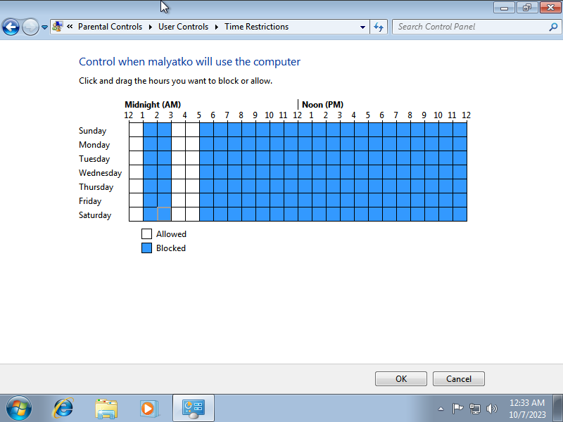{width=13cm}

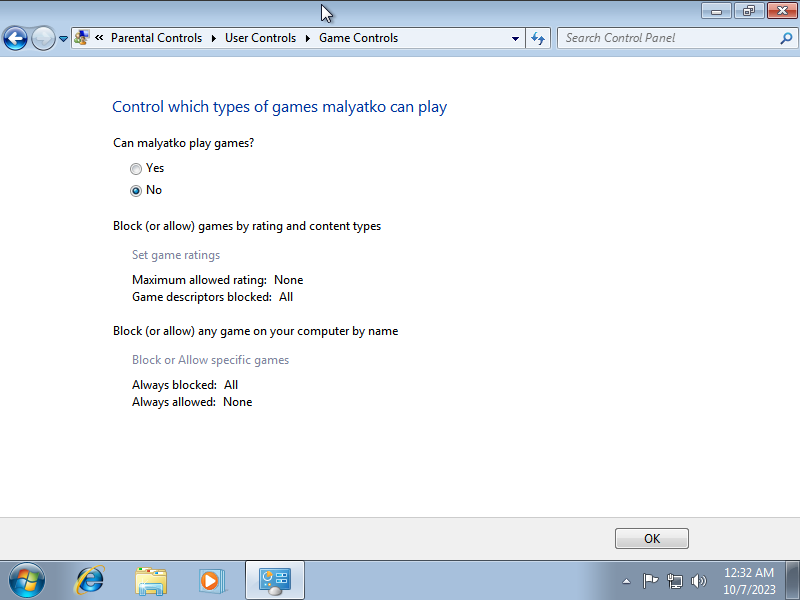{width=13cm}

В будь-якому разі, я сподіваюся, що мої діти матимуть щасливе
дитинство без продуктів Microsoft.

\clearpage

4. Створити обліковий запис користучись командним радком.

{width=14cm}

5. Для облікового запису, створеного в п.2 змінити групуна "звичайний доступ"

{width=14cm}

\clearpage

# Висновок

Windows дуже зосереджена на графічному інтерфейсі, тому
інструменти командного рядка там, порівняно з юніксами,
дуже обмежені.
`PowerShell` намагається бути кращою за `cmd`, але
навіть звичайна `sh` набагато краща.

# Відповіді на контрольні запитання

1. Що таке специфікація файлу?
2. Правила іменування файлів.
3. На які групи підрозділяються всі команди ОС MS-DOS.
4. Як працюють команди  ОС MS-DOS?
5. Що таке шлях до файлу?
6. Призначення символу <..> і <\> у записі шляху.
7. Як задати шаблон групи файлів в команді?
8. Які команди консольного режиму можуть робити з групою файлів?
9. Призначення команди dir.
10. Призначення параметрів [/P] і [/W] у записі команди dir .
11. Призначення команд md, rd.
12. Призначення команд cd.
13. Призначення команд copy, move.
14. Призначення команд type, ren, del
15. Призначення команди copy con.

---

1. **Специфікація файлу** вказує конкретні характеристики або властивості файлу, такі як розмір, дату створення, тип файлу, дозволи доступу, інформацію про власника тощо. Вона дозволяє користувачам і операційній системі отримати докладну інформацію про файл.

2. **Правила іменування файлів** зазвичай включають такі обмеження:
   - Дозволені символи: Імена файлів можуть містити літери, цифри, крапки, підкреслення та деякі інші спеціальні символи.
   - Довжина імені: Зазвичай обмежена до певної кількості символів.
   - Заздалегідь зарезервовані імена.

3. **Групи команд MS-DOS** можна розділити на кілька основних категорій:
   - Команди керування файлами (наприклад, dir, copy, del).
   - Команди керування системою (наприклад, date, time, shutdown).
   - Команди роботи з текстовими файлами (наприклад, type).
   - Команди мережевого взаємодії (наприклад, ping, net).
   - Команди роботи з пристроями (наприклад, chkdsk, format).
   - Команди керування процесами (наприклад, tasklist/kill).

4. **Команди MS-DOS** працюють так, як і будь-які інші команди, але інтерпретатор порівняно з оболонками юніксів дуже обмежений.

5. **Шлях до файлу** вказує місце розташування файлу в файловій системі. Може бути абсолютним чи відносним (залежить від поточної директорії).

6. `..` означає каталог на рівень вище (той, у якому міститься поточний), `\` --- роздільник імен у шляхах.

7. У різних оболонках можна по-різному, основа --- `*` (будь-яка кількість будь-яких символів) та `?` (будь-який символ).

8. Команди консольного режиму, які можуть обробляти групу файлів, включають `copy`, `move`, `del`, `ren`, і багато інших.

9. **Команда dir** виводить список файлів і каталогів у поточному каталозі разом із їхніми характеристиками, такими як розмір, дата, і час.

10. Параметри `/P` і `/W` в команді dir використовуються для керування відображенням результатів:
    - `/P` дозволяє виводити результати сторінками, паузуючи на кожній сторінці.
    - `/W` виводить результати у форматі "широкого" списку без додаткових відомостей.

11. **Команда md** (або mkdir) створює новий каталог, а **команда rd** (або rmdir) видаляє каталог.

12. **Команда cd** використовується для зміни поточного каталогу.

13. **Команди copy і move** використовуються для копіювання і переміщення файлів в інший каталог або на інший пристрій.

14. **Команда type** виводить вміст текстового файлу на екран. **Команда ren** використовується для перейменування файлів, а **команда del** для видалення файлів.

15. **Команда copy con** дозволяє користувачу створювати новий текстовий файл, введенням тексту з консолі.
