\input{$UNI/.templates/parts/header.tex}
ознайомитися з установкою контроллера домену, DNS- та DHCP- серверів
на платформі операційної системи Windows Server 8.1. Ознайомити з
налаштуванням профілів користувачів домену Windows Server. Вивчити способи
завдання групових політик, види параметрів групових політик, об’єкти групових
політик, навчитися задавати групові політики для різних об’єктів.

## Завдання 1

Запустіть віртуальну машину VirtualBox.
Відкрийте віртуальну машину з операційною системою Windows Server 8.1
Виконайте вхід в систему для користувача Administrator з паролем Pa$$word
Назначте наступне ім’я комп’ютеру: Server
Мережевому адаптеру назначте IP-адресу 192.168.1.5, маску підмережі –
255.255.255.0

{width=13cm}

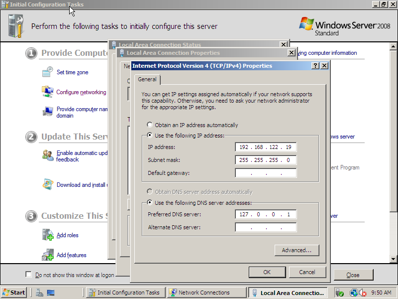{width=13cm}

### Встановлення Active Directory та DNS-сервера

- Встановіть роль сервера «Доменні служби Active Directory».
- Запустіть утиліту dcpromo
- Створіть новий домен в новому лісі та надайте йому ім’я office.com
- Виберіть наступний режим роботи лісу: Windows Server 2008.
- Встановіть DNS-сервер.
- DNS-серверу назначте IP-адресу 192.168.1.5

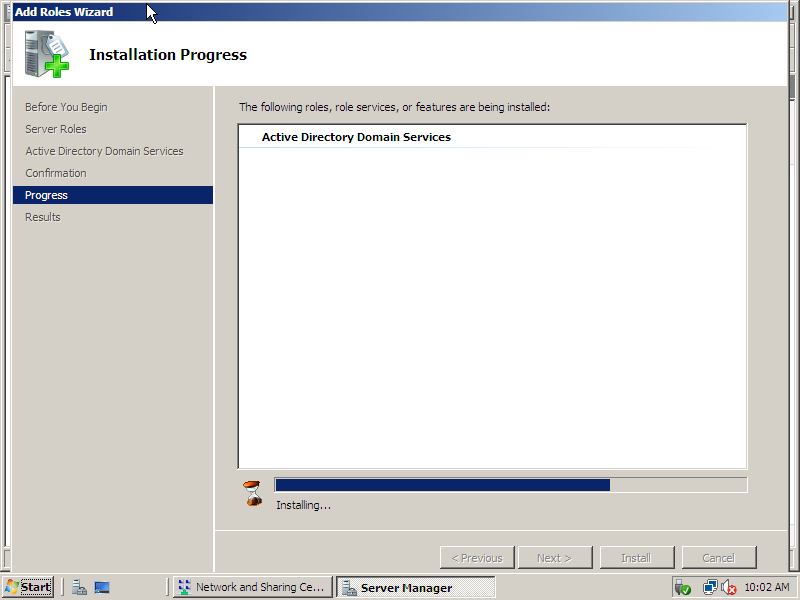{width=13cm}

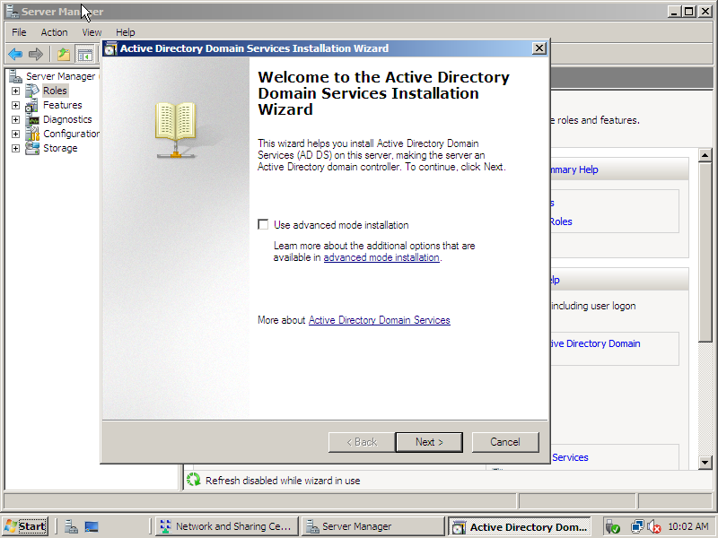{width=13cm}

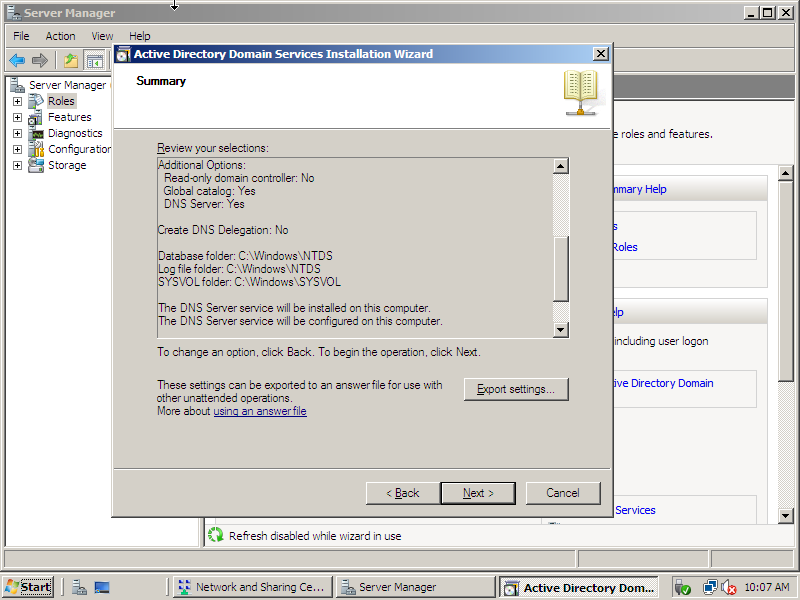{width=13cm}

### Встановлення DHCP-сервера

- Встановіть DHCP-сервер.
- Налаштуйте DHCP-сервер згідно таблиці 1.

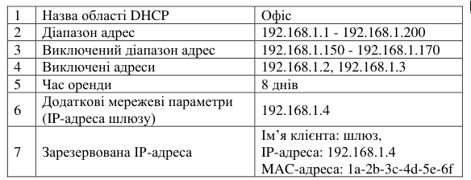{width=12cm}

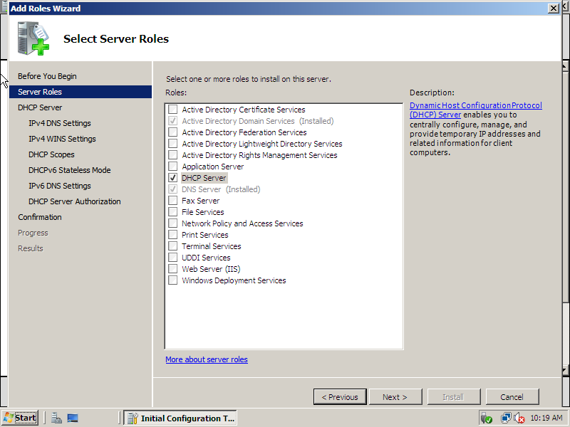{width=13cm}

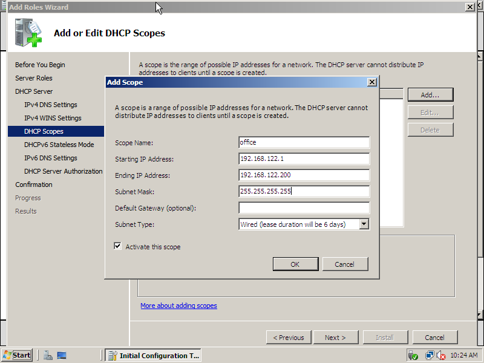{width=13cm}

\clearpage

## Завдання 2

- Запустіть механізм «Active Directory - користувачі та комп'ютери».
- В домені office.com створіть структуру підрозділів, користувачів та груп
- згідно таблиці 2. Назначте користувачам паролі згідно існуючої політики безпеки.
- Помістіть користувачів Директор та Заступник у групу Керівники.
- Помістіть користувачів Бухгалтер, Економіст та Менеджер у групу Фінансисти.
- Помістіть користувачів Адміністратор, Програміст та Сервіс-інженер у групу IT-спеціалісти.
- Надайте користувачу Адміністратор права адміністратора домену.
- В головному меню виберіть пункти «Адміністрування» – «Керування груповою політикою».
- Розгорніть домен office.com
- Виберіть підрозділ «Фінансисти», з контекстного меню виконайте команду «Створити об’єкт групової політики в цьому домені та зв'язати його».
- Надайте ім’я об’єкту групової політики «Фінансова політика безпеки».
- Відкрийте об’єкт групової політики «Фінансова політика безпеки».
- З контекстного меню об'єкту «Фінансова політика безпеки» виконайте команду «Змінити».
- Розгорніть вузол «Конфігурація користувача» – «Політики» –
- «Адміністративні шаблони».
- У вузлі «Панель керування» – «Персоналізація» двічі клацніть параметр «Тайм-аут заставки».
- Прочитайте пояснення на однойменній вкладці.
- Виберіть опцію «Ввімкнути».
- У полі «Секунди» наберіть число 600.
- На вкладці «Коментар» наберіть «Фінансова політика безпеки» та клацніть «OK».
- Двічі клацніть параметр «Парольний захист заставки».
- Виберіть опцію «Ввімкнути».
- На вкладці «Коментар» наберіть «Фінансова політика безпеки» та клацніть «OK».
- Закрийте «Редактор керування груповими політиками».
- Перевірте параметри політики підрозділу «Фінансисти» за допомогою механізму «Active Directory - користувачі та комп'ютери».
- Примусово оновіть групову політику.

{width=13cm}

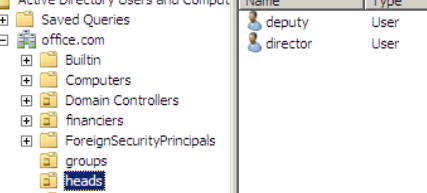{width=7cm}

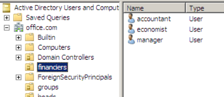{width=7cm}

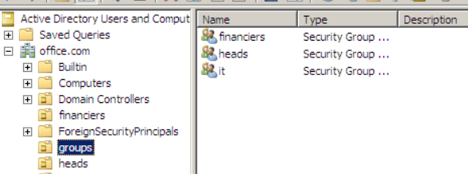{width=7cm}

{width=13cm}

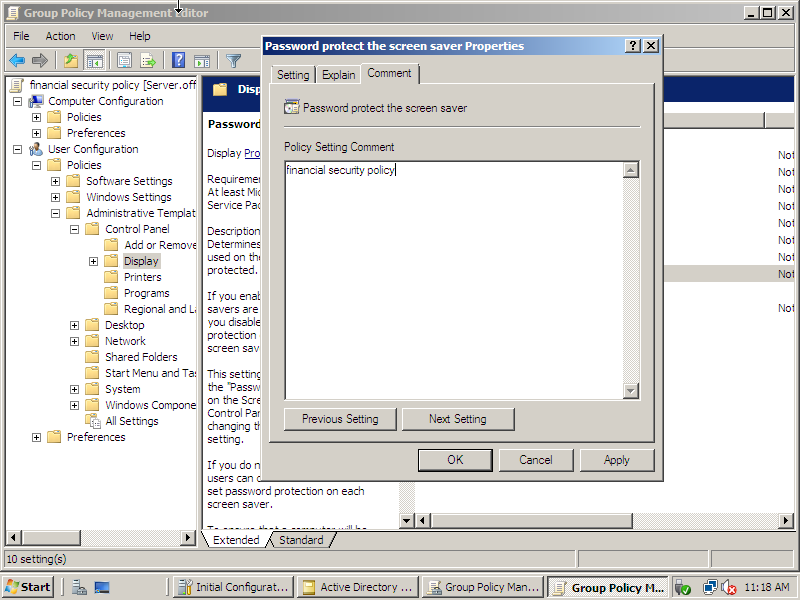{width=13cm}

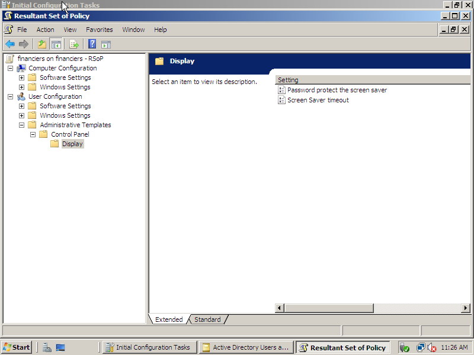{width=13cm}

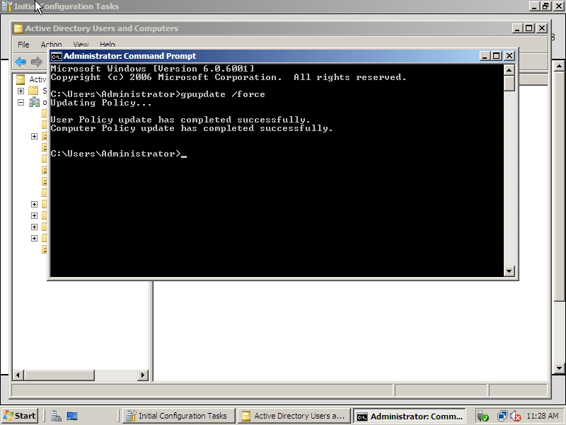{width=13cm}

\clearpage

## Завдання 3

- Запустіть віртуальну машину VirtualBox або сервер.
- Відкрийте віртуальну машину з операційною системою Windows Server 2008 або сервер
- Виконайте вхід в кожну систему з наступними параметрами:  користувач – Administrator, пароль - Pa$$word
- Перевірте налаштування мережевої карти сервера.
- Виконайте налаштування мережевої карти клієнта:  IP-адреса - 192.168.1.2, DNS-сервер - 192.168.1.5, маска підмережі – 255.255.255.0
- Виберіть розташування для мережі клієнта – «Мережа підприємства».
- Введіть клієнта в домен office.com та надайте клієнтському комп'ютеру ім'я Windows 8.
- На диску c: сервера створіть папку Офіс.
- Відкрийте властивості папки Офіс.
- Відкрийте вкладки «Доступ - Розширене налаштування – Дозволи».
- Надайте дозвіл на зміну та читання даних всім користувачам домену.
- У вікні властивостей папки Офіс перейдіть на вкладку «Безпека».
- Надайте дозвіл на читання, перегляд та виконання даних всім користувачам домену.
- Всередині папки Офіс створіть папки Керівники, Фінансисти та IT-спеціалісти.
- Відкрийте властивості папки Керівники.
- За допомогою вкладки Безпека надайте групі Керівники права доступу на зміну інформації в цій папці.
- Надайте відповідні права Фінансистам та IT-спеціалістам на їхні папки.
- Відкрийте обліковий запис Програміст. Назначте йому мережевий диск р: для домашньої папки за шляхом: `\\server\Офіс`
- На клієнтському комп'ютері ввійдіть в систему з обліковим записом Програміст.
- Переконайтеся в доступності мережевого диску р: та папки IT-спеціалісти.

{width=13cm}

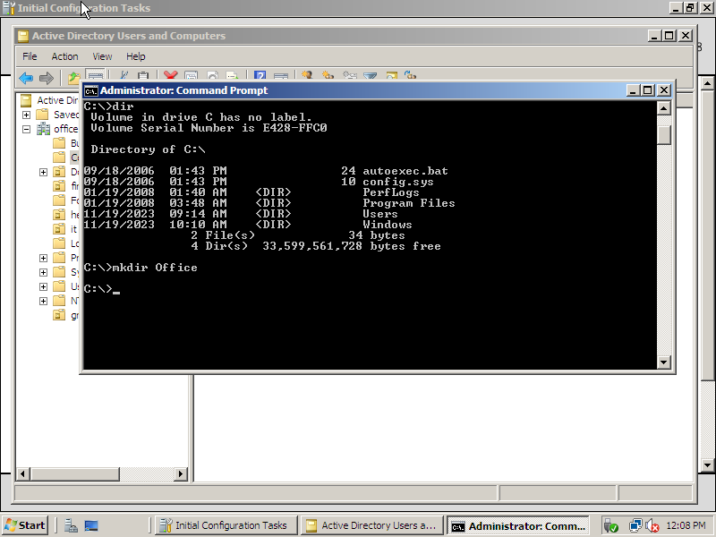{width=13cm}

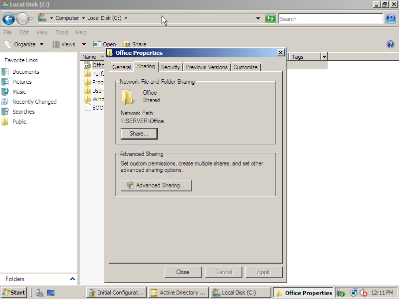{width=13cm}

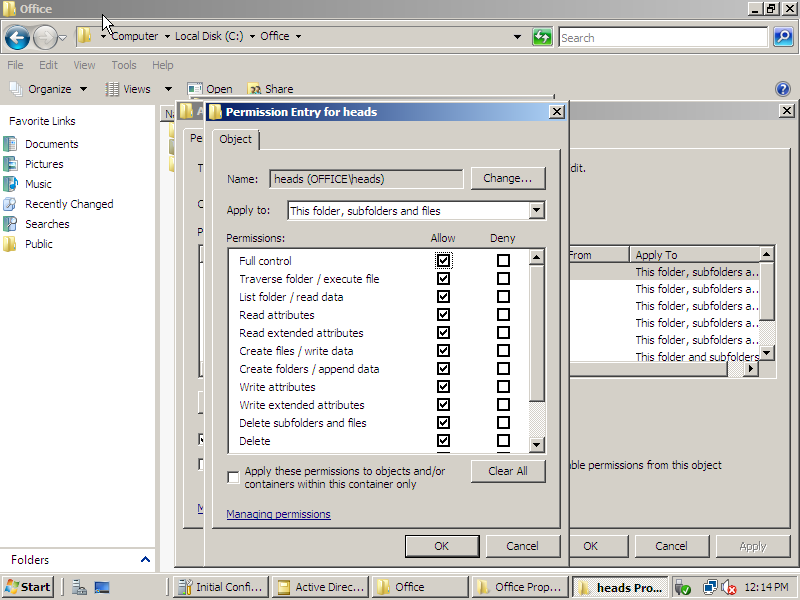{width=13cm}

{width=13cm}

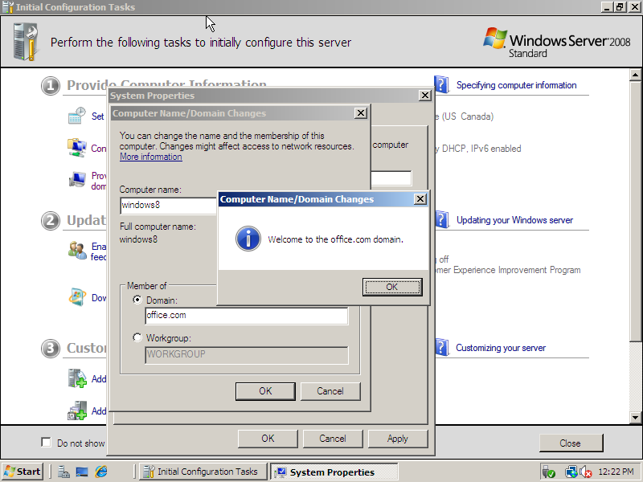{width=13cm}

{width=13cm}

\clearpage

## Завдання 4

- Введіть клієнта в домен office.com та надайте клієнтському комп'ютеру ім'я Windows 8.1.
- На клієнтському комп'ютері виконайте вхід в систему наступним чином:  користувач - `Windows 8\Administrator`, пароль - Pa$$word
- На клієнтському комп'ютері в командному рядку виконайте команду gpedit.msc
- У вікні Редактора локальної групової політики відкрийте розділи «Конфігурація комп’ютера - Адміністративні шаблони – Система – Профілі користувачів» та ввімкніть параметр «Додає групу безпеки «Адміністратори» до переміщуваних профілів користувача».
- На сервері створіть папку із загальним доступом `с:\Profiles`. Надайте повний доступ авторизованим користувачам, користувачам домену та системі.
- Відкрийте обліковий запис Сервіс-інженер та вкажіть шлях до його профілю в наступному форматі: `\\server\Рrofiles\%Username%`
- На клієнтському комп'ютері ввійдіть в систему з обліковим записом Сервіс- інженер.
- Завершіть сеанс роботи Сервіс-інженера на клієнтському комп'ютері.
- Переконайтеся, що переміщуваний профіль Сервіс-інженера скопіювався на сервер.
- На сервері в профілі Сервіс-інженера на його Робочому столі створіть папку Клієнти.
- На клієнтському комп'ютері ввійдіть в систему з обліковим записом Сервіс- інженер та переконайтеся, що папка Клієнти з’явилась на його Робочому столі.
- Завершіть сеанс роботи Сервіс-інженера на клієнтському комп'ютері.
- На сервері відкрийте обліковий запис Менеджер та вкажіть шлях до його профілю в наступ-ному форматі: `\\server\Рrofiles\%Username%`
- На клієнтському комп'ютері ввійдіть в систему з обліковим записом Менеджер.
- Завершіть сеанс роботи Менеджера на клієнтському комп'ютері.
- Переконайтеся, що переміщуваний профіль Менеджера скопіювався на сервер.
- Перейменуйте на сервері файл профілю Менеджера Ntuser.dat на Ntuser.man
- На клієнтському комп'ютері ввійдіть в систему з обліковим записом Менеджер та створіть на його Робочому столі папку «Шеф - завжди правий».
- Завершіть сеанс роботи Менеджера на клієнтському комп'ютері.
- На клієнтському комп'ютері знову ввійдіть в систему з обліковим записом Менеджер.
- Переконайтеся, що папка «Шеф - завжди правий» зникла з його Робочого столу.
- Надайте Програмісту дозвіл на віддалене керування Робочим столом сервера.
- На клієнтському комп'ютері ввійдіть в систему з обліковим записом Програміст.
- Виконайте підключення до віддаленої системи сервера з обліковим записом Програміст.
- Завершіть сеанс підключення Програміста до віддаленої системи сервера. На сервері встановіть роль «Служби віддалених Робочих столів».
- Активізуйте сервер ліцензій. Виберіть метод підключення «В браузер Web-сторінок», під'єднайтеся до сервера Microsoft та отримайте ключі активації.
- Запустіть Диспетчер служб віддалених Робочих столів. З клієнтського комп'ютера за допомогою Служби віддалених Робочих столів виконайте підключення до віддаленої системи сервера з обліковим записом Програміст.
- Переконайтеся, що на сервері в Диспетчері служб віддалених Робочих столів з’явилось підключення з обліковим записом Програміст.
- Завершіть сеанс підключення Програміста до віддаленої системи сервера.
- Розгорніть віддалений додаток RemoteApp. У якості додатку виберіть програму MS Word, яка заздалегідь встановлена на сервері.
- Створіть RDP-файл для запуску віддаленого додатку Microsoft Word та розмістіть даний файл на сервері на Робочому столі Програміста за наступним шляхом: `c:\users\Програміст\Desktop`
- На клієнтському комп'ютері виконайте підключення до віддаленої системи сервера з обліко-вим записом Програміст та запустіть віддалений додаток Microsoft Word.

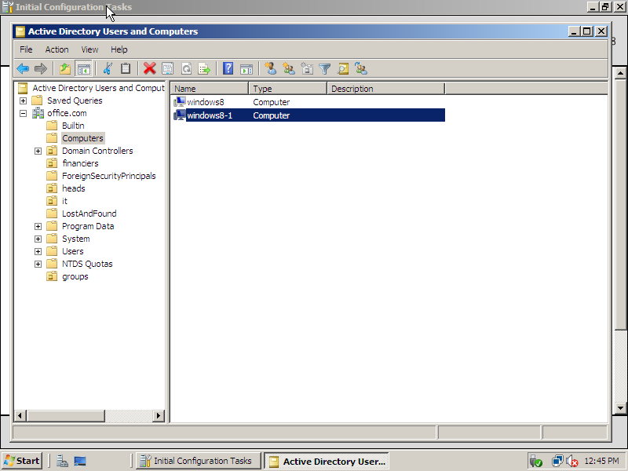{width=13cm}

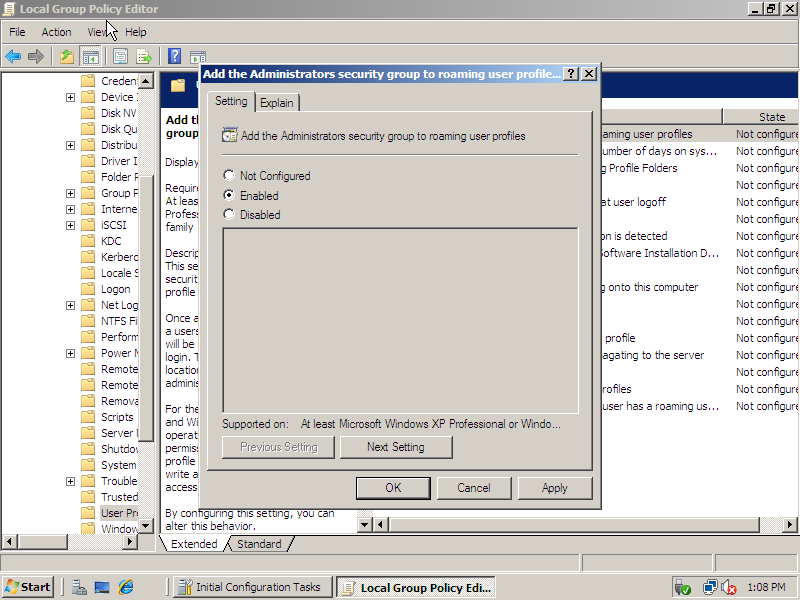{width=13cm}

{width=13cm}

{width=13cm}

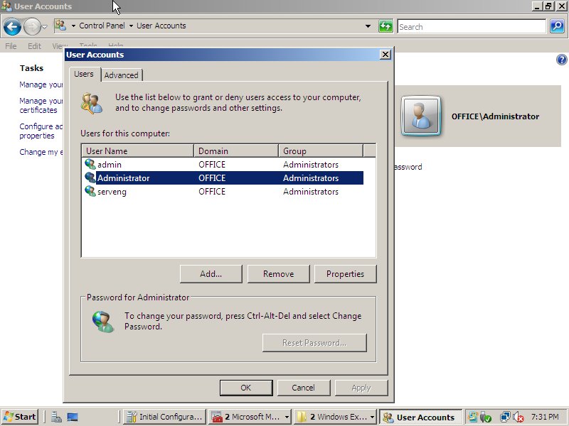{width=13cm}

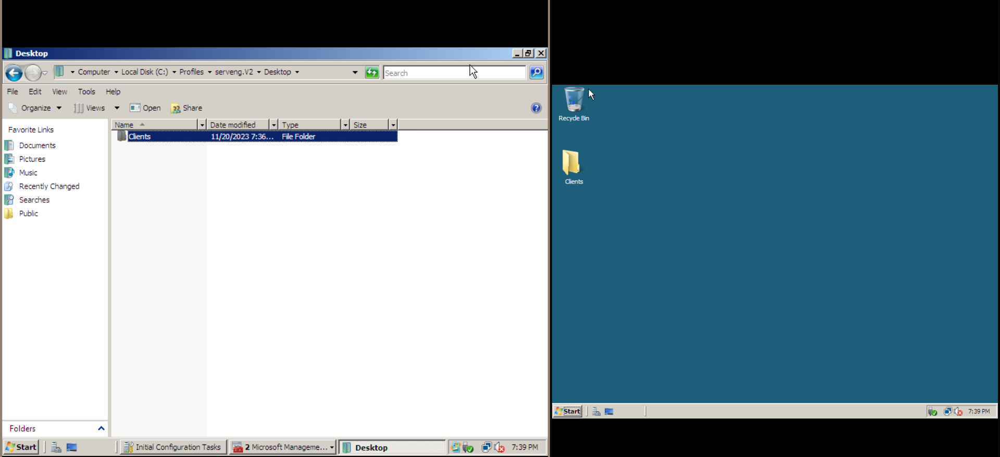{width=13cm}

\clearpage

Далі виконував завдання, але виявилося, що
файлу `ntuser.dat` не існує, а також я
не виявив ролі «Служби віддалених Робочих столів», тому переходжу до наступного завдання.

## Завдання 5

Задати у домені політику, відповідно до якої на рівні всього домену під час
установці пароля користувача потрібно було б таке: довжина пароля – не менше 8
символів; користувач не може встановити жоден з трьох попередніх паролів;
пароль має відповідати вимогам складності; максимальний вік пароля – 60 днів:

Для запуску консолі управління MMC виконати Start – Run – mmc.

Для управління об’єктами групової політики на рівні домену в консолі MMC
необхідно додати оснащення Group Policy Object Editor командою File  (Консоль) –
Add (Додати) – Remove Snap-in... (Додати або видалити оснастку) – Add...
(Додати) і вибрати зі списку відповідну оснастку.

Для визначення об’єкта дії політики натиснути Browse... (Огляд...).

Вивчити вікно і перерахувати об’єкти групових політик.

Вибрати Default Domain Policy. Натисніть Finish (Готово). У лівому вікні консолі
повинно з’явитися оснащення Default Domain Policy <ім’я контролера домену>
Policy.

Розгорнути оснащення та вибрати Computer Configuration – Windows Settings –
Security Settings – Account Policies – Password Policy.

Вивчити політики паролів і встановити установки відповідно до завдання.

Створити нового користувача і перевірити правильність налаштувань.

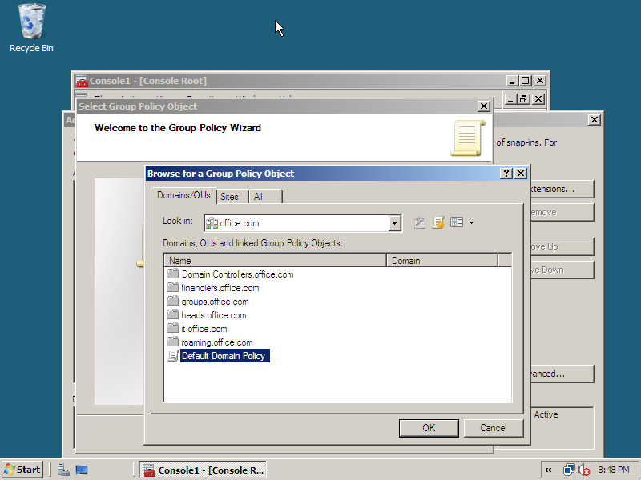{width=13cm}

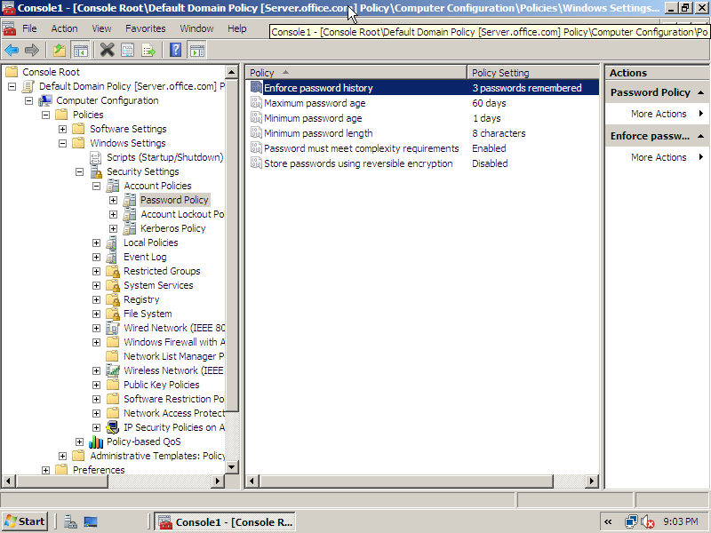{width=13cm}

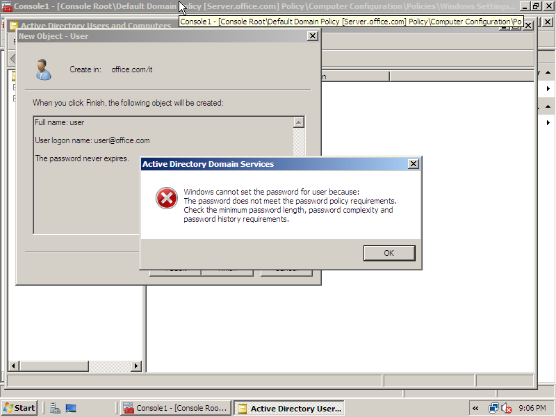{width=13cm}

\clearpage

## Завдання 6

Задати політику на рівні всього домену, що виконує блокування облікових записів
на 5 хвилин у тому разі, якщо поспіль було зроблено не менше трьох помилок
входу в систему.
Відповідна  політика  перебуває  в  наступному  розділі:   Computer Configuration
(Конфігурація комп’ютера) – Windows Settings (Конфігурація Windows) – Security
Settings (Налаштування безпеки) – Account Policies (Політики облікових записів) –
Account Lockout Policy (Політика блокування облікового запису).
Переконатися, що установки політики шляхом декількох спроб ввести
неправильний пароль користувача на робочій станції.

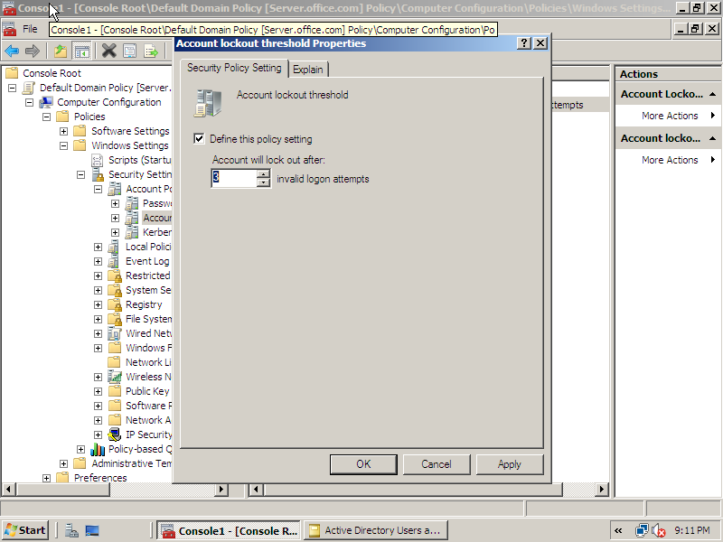{width=13cm}

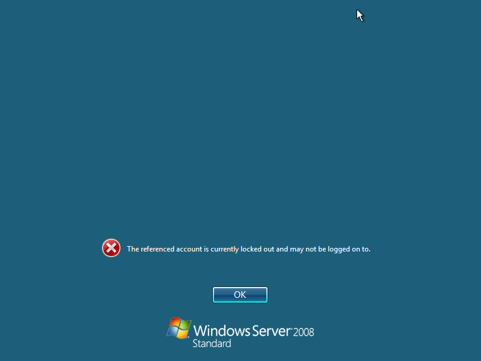{width=13cm}

\clearpage

## Завдання 7

Створити організаційний підрозділ StudentSecurity.
Виконати команду Start – Programs – Administrative Tools – Active Directory Users
and Computers (Пуск – Програми – Адміністрування –
Користувачі та комп’ютери Active Directory).
Розкрити папку faculty.ua в лівій панелі вікна.
У меню Action виберіть команду New – Organization Unit.
У вікні New Object – Organization Unit (Новий об’єкт – Підрозділ) у полі Name
набрати StudentSecurity.
Помістити в організаційний підрозділ обліковий запис студента.
Правою  кнопкою  клацнути  по  новому  об’єкту,  вибрати  Properties
(Властивості) – Security (Безпека).
Переглянути список груп, що володіють правом доступу до підрозділу
StudentSecurity.

\clearpage

## Завдання 8

Задати політику на рівні організаційного підрозділу StudentSecurity, що забороняє
змінювати картинку робочого столу і завантажує загальну для всіх картинку.
Відкрити вікно StudentSecurity.
Виконати  команду  User  Configuration  (Конфігурація  користувача)  –
Administrative Templates (Адміністративні шаблони) – Desktop (Робочий стіл) –
ActiveDesktop, вибрати параметр, що забороняє зміну картинки і задати загальну
картинку робочого столу для всього підрозділу.
Переконатися в правильності налаштування.
Задати мережні параметри робочої станції: ім’я робочої станції – user1; IP-адресу
надати з тієї ж підмережі, що і контролер домену (якщо не працює сервер DHCP).
Переконатися в можливості встановлення зв’язку між контролером домену та
робочою станцією. Помістити у звіт скріншот, у якому відображено
підтвердження встановлення зв’язку між комп’ютерами.

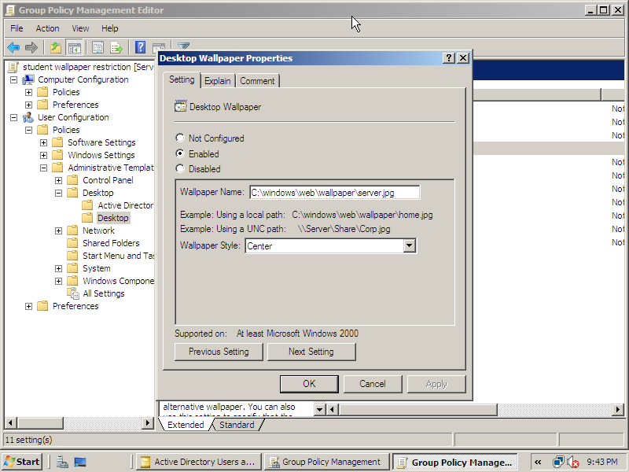{width=13cm}

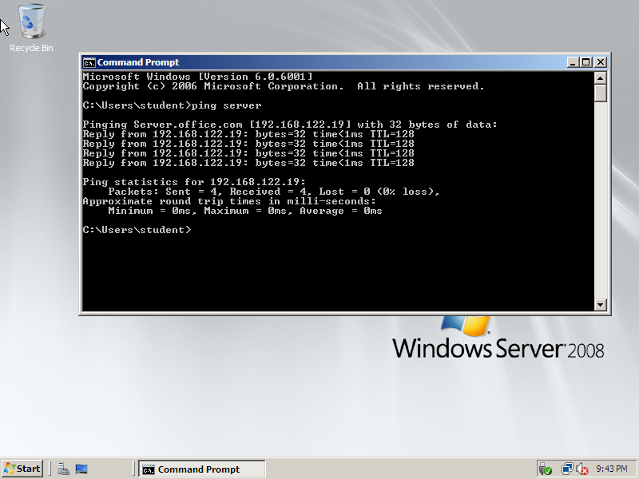{width=13cm}

\clearpage

## Завдання 9

Включити робочу станцію до домену. Розглянути процес на прикладі включення
робочої станції user1 у домен faculty.ua:
Для приєднання комп’ютера до домену на робочій станції відкрити вікно
System Properties (Властивості системи), виконавши одну з команд Settings
(Настройки) – Control Panel (Панель управління) – System (Система) або
викликати з контекстного меню вікно властивостей папки My Computer (Мій
комп’ютер).
Перейти на вкладку Computer Name (Ім’я комп’ютера).
Вибрати Network ID (Ідентифікація). Відкриється майстер мережевої
ідентифікації Network Identification Wizard. Натиснути Next (Далі).
На вкладці Connecting to the Network (Підключення до мережі) вибрати This
computer is part of a business network, and I use it to connect to other computers at
work (Комп’ютер належить до корпоративної мережі, і під час роботи я
використовую його для з’єднання з іншими комп’ютерами).
На цій вкладці існує другий варіант. Який? У яких випадках він
застосовується?
Вибрати тип мережі – My company uses a network with domain (Моя організація
використовує мережу з доменами).
У вікні Network Information (Мережева інформація) вивчити, які мережеві
параметри знадобляться.
У вікні User Account and Domain Information (Відомості про облікову запису і
домені) залишити все без змін. Натиснути Next.
У вікні Computer Domain (Домен комп’ютера) записати ім’я домену і вузла –
Computer name (Ім’я комп’ютера) – user1, а Computer domain (Домен
комп’ютера) – faculty. Натисніть Next.
З’явиться вікно, у якому потрібно ввести ім’я та пароль запису, який має дозвіл
на додавання користувачів до домену. Наприклад, у лабораторній роботі це
будуть:
User name – Administrator;
Password – порожній (або поточний пароль адміністратора);
Domain – faculty.ua;
У вікні User Account буде запропоновано додати нових користувачів.
Вибрати перемикач Do not add user at this time (Не додавати учасників у цей
час).
Натиснути Finish (Готово) і перезавантажити комп’ютер. Внести до звіту
скриншот вікна Computer Name (Ім’я комп’ютера) робочої станції.

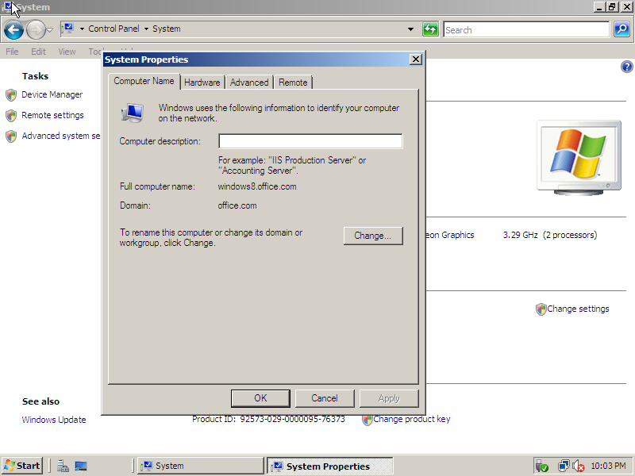{width=13cm}

\clearpage

## Завдання 10

На робочій станції увійти у систему під одним з доменних облікових записів.
Відкрити загальний доступ до папки Users, розташованої на сервері.
Отримати доступ до папки «Студенти» із робочої станції домену:
На робочій станції зайти під будь-яким доменним обліковим записом.
Отримати доступ до папки можна одним з таких способів:
у мережевому оточенні знайти папку Users;
виконати команду Start – Run (Пуск – Виконати) і ввести ім’я в форматі \ \
<ім’я сервера> \ <ім’я папки>. Наприклад: \ \ server \ users.
Переконатися в тому, що тут ви зможете зберігати свої документи,
змінювати наявні, але вам відмовлено змінювати права доступу на папку.
Підключити загальну папку Студенти як мережевий диск G:
Увійти під обліковим записом студента.
Відкрити контекстне меню папки Студенти.
Скористатися командою My Network Places (Моє мережне оточення) – Map
Network Drive (Підключити мережевий диск).

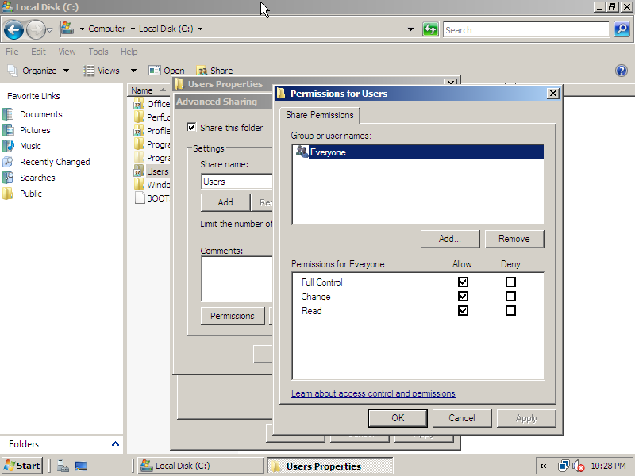{width=13cm}

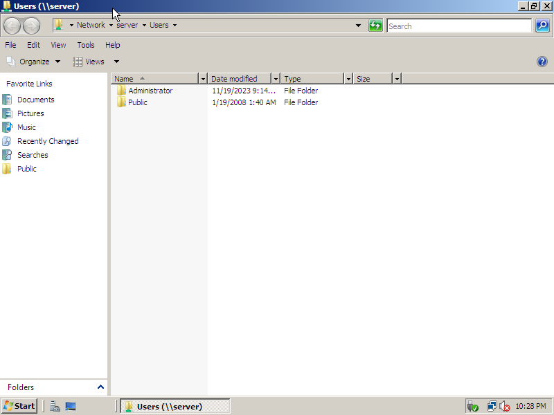{width=13cm}

\clearpage

## Завдання 11

Вивчити використання команди Run As:
Увійти на сервер під обліковим записом адміністратора.
Помістити у папці Студенти з загальним доступом додаток, ярлик програми
або програму з Control Panel.
Заборонити студенту доступ до об’єкта.
На робочій станції зайти під обліковим записом студента.
Відкрити папку Студенти і спробувати відкрити об’єкт. Скопіювати у буфер
вікно, що забороняє доступ до об’єкта.
Виділити об’єкт і, утримуючи Shift, вибрати у контекстному меню команду Run
As (Запустити як).
Установити перемикач Run The Program As The Following User (Запустити
програму від імені наступного користувача).
У  полі  User name  ввести  mydomain  \  Administrator,  а  в  Password  – пароль
адміністратора. Натиснути ОК.
Запустити об’єкт.
Видалити робочу станцію з домену.

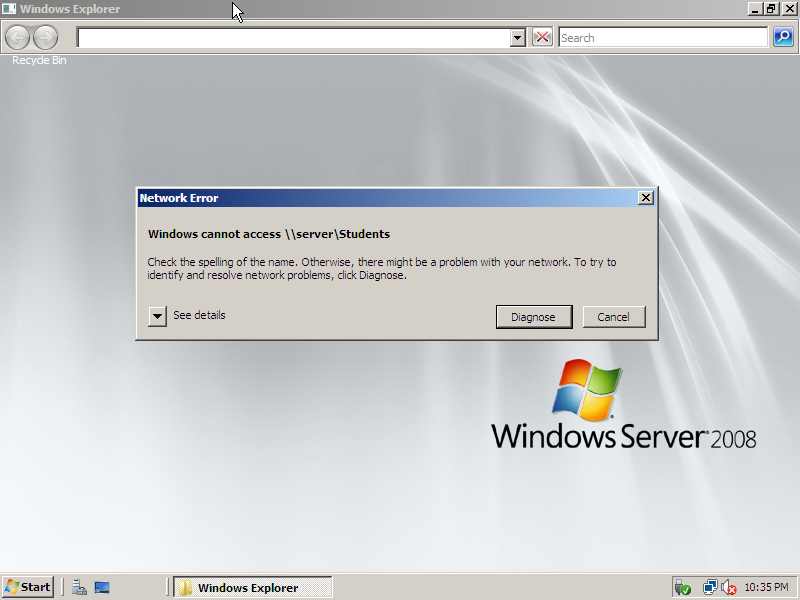{width=13cm}

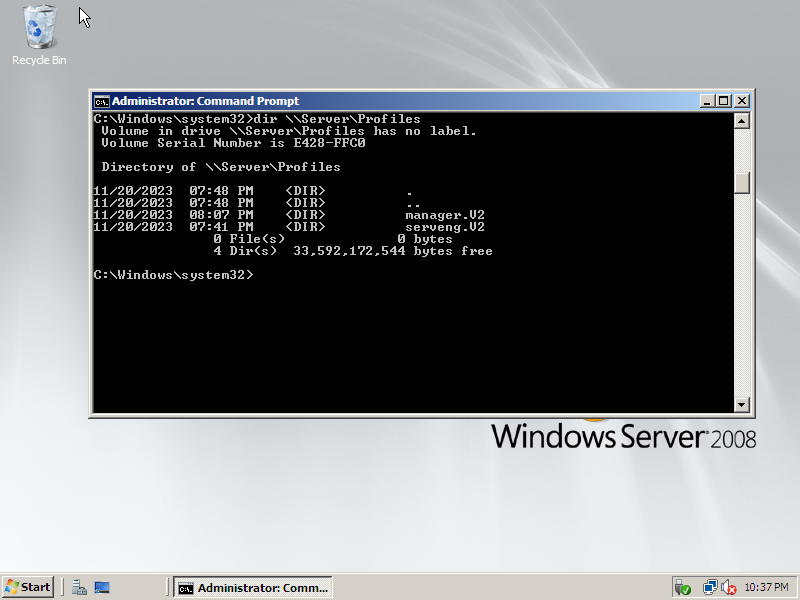{width=13cm}

\clearpage

# Висновок

Я ознайомився з установкою контроллера домену, DNS- та DHCP- серверів
на платформі операційної системи Windows Server 8.1. Ознайомився з
налаштуванням профілів користувачів домену Windows Server. Вивчив способи
завдання групових політик, види параметрів групових політик, об’єкти групових
політик, навчився задавати групові політики для різних об’єктів.
