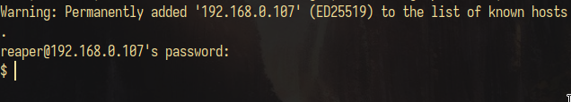
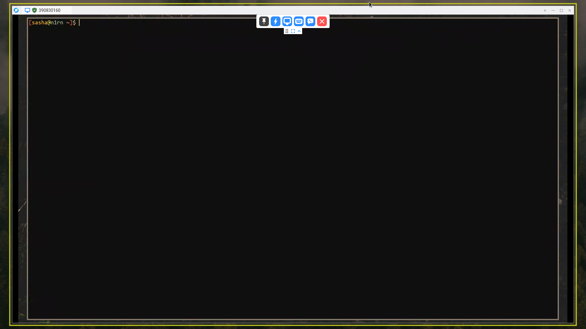

\input{$UNI/.templates/parts/header.tex}
Ознайомитися на практиці із засобами віддаленого управління в
операційній системі Linux Ubuntu. Набути досвіду і навички управління
віддаленим доступом.

# Завдання

1. Використовуючи теоретичні відомості вивчити призначення і правила роботи з
сервісом ssh.
2. Довстановити при необхідності необхідну програмне забезпечення (Ssh, sshd,
putty).
3. Забезпечити доступ по протоколу ssh до свого комп'ютера. Надати права і
пароль для віддаленого управління вашим комп'ютером сусіднього - проти
годинникової стрілки - комп'ютера.
4. Встановити віддалене підключення до віддаленого (remote) комп'ютера. Як
Remote виступає сусідній за годинниковою стрілкою комп'ютер. Тобто ви повинні
керувати віддалено правим комп'ютером, і забезпечити можливість віддаленого
управління вашим комп'ютером лівому від вас комп'ютера

# Етапи розв'язку

## Завдання 1

`SSH` (Secure Shell) --- протокол для безпечного
віддаленого керування комп'ютерами. Якщо коротко,
він дає можливість запустити оболонку (`shell`, інтерпретатор команд)
для вказаного користувача, але робить це безпечно,
шифруючи передавані дані.

Для роботи потрібно встановити та
запустити на комп'ютері, до якого доступаються, демон
`ssh` --- `sshd`. Після цього з іншого комп'ютера за допомогою
клієнта `ssh` можна логінитись на сервер.

Правила роботи з `ssh`:

1. Не робити автентифікацію за паролем на публічний сервер.
2. Не розголошувати пароль користувача без необхідності.
3. Не ділитися ключами з випадковими людьми.

## Завдання 2

Необхідне ПЗ (`openssh`, `sshd`) встановлене.

## Завдання 3

Потрібно запустити на комп'ютері, для
якого організовується доступ `sshd`.
Запускається як і інші сервіси за допомогою
встановленої системи ініціалізації. Наприклад,
сойстемд:

```
systemctl enable sshd
```

В принципі, це все необхідне, можна логінитись:

```sh
ssh root@host
```

### Безпечніше з ключами

Також стандартно я налаштовую автентифікацію
за допомогою ключів і забороняю вхід з використанням
пароля. Для цього:

1. Генеруємо ключі на комп'ютері, з якого доступаємось:

```
ssh-keygen
```

2. Імпортуємо їх на сервер:

```sh
ssh-copy-id юзер@домен
```

3. Тепер можна прибрати можливість використання пароля для входу,
змінимо файл `/etc/ssh/sshd_config`, щоб він містив таке:

```sh
PasswordAuthentication no
ChallengeResponseAuthentication no
UsePAM no
```

Також можна додати дещо в
`.ssh/config` клієнта:

```
host host
   hostname <домен чи IP>
   # для під'єднання через tor
   proxyCommand ncat --proxy 127.0.0.1:9050 --proxy-type socks5 %h %p
   # також можна встановити шлях до ключа
   IdentityFile /шлях/до/ключа
```

щоб залогінитись:

```sh
ssh root@host
```
, наприклад
```sh
[sasha@amnesia ~]$ ssh root@host 'sv status nginx'
Enter passphrase for key '/home/sasha/.ssh/kkkeyyyyyyyyyyy':
run: nginx: (pid 1002) 932277s
```






# Висновок

`ssh` --- дуже зручний протокол для
віддаленого керування комп'ютерами.
Якщо потрібно віддалено працювати
з графічними програмами, то для цього
є `RDP`, а ще можна під'єднатись до
віддаленого X-сервера.
