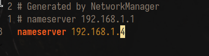
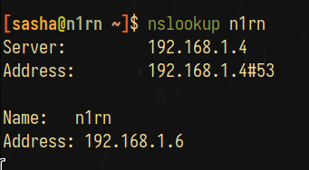

\input{$UNI/.templates/parts/header.tex}
оволодіти основними навиками встановлення та налаштування DNS-
сервера в операційній системі Linux Ubuntu.

# Завдання

1. Додати роль DNS сервера.
2. Виконати налаштування клієнта DNS.
3. Додати зону для DNS сервера.
4. Додати в базу даних DNS сервера дані про клієнта із вказанням доменного імені.
5. Налаштувати ведення журналу на DNS сервері.
6. Протестувати роботу служби DNS шляхом перевірки доступності комп’ютера за його доменним ім’ям.
7. Переглянути журнал DNS сервері виділити дії, пов’язані з виконанням п.6 завдання.

# Етапи розв'язку

## 1. Додати роль DNS сервера.

Я використав `dnsmasq` як сервер DNS.
Відповідно, для цього я його встановив і
після налаштування (див. нижче) запустив
сервіс.

## 2. Виконати налаштування клієнта DNS.

у файлі `/etc/resolv.conf` вказую IP-адресу сервера:
```
# Generated by NetworkManager
nameserver 192.168.1.4
```

{width=7cm}

## 3. Додати зону для DNS сервера.

Конфігурації у файлі `/etc/dnsmasq.d/lab.net`:
(для цього в `/etc/dnsmasq.conf` я розкоментував `conf-dir=/etc/dnsmasq.d`)

```sh
listen-address=::1,127.0.0.1,192.168.1.4
interface=wlan0
# no-dhcp-interface=wlan0 це вимикає dhcp та tftp й надає тільки DNS
bogus-priv # Щоб не надсилати назовні локальні іп-адреси для обробки
domain=lab.net
expand-hosts # додає доменну частину до простих імен
# (до простого simplename в /etc/hosts можна звертатись як simplename.lab.net)
local=/lab.net/ # локальна зона, тут указано, що її не треба резолвити ззовні
domain-needed # ніколи не надавати апстрім серверам імена без крапок чи доменних частин
# (типу google, а не google.com)
no-resolv # не використовувати /etc/resolf.conf
no-poll
server=8.8.8.8 # натомість використовувати DNS Google для зовнішніх доменів
server=8.8.4.4
```

## 4. Додати в базу даних DNS сервера дані про клієнта із вказанням доменного імені.

```
127.0.0.1	localhost
::1		localhost
127.0.1.1	amnesia.localdomain amnesia
192.168.1.4	dnsmasq.lab.net dnsmasq

192.168.1.6	n1rn
```

## 5. Налаштувати ведення журналу на DNS сервері.

у файлі `/etc/dnsmasq.conf`:
```
# For debugging purposes, log each DNS query as it passes through
# dnsmasq.
log-queries
```

можна встановити йому окремий файл для логів за допомогою параметру log-facility (зрештою, його теж можна вказати в конфігураційному файлі)
```
exec dnsmasq -k --enable-dbus -u dnsmasq -g dnsmasq --log-facility=/var/log/dnsmasq.log 2>&1
```

## 6. Протестувати роботу служби DNS шляхом перевірки доступності комп’ютера за його доменним ім’ям.

```
[sasha@amnesia ~]$ nslookup n1rn localhost
Server:         localhost
Address:        ::1#53
Name:   n1rn
Address: 192.168.1.6
```

{width=7cm}

## 7. Переглянути журнал DNS сервері виділити дії, пов’язані з виконанням п.6 завдання.

```sql
[sasha@amnesia /var/log]$ sudo cat dnsmasq.log
Nov 23 23:44:00 dnsmasq[31930]: started, version 2.89 cachesize 150
Nov 23 23:44:00 dnsmasq[31930]: compile time options: IPv6 GNU-getopt DBus no-UBus i18n IDN2 DHCP DHCPv6 no-Lua TFTP conntrack ipset nftset auth cryptohash DNSSEC loop-detect inotify dumpfile
Nov 23 23:44:00 dnsmasq[31930]: DBus support enabled: connected to system bus
Nov 23 23:44:00 dnsmasq[31930]: using nameserver 8.8.8.8#53
Nov 23 23:44:00 dnsmasq[31930]: using nameserver 8.8.4.4#53
Nov 23 23:44:00 dnsmasq[31930]: using only locally-known addresses for lab.net
Nov 23 23:44:00 dnsmasq[31930]: read /etc/hosts - 220157 names
--> Nov 23 23:45:08 dnsmasq[31930]: query[A] n1rn from ::1
--> Nov 23 23:45:08 dnsmasq[31930]: /etc/hosts n1rn is 192.168.1.6
--> Nov 23 23:45:08 dnsmasq[31930]: query[AAAA] n1rn from ::1
--> Nov 23 23:45:08 dnsmasq[31930]: config n1rn is NODATA-IPv6
```

# Висновок

Я навчився налаштовувати `DNS`-сервер
за допомогою `dnsmasq`.
