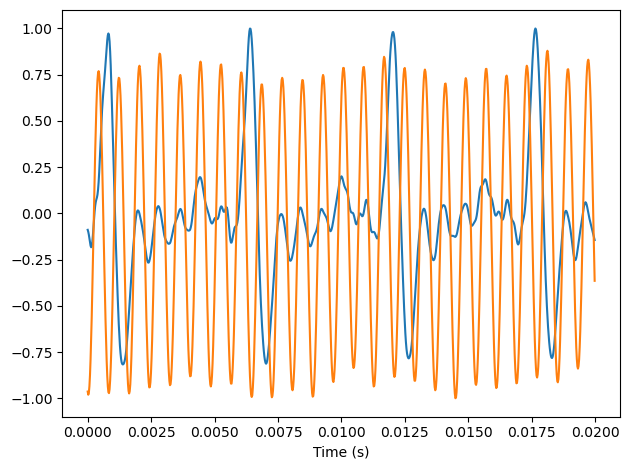
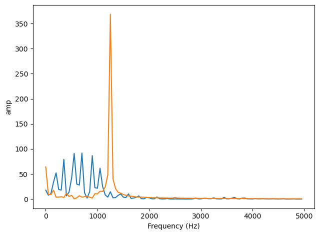
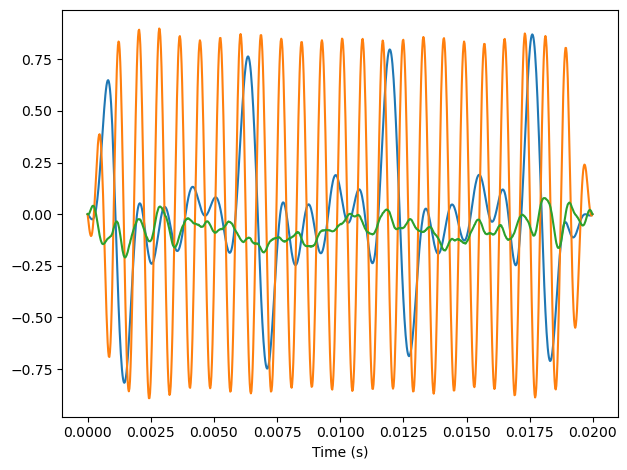
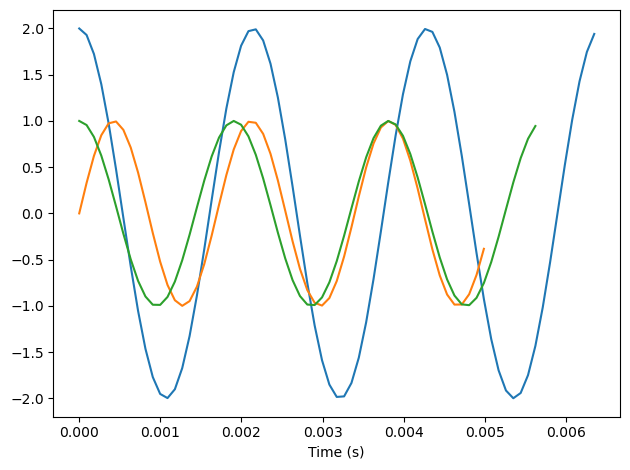
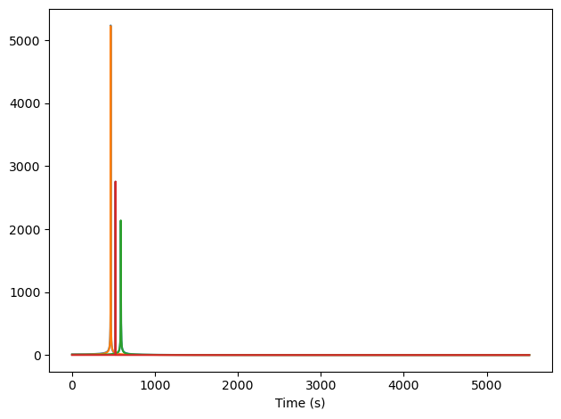

# Завдання
## Основнi
1. В робочому пакетi вiдкрийте блокнот chap01.ipynb. Ознайомтеся з поясненнями та
прикладами, що до нього входять.
2. Вiзьмiть будь-який waw-файл на Ваш вибiр, що мiстить музику, голос чи iншi звуки
iз чiтко вираженою амплiтудою. З файлу видiлiть фрагмент довжиною близько 0.5 с, на
якому рiвень сигналу бiльш-менш сталий.
3. Обчислiть та побудуйте спектр даного фрагмента. Спробуйте встановити, як пов'язанi
звучання доного фрагмента iз структурою його спектра.
4. Використайте high-paЯs, low-paЯs та band-stop для фiльтрацiЁ гармонiк. Перетво-
рiть фiльтрований сигнал назад у вейв i оцiнiть на слух результат фiльтрацiЁ.

## Додатковi
5. Створiть складний сигнал iз довiльноЁ кобiнацiЁ простих сигналiв SinSignal та
CosSignal. Утворiть вейв та прослухайте його. Розрахуйте спектр сигналу. Порiвняйте
спектр iз початковими складовими.
6. Напишiть функцiю stretch, що бере wave та коефiцi¹нт змiни. Вона повинна приско-
рювати чи уповiльнювати програвання шляхом змiни ts та framerate. Пiдказка: рiшення
просте, 2-3 рядки коду.

\clearpage

# Основні завдання

Я вирішив порівняти два записи чистого сигналу електрогітари ---
один із застосуванням флажолета, другий --- без.

## Про підготовку WAV для thinkdsp

До 12 версії бібліотека не підтримувала Extensible Wav,
а в мене встановлена 11.7, тому мені потрібно було змінити
вихідний файл.

Щоб конвертувати WAV_FORMAT_EXTENSIBLE у PCM_WAVE,
я використав sox:
```sh
sox boba.wav -b 16 -c 2 -r 44100 boba_1.wav
```

Отже, далі я розглядаю характеристики сигналу без
флажолету та з ним і порівнюю їх характеристики.

## Завдання 1-2

Імпортуємо файли

```python
from thinkdsp import read_wave
pinch = read_wave('pinch.wav')
nopinch = read_wave('nopinch.wav')
```

Накладаємо графіки сигналу з флажолетом (оранжевий) і без нього (синій):

```python
segment = nopinch.segment(0,0.02)
segment.plot()
decorate(xlabel='Time (s)')

pinchseg = pinch.segment(0,0.02)
pinchseg.plot()
decorate(xlabel='Time (s)')
```

{width=11cm}

## Завдання 3

```python
spectrum = segment.make_spectrum()
pinch_spectrum = pinchseg.make_spectrum()
pinch_spectrum_2 = pinchseg.make_spectrum()
```

```python
spectrum.plot(high=5000)
decorate(xlabel='Frequency (Hz)', ylabel='amp')
pinch_spectrum.plot(high=5000)
```

{width=11cm}

## Завдання 4

Застосовуємо фільтри:

```python
spectrum.low_pass(1000)
pinch_spectrum.high_pass(1000)
pinch_spectrum_2.band_stop(1100,2000)
```

Перетворюємо спектри на вейви:

```python
low = spectrum.make_wave()
high = pinch_spectrum.make_wave()
band = pinch_spectrum_2.make_wave()
```

лол

```python
low.apodize()
high.apodize()
band.apodize()
low.plot()
high.plot()
band.plot()
decorate(xlabel='Time (s)')
```

{width=11cm}

# Контрольні запитання

1. Дайте визначення поняття "сигнал". Дайте приклади сигналiв рiзної фiзичної при-
роди.
2. Що таке спектр сигналу? Що таке основний тон? домiнуючий тон? гармонiки?
3. Чим вiдрiзняються об'єкти типiв signal та wave в пакетi thinkdsp?
4. Який ефект вiд застосування фiльтра нижнiх частот? верхнiх частот?

\clearpage

# Додаткові завдання

## Завдання 5
Створiть складний сигнал iз довiльноЁ кобiнацiЁ простих сигналiв SinSignal та
CosSignal. Утворiть вейв та прослухайте його. Розрахуйте спектр сигналу. Порiвняйте
спектр iз початковими складовими.

```python
from thinkdsp import CosSignal, SinSignal

sig1 = CosSignal(freq=440*1.06, amp=2.0, offset=0)
sig2 = SinSignal(freq=440*1.06**5, amp=1.0, offset=0)
sig3 = CosSignal(freq=440*1.06**3, amp=1.0, offset=0)
```

```python
from thinkdsp import decorate

sig1.plot()
sig2.plot()
sig3.plot()

decorate(xlabel='Time (s)')
```

{width=11cm}

Утворимо новвий сигнал `mix` як суму двох попередніх
і побудуємо його спектр:

```python
mix = sig1+sig2+sig3
wave = mix.make_wave(duration=0.5, start=0, framerate=11025)
wave1 = sig1.make_wave(duration=0.5, start=0, framerate=11025)
wave2 = sig2.make_wave(duration=0.5, start=0, framerate=11025)
wave3 = sig3.make_wave(duration=0.5, start=0, framerate=11025)

mix_sp = wave.make_spectrum()
sig1_sp = wave1.make_spectrum()
sig2_sp = wave2.make_spectrum()
sig3_sp = wave3.make_spectrum()

mix_sp.plot()
sig1_sp.plot()
sig2_sp.plot()
sig3_sp.plot()

decorate(xlabel='Time (s)')
```

{width=11cm}

## Завдання 6

```python
def stretch(self, factor):
    self.framerate *= factor
wave = mix.make_wave(duration=0.5, start=0, framerate=11025)
stretch(wave, 0.2)
```

```python
from IPython.display import Audio
audio = Audio(data=wave.ys, rate=wave.framerate)
audio
```
