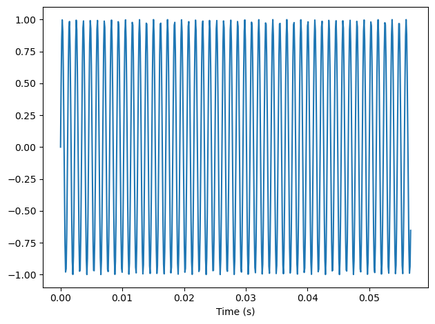
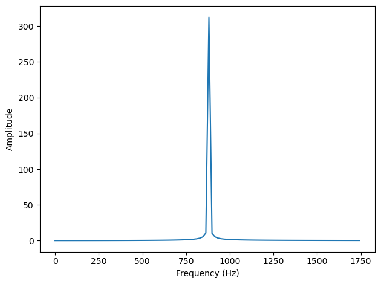
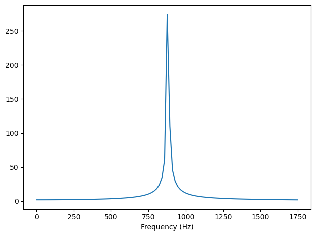
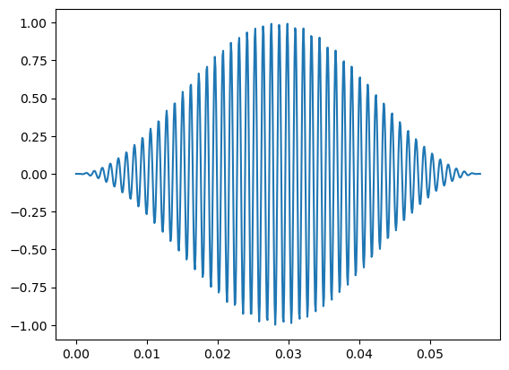
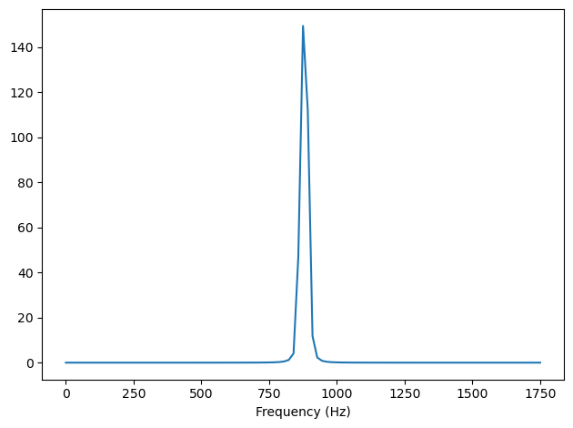

\input{$UNI/.templates/parts/header.tex}
Ознайомитися з явищем частотного витоку та дослідити вплив накладання віконних
функцій на якість спектральної характеристики.

# Короткі теоретичні відомості

Однією з поширених проблем є розриви на початку та в кінці сегмента. Оскільки
DFT припускає, що сигнал є періодичним, воно з’єднує кінець сегмента з
початком, створюючи цикл. Якщо кінець не з’єднується з початком плавно, через розрив
у сегменті виникають додаткові частотні компоненти, яких немає в сигналі. Такий ефект називають
частотним витоком.

Тому використовуються віконні функції, які обробляють сегмент так, щоб
на його кінцях амплітуда прямувала до 0 і цим мінімізують розриви та, відповідно, витоки.
Це, наприклад, функція Уелша, синусне(косинусне) вікно, функції Ханна та Хаммінга та вікно з пласким верхом.
У кожної з них є свої переваги та недоліки.

# Хід роботи
## Вейв з цілої кількості періодів

```python
import numpy as np
import matplotlib.pyplot as plt

from thinkdsp import decorate
```


```python
from thinkdsp import SinSignal

signal = SinSignal(freq=880)
```


```python
duration = signal.period * 50
wave = signal.make_wave(duration)
wave.plot()
decorate(xlabel='Time (s)')
```


{width=10cm}


```python
spectrum = wave.make_spectrum()
spectrum.plot(high=1760)
decorate(xlabel='Frequency (Hz)', ylabel='Amplitude')
```


{width=10cm}


## Вейв, подовжений на чверть періоду

```python
duration = signal.period * 50.25
wave = signal.make_wave(duration)
wave.plot()
decorate(xlabel='Time (s)')
```


{width=10cm}


```python
spectrum = wave.make_spectrum()
spectrum.plot(high=1760)
decorate(xlabel='Frequency (Hz)')
```

На рис. 4 видно, що утворений спектр має в собі зайві частоти.

{width=10cm}


## Обробка вейву віконною функцією


```python
def hann(N):
    win_func = np.ones(N)
    for n in range(N):
        win_func[n] = np.sin(np.pi*n/N)**2
    return win_func
```


```python
npoints = len(wave.ys)
win_func = hann(npoints)
wave_n = wave.copy()
wave_n.window(win_func)
wave_n.plot()
```


{width=10cm}


```python
spectrum = wave_n.make_spectrum()
spectrum.plot(high=1760)
decorate(xlabel='Frequency (Hz)')
```


{width=10cm}

# Висновок

Віконні функції усувають частотні витоки, наскільки це можливо, але вони не ідеальні та можуть
спотворювати сигнал (наприклад знизити амплітуду основної частоти).
